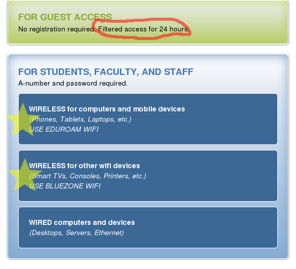

CS1440 - Monday, January 09 - Lecture 01 - Module 0

# Topics:
* [Get to know your professor](#get-to-know-your-professor)
* [You're hired](#youre-hired)
* [What CS 1440 is about](#what-cs-1440-is-about)
* [Problem-Solving Activity: When will you find time to sleep](#problem-solving-activity-when-will-you-find-time-to-sleep)
* [Action Items](#action-items)

------------------------------------------------------------
# Get to know your professor

Hi, I'm Erik Falor, and I'm your professor this semester.

My family got our first computer for Christmas in 1994, when I was in eighth grade.  I always thought of myself as being "good with computers", but I didn't begin seriously programming until my second year of college when I was 21.  I was originally a Communications major because I debated and worked on the newspaper in High School.  I was not then, nor am I now, mathematically inclined.  Compared to my CS classmates I had a late start getting into programming, and I felt like I had to do a lot of catching up to get even with where they were.

I earned my Bachelor's in CS and worked as a software engineer for 13 years at Spillman Technologies, Inc. (now Motorola Solutions) and Automated Products Group.  In 2011 I joined the USU Master's program as a part-time remote student, and graduated fall 2016.  I taught a class as an adjunct the following spring semester, and loved it.  I have been teaching full-time since fall 2017.

I spent my programming career:

*   _Reading_ horrible documentation
*   _Writing_ documentation that was, hopefully, an improvement
*   _Maintaining_ software that was first written **way** before my time.  Some of the oldest code I touched was first written in the early 90's, while I was still in elementary school.
    *   _Testing_ code written by myself and teammates
    *   _Finding_ and fixing bugs
    *   _Monitoring_ the performance of our software on customers' systems
    *   _Porting_ software between platforms
*   _Building_ software with build systems such as Make, Ant, VisualStudio, IAR Embedded Workbench and shell scripts
*   _Reviewing_ code written by my team
*   _Processed_ data with SQL & ISAM databases, XML/XSLT, the Unix text tools and tools that I made myself
*   _Designing_ new software
    *   _Writing_ new code in Perl, C, C++, Java/C#, XSLT and Shell

Things I don't like

0.  Counting from `1`
1.  Microsoft Windows™
2.  Desktop Environments
3.  Office Suites with their pretentious "rich" file formats
4.  Your text editor
5.  Squishy keyboards and touch screens
6.  QWERTY
7.  Ball-point pens
8.  Mainstream music

Things I do like

0.  Counting from `0`
1.  Linux
2.  Tiling window managers
3.  OG plain-text files, Markdown, and $`\LaTeX`$
4.  Vim
5.  Mechanical keyboards
6.  Colehack - my own custom keyboard layout
7.  Fountain pens
8.  Lately I've been listening to shoegaze. Some bands I like
    *   Nothing
    *   Narrow Head
    *   Gleemer
    *   Airiel
    *   Grivo
    *   trauma ray
    *   Pinkshinyultrablast

There is no such thing as a "stupid question" in my classroom...

...though some questions are not germane to the lecture.  I'm always happy to stay after class to answer off-topic questions.

# You're hired!

Welcome to DuckieCorp, the consultancy firm for programmers who talk to themselves.

The purpose of this course is to prepare you to become a competent problem-solver who understands and uses the best software engineering techniques.

## Get to know the course

*   Course structure 
    *   There are two sections of this course
        *   **Section 001** taught by Joseph Ditton
        *   **Section 002** taught by Erik Falor
    *   These on-line lecture notes are your textbook
        -   https://gitlab.cs.usu.edu/erik.falor/fa22-cs1440-lecturenotes
*   [Topics covered in this course](../../Outline_of_Topics.md)
    *   Content and assignments are organized into Modules on Canvas
    *   Complete the **Course Contract** ASAP
*   Assignments (80% of your grade)
    *   Assignments here are large multi-stage projects as compared to the small exercises from CS 1400
    *   You have approximately 2 weeks per assignment
        -   This is *not* an invitation to procrastinate. Make every day count!
    *   You *may* brainstorm your software design with your study buddies
    *   You *must* write your code individually
        *   *Do not* submit code you saw on Chegg, CourseHero, Stack Overflow, YouTube, the CS Discord, etc.
    *   Submit assignments to GitLab only; nothing will be turned in on Canvas
    *   Within 72 hours complete the **Assignment Reflection Quiz** for 5 points
* Quizzes (10% of your grade)
    *   Two kinds - **Practice Quizzes** and **Mastery Quizzes**
    *   Practice quizzes
        *   Prime you to learn new things at the beginning of the module
        *   Help you to prepare for the graded quizzes
        *   Take as many times as you like
        *   These **do not** affect your grade
    *   Mastery quizzes
        *   Basic Canvas Quizzes
        *   No Proctorio; please don't be the one who forces me to start using it
        *   Test your mastery of concepts taught in the module
        *   Due at the end of the module
        *   May be taken **only one time**
* Class participation (10% of your grade)
    *   Meet your study buddies and form your network of software colleagues
    *   50 points for in-class participation
    *   50 points for being the Designated Questioner **one time**
        *   You *can* get points for on-line discussions on Canvas
        *   If you have a special circumstance, Designated Questioner can be done on-line as well (ask me)
*   Course Discord Server
    *   Participation on Discord is **optional**
    *   Get the sign up link by taking the **Discord Rules Quiz** on Canvas
*   CS Coaching Center
    *   Location: [Online](https://coach.cs.usu.edu)
    *   Hours
        *   Mon - Fri: 9am to 9pm
        *   Saturday: 12pm to 8pm
    *   The coaches aren't there to write your code for you, they support you in doing the work yourself!
    *   You must present a completed *Software Development Plan* before they will answer questions about your code.  This document is already *required* in this course, and it is necessary if you want their help.  The TAs and I will also ask for your plan when you come to us for help about assignments.
    *   Coaches don't help you study for exams.  Do that with your study buddies.
*   Joseph's Office Hours (Section 001)
    *   IRL: Old Main room 420
    *   Virtually:  Click the "Office Hours" link in Canvas
    *   When: Every Thursday from 1pm to 4pm 
*   Erik's Office Hours (Section 002)
    *   IRL: Old Main room 418A
    *   Virtually:  https://usu-edu.zoom.us/my/erik.falor?pwd=ZE4zNXRpNVl4VVhHNkN5Q2wwV3VrUT09
    *   When: Every Thursday from 9am to 12pm
*   Teaching Assistants
    *   Jaxton Winder
    *   Jenna Cioffi
    *   Logan Smith
	*	Santosh Aryal
    *   Kobra Bohlourihajar
    *   Check the **Syllabus** for their up-to-date office hours and contact info

# [What CS 1440 is about](../../What_CS_1440_Is_About.md)

CS 1440 is **fundamentally different** than CS 1400.  This document helps you set the right expectations.

# Problem-Solving Activity: When will you find time to sleep?

Getting a college degree is a **lot** of work.  But exactly how much work are you in for?  Can you afford to have a job, a social life, or even to sleep?

After all of this hard work, you should be able to call yourself an expert in your field, right?

Since I am a programmer, my instinct is to write a program to figure this out.  But every time I dive straight in and write code, I get stuck.  A better way is to first *design* the program in my mind before I commit it to [code](./effort.py)

Let's find answers to these questions in particular:

*   How many hours per week I will need to spend on my classes?
    *   ...
*   How many hours of my Bachelor's degree actually go towards becoming a programmer?
    *   ...
*   How many hours per week I will have to have a job?
    *   ...
*   How many hours per week I will have in free time?
    *   ...
*   How many hours per week I will have to sleep?
    *   ...
*   How far away from being a "Gladwell Expert" will I be at the end of my degree?
    *   ...

# Action Items

## Before our next lecture on **Wednesday**:

0.  Make an account on https://gitlab.cs.usu.edu
    *   Follow the instructions in [GitLab Account Setup](../../Using_Git/GitLab_Account_Setup.md)
    *   While on campus you must connect using the **Eduroam** network
    *   You cannot see my GitLab server while on **BLUEZONE** 
    *   
1.  Run through the Required Software Install Instructions on Canvas so we can address any issues ASAP
2.  Use Git to clone Assignment #0 [Shell Tutor](https://gitlab.cs.usu.edu/erik.falor/shell-tutor) and begin working through it
3.  If your Python skills are rusty, send me an email and I will invite you to the **Python Crash Course** on Canvas
4.  Take the "Get to know you" participation survey on Canvas
    *   Now that you know a little bit about me, this week's participation activity asks a few questions to help me get to know you as a person
    *   Find the **Get to know you** quiz in Module 0 on Canvas
    *   It is due at *midnight, Wednesday, January 11*

