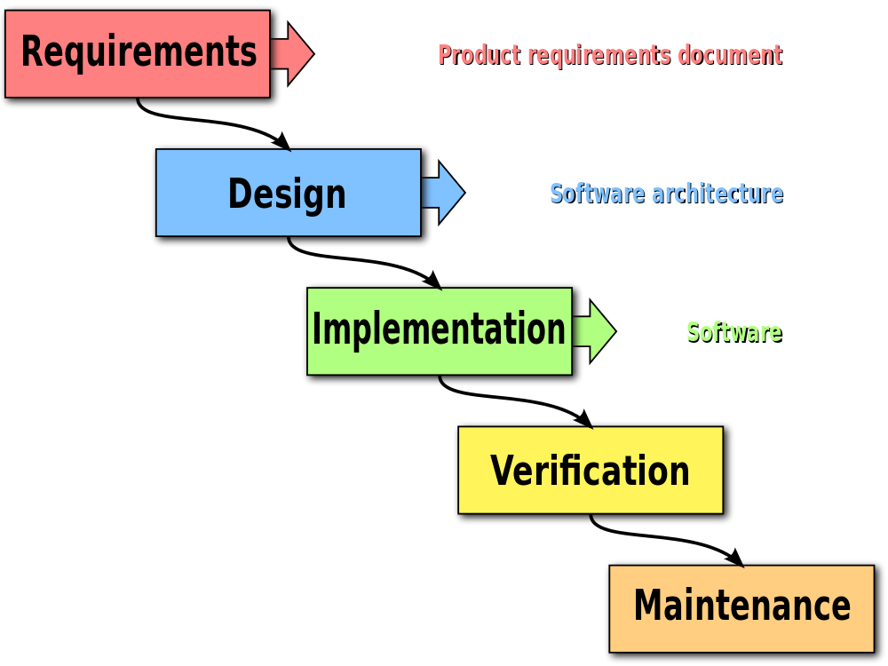

CS1440 - Wednesday, January 18 - Lecture 04 - Module 0

# Topics:
* [Announcements](#announcements)
* [When to Submit Your Work](#when-to-submit-your-work)
* [Assignment #1: Tic-Tac-Toe](#assignment-1-tic-tac-toe)
* [Software Development Plan and Sprint Signature](#software-development-plan-and-sprint-signature)
* [The Markdown markup language](#the-markdown-markup-language)


------------------------------------------------------------
# Announcements

## Free Software and Linux Club

Join us on the [FSLC Discord server](https://discord.gg/GKWhbVDN38)

*   **What**  Project Night
*   **When**  6:30pm Wednesday, January 18th
*   **Where** ESLC 049 and 051


All are welcome to join us for our initial project night.  Whether you're interested in reserving a box, setting up a server on the campus network, or simply hacking on a side project.  We have a plentiful supply of machines available. 


*   **What**  Meeting: Intro to FOSS + Linux and Install Help
*   **When**  6:30pm Thursday, January 19th
*   **Where** ESLC 053

Our inaugural meeting on Thursday will be an introductory presentation on Linux and Free Software, and we'll be providing support for those who want to install Linux in any configuration.

We look forward to seeing you all there! 


## Cache Valley UT Developer Community

*   **What**  Deno - ["The easiest, most secure JavaScript runtime"](https://deno.land)
*   **When**  7:00pm Thursday, January 19th
*   **Where** Bridgerland Technical College (1301 N 600 W, Logan)
    *   Room 840
*   [Discord Community](https://discord.gg/J867CsHJaG)
*   [Twitter account](https://twitter.com/cache_dev)


# Action Items

## Assigned Reading: "How to Report Bugs Effectively"

*   Read the essay "How to Report Bugs Effectively" from [Simon Tatham's homepage](https://www.chiark.greenend.org.uk/~sgtatham/bugs.html) before our next meeting on Friday, January 20th and be prepared to discuss it.
*   There is a brief Canvas quiz about the essay which is due **right before Friday's lecture**
*   As a reminder, here is the [schedule of required readings](../../Required_Reading_Schedule.md)

## Call on 2 designated questioners


# When to Submit Your Work

*   Assignments are due by 11:59:59 PM on the posted due date according to the clock on my GitLab server.
    *   Submissions are not accepted more than 48 hours after the due date.
*   A submission arrives when it is *pushed* to my GitLab server.
    *   Commits pushed _after_ the due date are late.
    *   Commits bearing timestamps _before_ the due date but are *pushed* _after_ the due date are late.
*   You can push your code to GitLab as many times as you want.
    *   Do not push your code to GitLab after the due date passes *unless* you intend to turn it in late.

|  Lateness   |            Penalty         |
|-------------|----------------------------|
| < 24 hours  | Max score == 75% of total  |
| < 48 hours  | Max score == 50% of total  |
| >= 48 hours | Submission is not accepted |

Exceptions to the above can only be made in the event of school-sanctioned travel or for a _serious, unexpected_ emergency.  Inform the instructor as soon as you can, preferably in advance, to work out an arrangement.


## Which clock judges lateness?

The clock on **gitlab.cs.usu.edu** keeps the official time for the class.  When you push to the server you will see a "receipt" in your console:

```
***********************************************************************
*           __  ________  __  _____                ____    _          *
*          / / / / __/ / / / / ___/__  __ _  ___  / __/___(_)         *
*         / /_/ /\ \/ /_/ / / /__/ _ \/  ' \/ _ \_\ \/ __/ /          *
*         \____/___/\____/  \___/\___/_/_/_/ .__/___/\__/_/           *
*                                         /_/                         *
*  ,/         \,                                                      *
* ((__,-"""-,__))                                                     *
*  `--)~   ~(--`                                                      *
* .-'(       )'-,                                                     *
* `--`d\   /b`--`  Big Blue says:                                     *
*     |     |                                                         *
*     (6___6)  Your submission arrived Wed 18 Jan 2023 21:17:25 MDT   *
*      `---`                                                          *
*                                                                     *
***********************************************************************
```

*   The timestamp comes from the GitLab server's clock.
*   This is the official time of your submission's arrival.
*   If the time shown in the receipt is after midnight, don't send me an email explaining why it was late.
    *   Unless you are receiving emergency medical treatment or traveling to or from a school-sanctioned event, nothing you say can make a difference.
    *   Just take the L and do better next time.
*   If you don't see this receipt, make sure that you are pushing your code to **my** GitLab server at `gitlab.cs.usu.edu`.


## The Grading Gift

Each student is allowed **one** late submission per semester without penalty and without question.

Programmers are notorious for missing deadlines.  I want you to destroy that stereotype.  However, everybody has a bad day now and then.  The Grading Gift lets you gracefully recover when this happens to you.

*   The Grading Gift does not extend the submission window of due date + 48 hours.
    *   It only removes the penalty of being late.
    *   It does not make up points lost due to coding errors or other mistakes.
    *   The Grading Gift cannot be used retroactively.
*   The Grading Gift **may not** be used on the final assignment.
    *   That assignment's due date is already extended by 48 hours.


### How to use the Grading Gift

*   Send an email **to the instructor and to the graders** expressing your intent to use the Grading Gift.
    *   Send an email, not a Canvas message (those have a tendency to get lost).
    *   All of our email addresses are in the Syllabus.
    *   You do not need to tell us why you are using the Grading Gift.  In fact, we don't want to know.
*   This email must be sent **before** the 48 hour extension period has passed.
    *   Requests are not accepted after that deadline.
    *   The Grading Gift cannot be used retroactively.


# Assignment #1: Tic-Tac-Toe

A customer hired DuckieCorp to write an unbeatable Tic-Tac-Toe game.  Two teams worked independently on separate parts of the project.  Everything was smooth sailing until they combined their work into a single program.  When the unbeatable AI stopped winning, the programmers lost their cool.  While they are taking a time-out, you get to untangle their mess and save the project.

There is not much new code that needs to be written in this assignment.  Your work consists of

*   Coming up to speed on what the other teams have done
*   Organizing the code in a better way
*   Re-writing a few functions to fix a trivial bug

Begin by cloning the [starter code repository](https://gitlab.cs.usu.edu/erik.falor/cs1440-falor-erik-assn1)


## Suggested schedule

This assignment is due at midnight on **Friday, January 27th** (a week and a half from today)

*   Thursday: Phase 0
*   Friday: Phases 0 and 1
*   Monday: Phase 1
*   Tuesday: Phases 1 and 2
*   Wednesday: Phases 2 and 3
*   Thursday: Phase 3
*   Friday: Phases 3 and 4


# Software Development Plan and Sprint Signature

*   These two files are required to be a part of your git repositories
*   Template files are supplied in the `doc/` directory of your starter code
    *   You are not graded on the quality of these files per se, but if you do a really sloppy job you'll hear about it
*   Removing, renaming, or failing to update these files will result in lost points
    *   Moving these files to another directory results in a penalty
    *   Please leave them where we expect to find them!
    *   I'm really serious about these files!!!


## [Sprint Signature](../Sprint_Signature.md)

*   Keep a daily log of your efforts as you work on assignments
*   This document doesn't have to be detailed; a one- or two-sentence summary of your main activities is what you're aiming for
*   This document, combined with your Git repository's log will provide a clear picture of your work habits
    *   This document is *not* a replacement for thoughtful `git commit` comments, and vice versa
    *   Git commit messages describe the changes **each commit** makes to your code
        *   This information helps you navigate the history of your repository when you need to locate a specific change
        *   You should make several commits each day you work
    *   The Sprint Signature is a high-level **summary of your day's work**
        *   Distill the results of many commits' worth of work into one or two sentences
        *   The purpose is to give you a sense of progress along your plan, and to recognize when you're spinning your wheels.
    *   Do your best to **track how much time** you spend on assignments each day you work
        *   You can't improve your effectiveness if you don't have a clear idea of how you spend your time
        *   You can use the timer app on your phone, or one of the bajillions of timer web apps or YouTube videos


## The Software Development Plan (SDP)

In this course a software development plan is a document you are required to write for each assignment.  In it you document your efforts at each stage of the software development process.

Most authors name 5 phases in the software development process:



At DuckieCorp we split the process into these 6 phases:

| Project Phase                | Proportion of time
|------------------------------|-------------------
|0. Requirements Specification | 20%
|1. Design                     | 30%
|2. Implementation             | 15%
|3. Testing and Debugging      | 30%
|4. Deployment                 | 5%
|5. Maintenance                | ∞

You will need to write a little something about each phase as you work on your projects.  This is explained in more depth [here](../Software_Development_Plan.md)

As you write your plan, think about how you can apply the [Eight General Problem Solving Techniques](../General_Problem_Solving_Techniques.md) to the problem at hand.


# [The Markdown markup language](../Markdown.md)

Markdown is a lightweight markup language for creating formatted text using a plain-text editor.  It was created by John Gruber and Aaron Swartz in 2004.  It has become a popular format for writing documentation for code.

The document linked above is a reference for you to follow while you work on your first Markdown documents.


