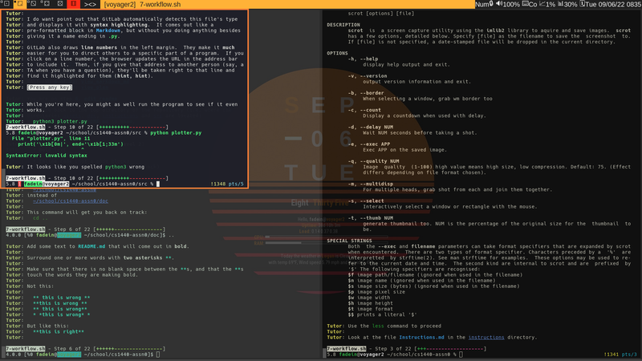
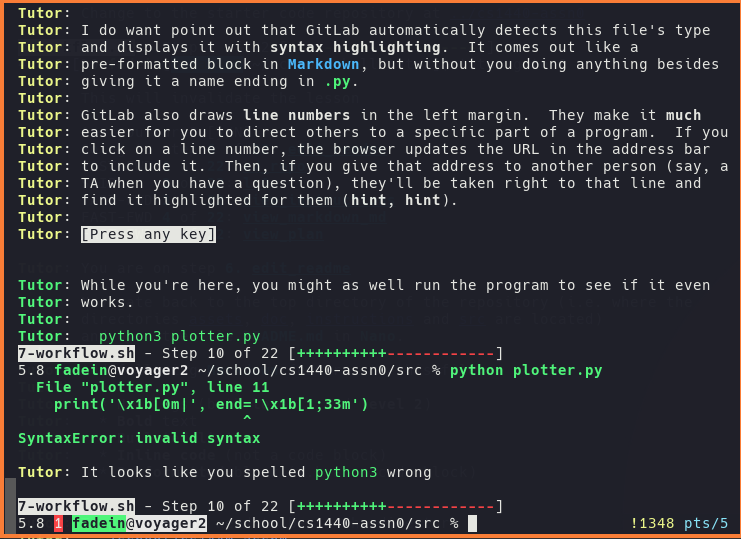

CS1440 - Friday, January 20 - Lecture 05 - Module 0

# Topics:
* [Announcements](#announcements)
* [Stand Up Scrum Meetings](#stand-up-scrum-meetings)
* [Retrospective: Assignment #0](#retrospective-assignment-0)
* [How to Report Bugs Effectively](#how-to-report-bugs-effectively)
* [Using Modules for code organization](#using-modules-for-code-organization)


------------------------------------------------------------
# Announcements

## Science Unwrapped Tonight

*   **What**  Predicting Snowmageddon: Using Data Science to Design Against Disaster
*   **Who**   Dr. Brennan Bean, USU Department of Mathematics and Statistics
*   **When**  7:00pm Friday, January 20th
*   **Where** ESLC 130

Lots of snow is great for skiers and thirsty reservoirs, but can present a challenge to building designers. How do you build buildings that will safely withstand the weight of snow loads? By collecting and analyzing LOTS of data, and living with a little uncertainty, says USU statistician Brennan Bean, who will discuss the power of data science in a changing climate.

Admission is free

Refreshments and activities after


# Action Items

*	Call on 2 designated questioners


# [Stand Up Scrum Meetings](../Stand_Up.md)

Back in ye olden-times, software projects followed the Waterfall methodology.

DuckieCorp strives to be the kind of agile software shop that employs only the most trendy software development methodologies.  One such methodology is called **Scrum**, in which teams hold a brief meeting on a daily basis to talk about how their work is progressing.  

We will hold stand ups at the beginning of each class period going forward.


# Retrospective: Assignment #0

Besides Stand Up meetings, SDPs and Sprint Signatures, there are a few more things we do at DuckieCorp to keep our projects on track.

**Retrospective meetings** are held at the end of each sprint to reflect on and draw lessons from the experience.


Statistic                        | Value
--------------------------------:|:---------------
Average Hours Spent              | 4.477
Standard Deviation Hours         | 3.004
... Medium                       | 47.7%
... Hard                         | 1.9%
... Too Hard/Did not complete    | 0.0%


## What went well?

*   157 students successfully completed the tutorial
*   I found 2 pairs of students who submitted *identical* certificates
    *   Cheating?
    *   It turned out to be 2 students who both created two repositories
    *   Not cheating.  Phew!
*   8 bug bounties paid out for a project that hasn't changed since last semester
    *   This means there were still 8 mistakes in the program that **nobody** noticed last fall
*   **Longest Single Lesson** - one student completed `4-projects.sh` in **4d 19:17:25**
*   **Shortest Single Lesson** - one student completed `0-basics.sh` in **01:42** (that's one *minute*, not one hour)
*   The **average lesson** duration was **16:02:02**
*   The **total amount of time** logged by students using the shell tutor this semester was **104d 21:20:15**


## What went wrong?

This class experienced a different mix of issues than students last semester.

*   I got a lot of emails from the "The project you were looking for could not be found or you don't have permission to view it." error message
    *   **fix** Partway through the tutorial I changed some text in `6-git.sh` to better explain this
    *   **fix** I also sent an announcement in Canvas
*   New error messages seen by WSL users in lesson 3.1 
    *   We had a few small problems with that lesson last Fall, but nothing on the scale of what you experienced this time
    *   **fix** ???
*   This semester many students got to the end of `7-workflow.sh` and were told that they didn't finish some of the previous lessons
    *   **If this happened to you, can you tell me about your experience?**
    *   These students were forced to exit `7-workflow.sh` abruptly to re-do the "missing" lessons
    *   But `7-workflow.sh` isn't easily re-started; it depends on things that happen in `6-git.sh`, and makes some other permanent changes to the repo
    *   It was a big mess that I did not anticipate
    *   **fix** Jaxton prototyped a feature for `7-workflow.sh` that we will roll out next semester
*   Confusing text for Mac users in `1-commands.sh` regarding certain commands being "shell built-ins" vs. "external commands"
    *   `which which` and `which cd` comes back with weird responses
    *   The way that stuff is handled on Mac drives me crazy - it's not worth the trouble!
    *   **fix?** This has been such a pain point that I'm considering dropping those steps from that lesson
*   3 Linux users got stuck at `man -k manual` at the end of `1-commands.sh`
    *   This affected my computer, too!  This wasn't a problem last semester
    *   The `man` program underwent an update since last fall; I blame them
    *   **fix** I added some code to that step to detect the problem and suggest a fix
*   Many Windows users seem to be confused about WSL vs. Git+Bash
    *   This hasn't been an issue in past semesters
    *   It surprised us because we haven't changed the instructions on Canvas in quite a while
    *   **fix** ???


# Assigned Reading: [How to Report Bugs Effectively](https://www.chiark.greenend.org.uk/~sgtatham/bugs.html)

Take a few minutes and discuss these questions with your study buddies:

*   What is wrong with saying "it doesn't work"?
*   What problems arise if your description of the bug is unclear?
*   How much information should you provide in a bug report?
*   How can you tell which pieces of information are *too much*?
*   Is it helpful to suggest what you think is going wrong?  Why or why not?


## DuckieCorp Bug Reporting Best-Practices

About half of the bug reports I get from DuckieCorp interns are actually cases of *user error*.  If you follow the advice from the essay you will spare yourself embarrassment.

You will also find that this process sometimes helps you to **solve the problem yourself**.  Instead of merely reporting a problem, you can provide a complete bug **fix**.

In addition to Simon's advice, keep these guidelines in mind at DuckieCorp:

*   It is unfortunate that you are in a frustrating situation
    *   Please remember that we are people, too
    *   Patience and respect should be shown by **both sides** in **all** interactions
*   Double-check that you have been following the instructions **EXACTLY**
    *   If you haven't noticed by now, computers are **VERY** particular about what their input looks like
    *   Pay close attention to *wh ite  sp ace*, *spellign* and *CapPitALiZatIon*
*   Avoid screenshots when possible (see below)
    *   Screenshots should be resorted to only when there is **no other way** to capture details of the problem.  For example, when:
        *   A graphical user interface is broken
        *   Your program outputs a picture, but the image is incorrect
    *   If you *must* send a screenshot, learn how to take a screenshot within your OS instead of snapping a pic of your laptop with your phone
        *   Professors make fun of students who do this
            *   Windows users: press the `Print Screen` key
            *   Linux users: install and run a program called `scrot`; `Print Screen` likely works, too
            *   Mac users:
                *   `Cmd-Shift-3` takes a screenshot the entire screen
                *   `Cmd-Shift-4` select a rectangular region to screenshot
                *   `Cmd-Shift-5` pops up a GUI to help you make a screenshot


### Why are screenshots bad?

Whoever said "a picture is worth a thousand words" never tried to debug a syntax error from a JPEG.  Screenshots are unnecessary 95% of the time.  Consider:

0.  Source code is plain text
1.  Error messages are plain text
2.  Your terminal is plain text

A picture of plain text is a waste of time and bandwidth.  When reporting a bug that is **textual** in nature, it is best to send just **the text itself**.

0.  Here is a screenshot of my desktop.  There is an error message in my Python program in there... somewhere.
    *   
    *   There's a lot going on here!  How long did it take you to zero in on the error message?
    *   This file costs more than a quarter of a megabyte of storage.  The full-sized version was double that.
    *   Screenshots of your desktop can dox you.  (You ever hear the Tragedy of Kurt Eichenwald the Unwise?  No?  I thought not, it's not a story the Normies would tell you...)
    *   Screenshots of your desktop can dox your coworkers/users/customers.
        *   Be careful with sensitive info that just happens to be on your screen; you could violate HIPPA, FERPA, RFPA, PCI compliance, etc.
        *   Hackers have broken into organizations using information gleaned from photographs & screenshots.
1.  This is a screenshot of *just* the terminal with the Python error
    *   
    *   This file still takes up an eighth of a megabyte
    *   If I want to find this error message in my inbox again, how do I search for it?  Search tools don't find text embedded in an image.
    *   What if an important clue scrolled off the top of the window?  This image does not hold any extra context about this error.
2.  This is the error message I care about, plus the command that caused it:
    *   ```
        5.8 fadein@voyager2 ~/school/cs1440-assn0/src % python plotter.py
          File "plotter.py", line 11
            print('\x1b[0m|', end='\x1b[1;33m')
                                 ^
        SyntaxError: invalid syntax

        Tutor: It looks like you spelled python3 wrong
        ```
    *   Later, when I search my inbox for `python SyntaxError`, this will come up
    *   This is exactly what I need to diagnose the problem, told in only `238` bytes.  This is orders of magnitude less than `144,031` or `285,944` bytes.
    *   You could scroll up in the terminal and copy more text to provide more context about the problem.  Many screenfuls of text weigh less than one picture.


# Using Modules for code organization

There are 5 Dallins in this class.

If I say "Hey, Dallin!", who will respond?

----

Modular organization is used *everywhere*; pay attention and you'll begin to see it.  For example, this very lecture notes repository is organized modularly.

*   The top level of organization are *modules* that combine topics related to an assignment
    *   Modules contain documents with information that you need to succeed with the upcoming assignment
    *   Modules also hold *lectures*, corresponding to individual lessons
        *   Inside each lecture are notes and code samples 

Understanding this organization helps you to independently find answers to your own questions.

*   You should *clone* this lecture notes repository onto your own computer so you always have a copy with you.
    *   `$ git clone https://gitlab.cs.usu.edu/erik.falor/sp23-cs1440-lecturenotes.git`
*   After it is cloned, use `git pull` to *update* it after every lecture
    *   `$ git pull`
    *   This way you can read and run the programs that I write with you in class
*   You can also make a convenient study guide called `all_notes.md` with the `concatenate.sh` script provided for you
    *   The `all_notes.md` study guide can be quickly searched with the `grep` tool to find a keyword you are interested in

*Demo: clone and search the notes in the shell*


The starter code for Assignment #1 has *thirty-nine* functions jammed into a single file.  Discuss with your study buddies these questions:

*   What are the advantages of putting all of the functions into one file?
*   What are the disadvantages of doing it?
*   As programs grow in length and complexity does it become important to separate your code into modules?


## [Organizing Code Into Modules](../Organizing_Code_Into_Modules.md)


