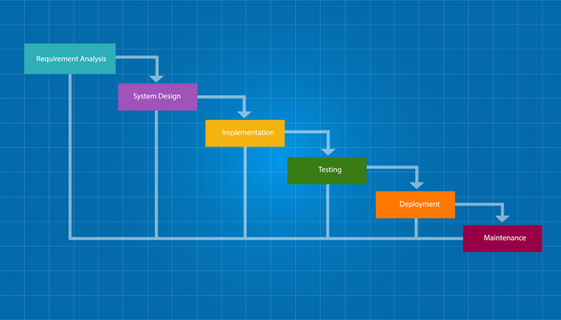
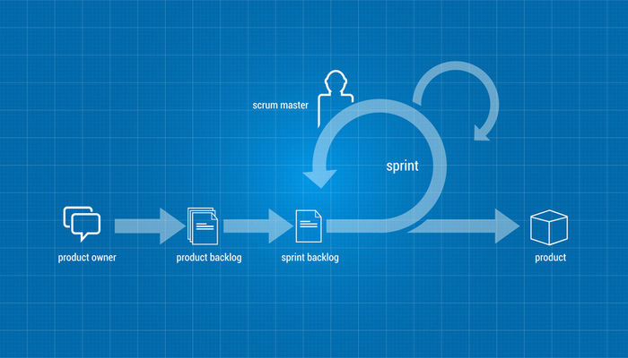

# Stand Up Scrum Meetings

Back in ye olden-times†, software projects followed the Waterfall methodology.  Waterfall assumes that you'll nail your design down the 1st time.  Put more charitably, Waterfall encourages software engineers to "measure twice, cut once."

*† Ye olden-times are defined as the 1960's through the 1990's*

In practice, software engineers rarely measure twice.  Their constant screw-ups resulted in earning a reputation for always being behind schedule and over budget.

At the turn of the millennium, Agile methodologies were developed in response to the shortcomings of Waterfall.  Agile takes into account that programmers are impatient people who can't plan beyond their next paycheck, and demand instant gratification.  (The turn of the millennium also saw the creation of social media.  Coincidence?)

Agile lets you go back and try, try again.

Spoiler: software engineers still enjoy a reputation of always being behind schedule and over budget.

## Scrum: not just for rugby!

DuckieCorp strives to be the kind of software shop that follows only the most trendy software development methodologies.  **Scrum** is a popular approach to Agile software development.  One of its notable characteristics is the *daily stand up meeting*, in which teams hold a brief meeting on a daily basis to talk about how their work is progressing.  This way, participants hold each other **accountable** for their work.  They can feel genuine pride and accomplishment if/when they succeed.

They are called "stand up" meetings because they are supposed to be **brief**.  Out-of-shape programmers don't like to stand for more than a few minutes at a stretch.

Each member of the team takes turns answering these questions:

0. What have you done since last scrum?
1. What will you do between now and the next scrum?
2. What got in your way of your progress? (impediments)

#### Impediment

> Something that impedes; a hindrance or obstruction
> -- from The American Heritage(R) Dictionary of the English Language, 4th Ed

It is important to stay on track as you enter the final stretch of each assignment.  You don't have time to waste spinning your wheels on unproductive tasks.  The gimmick behind the stand up meeting is to **notice** schedule slippage early and **address it** ASAP.

Of the three questions, the last is the magic one.  You will probably realize your own solution by putting your impediments into words ( **Restate the Problem**).  Failing that, it's quite likely that another member of your team has encountered a similar problem and can offer good advice ( **Don't get Frustrated**).

Holding effective stand up meetings is key to your success at DuckieCorp.  Since our class doesn't meet every workday, we will hold stand ups at the beginning of every class period going forward.

*   A stand up meeting lasts **3 minutes**
    *   You must **stand** until everyone has had their turn to speak
    *   Yes, seriously; it's not a very good *stand up* if you don't
*   Focus on your project!  This isn't a time for **chit-chat**
*   Your teammates are the **1-5** neighbors closest to you
    *   Teams larger than 6 **won't have enough time** for everybody to talk about their 3 questions
    *   Teams smaller than 2 **don't have very stimulating conversations**
*   After you sit down I can take a few **quick** questions about your impediments
