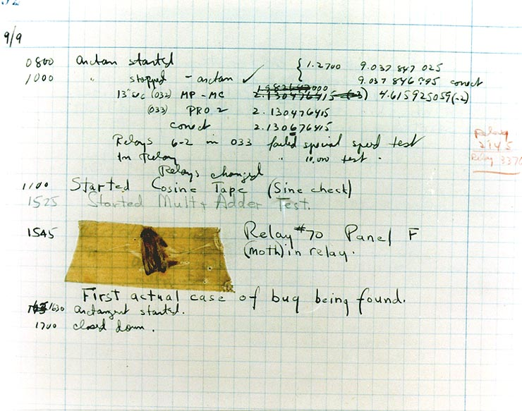

# Debugging

The process of finding software errors (the causes of failures) and then correcting those errors.

> If debugging is the process of removing bugs, then programming must be the process of putting them in.
>
> -- Edsger W. Dijkstra


*   [Origin of the Term](#origin-of-the-term)
*   [Ten Cool Debugging Tricks That Will Impress Your Friends](#ten-cool-debugging-tricks-that-will-impress-your-friends)
*   [How to Debug Anything in Four Easy Steps](#how-to-debug-anything-in-four-easy-steps)
*   [Rubber Duck Debugging](#rubber-duck-debugging)
*   [The "Wolf Fence" Algorithm for Finding Bugs](#the-wolf-fence-algorithm-for-finding-bugs)
*   [How to Read a Stack Trace](#how-to-read-a-stack-trace)
*   [Direct Debugging in the IDE](#direct-debugging-in-the-ide)


## Origin of the Term

The terms "bug" and "debugging" are popularly attributed to Admiral Grace Hopper in 1947.

While she was working on a Mark II computer at Harvard University, her associates discovered a moth stuck in a relay and thereby impeding operation, whereupon she remarked that they were "debugging" the system.  [She taped the bug into the computer's logbook with the remark](https://www.computerhistory.org/tdih/september/9/)

> First actual case of bug being found.



However, the term "bug", in the sense of "technical error", dates back at least to 1878 and Thomas Edison.

In the ACM's digital library, the term "debugging" is first used in three papers from 1952 ACM National Meetings.  Two of the three use the term in quotation marks.  By 1963 "debugging" was a common enough term to be mentioned in passing without explanation on page 1 of the CTSS manual.


## Ten Cool Debugging Tricks That Will Impress Your Friends

If these tricks don't impress your friends, get better friends.

0.  **Interactive debugging**
    *   This involves stepping through a program with the aid of a special tool called a "debugger".  The debugger lets the developer inspect the internal state of the program as it runs.  Debuggers can let you
        -   Pause execution at interesting points
        -   Inspect variables
        -   Execute function calls
        -   Examine memory & CPU registers
        -   Unwind the call stack
1.  **Print statement debugging**
    *   This is when the programmer temporarily adds `print` statements to a program to indicate how the program's execution evolves over time.
        *   These messages are typically removed once the bug is fixed and aren't intended to be shipped with production code.
        *   However, a *logging library* can permit a programmer to leave these messages in the source code, and adjust the amount of debugging information generated on-the-fly.
    *   > The most effective debugging tool is still careful thought, coupled with judiciously placed print statements. 
        > - Brian Kernighan
2.  **Log file analysis**
    *   Carefully reading through the *log files* created by a software system as it runs
        *   Some programs generate copious amounts of information over the normal course of operation.
        *   System administrators can increase the amount of data generated when a problem is suspected.
    *   Log files *may* contain warnings and errors made by the runtime environment (read: programming language), or messages added by programmers.
        *   A good log file should, at minimum, record.
            1.  The date & time the error occurred.
            2.  The location in the source code where the error was noticed (file & line number).
            3.  Information that will help a developer understand *why* the error happened (this one is the hard part).
    *   Logging is similar to **print statement debugging**, except logging messages are meant remain in the production code.
3.  **The "Wolf Fence" algorithm**
    *   A technique for locating a bug in a program by dividing it into halves.
        *   When the "broken" half of the program is identified, it is further partitioned until the bug is pinpointed.
        *   This is explained in more detail below.
    *   One might do this with breakpoints, log messages, or specially-crafted function calls (hooks).
    *   Git has a subcommand called `git bisect` that applies this technique to the revision history of a project.
        *   You'll learn about `git bisect` in a later lecture.
4.  **Problem Simplification**
    *   Once the general location of the problem has been identified, the next task is to isolate it among the many functions and classes that are involved.
    *   Systematically remove portions of the code that do not affect the buggy behavior.
        *   Eventually you will be left with a such simple set of instructions that the bug stands out.
        *   If, along the way, you delete something which makes the bug go away, you may have just found the part of the program where it was lurking!
    *   Conversely, you might apply this approach to the *data* that gives rise to the bug.
        *    If the inputs are too large and complicated to understand, whittle them down until the bug becomes obvious.
5.  **Crafted data**
    *   Some errors only occur when the program's input contains *unexpected* data.
        *   Errors which may be difficult to reproduce under normal operating conditions can be made to occur on demand with specially crafted inputs.
        *   Other errors are only evident after a program has consumed a large quantity of data, making the task of isolating the problem likewise large.
    *   A specially crafted *small* input file can be used to locate the problem much more quickly than the huge file provided by the bug reporter.
    *   Tools called "fuzzers" exist that throw lots of random inputs at programs to see what breaks.
        *   Fuzzing has been very successful at finding security vulnerabilities.
6.  **Backtracking**
    *   When you identify the point where the bug becomes evident, you are likely **not** looking at the origin of the bug.
        *   This is just where the bug became too serious to ignore.
        *   Its cause was several function calls back.
    *   Trace the steps of execution *backward* from this point until you discover where the program came off the rails.
        *   A few debuggers actually *can* run a program in reverse, but this is uncommon.
        *   In reality, you will run and re-run the program in the debugger several times to locate the bug's true origin.
        *   Inspect the call stack and set breakpoints at earlier points in the program.
        *   If your debugger has this capability, set *watchpoints* on variables related to the error.
7.  **Remote debugging**
    *   Interactive debugging of a program running on a different computer than the debugger itself.
        *   For example, you may connect to another system over the internet and attach an interactive debugger.
        *   Another example is debugging an embedded device (i.e. an Arduino) from a PC.
8.  **Protocol analysis**
    *   Using diagnostic tools to analyze network messages sent/received by the system, examine interactions with external hardware or an OS.
        *   Hardware tools include oscilloscopes, logic analyzers, digitizers, Data Aquisition (DAQ) devices, etc.
        *   Software examples include the Network tab in a web browser's developer tools, and programs like Wireshark, `tcpdump`, Kismet, `xscope`.
9.  **Post-mortem debugging**
    *   Debugging a program after it has already crashed.
    *   This is an autopsy for software.
        *   An example of this is inspecting a *core dump* file generated from a compiled C or C++ program.
        *   Core dumps aren't really a thing in Python or Java... (unless your program **really** screwed up!)
    *   This technique can also encompass reading error messages from a log file or on the console after a crash (see *log file analysis*).


## How to Debug Anything in Four Easy Steps

> The next woe is that designing grand concepts is fun; finding nitty little bugs is just work.  With any creative activity come dreary hours of tedious, painstaking labor, and programming is no exception.
>
> Next, one finds that debugging has a linear convergence, or worse, where one somehow expects a quadratic sort of approach to the end.  So testing drags on and on, the last difficult bugs taking more time to find than the first.
>
> -- Fred Brooks
> "The Tar Pit"

Maybe the word *easy* is a little misleading.  Following these steps is the easy part, but actually locating the bug probably isn't.


### 0. Test the software to find failures

For the same reason that you don't proofread your own English papers, programmers should *not* be solely responsible for testing their own code. As paradoxical as this may sound, a programmer's expectations about how the program *ought to* work prevents them from pushing the boundaries and effectively finding problems.

*   Testing provides critical information about the circumstance in which the failure occurs
*   Intentional, methodical testing results in the creation of test cases which reliably reproduce the failure later
*   Quality test cases are of vital importance
*   Tests should be
    1.  *Well-documented*
    2.  Easy to *run*
    3.  Easy to *understand*


### 1. Uncover the error which gives rise to the failure

Once the failure is known, the developer can use a variety of techniques to uncover the cause and produce a fix (there are at least 10 techniques).  The techniques in the above list are not mutually exclusive; professionals use a combination to zero in on bugs.


### 2. Create a fix

Once the problem is uncovered, fix it (if possible).  Hopefully, it is simply a problem with the code and *not* a flaw in the design (otherwise it's back to the drawing board).

*   At this point you may elect to put *assertions* into the code to alert developers (or users) if this specific error recurs.
    *   An *assertion* is a programming statement which causes the program to terminate with a clear, message when a condition is not satisfied.
    *   Much of the time the program passes safely over an assertion like it isn't even there.
    *   They are helpful for catching situations that are "impossible".
*   While it may sound counter-intuitive to intentionally make a program crash, this is sometimes the *safest* thing you can do:

> One of the benefits of detecting problems as soon as you can is that you can crash earlier, and crashing is often the best thing you can do. The alternative may be to continue, writing corrupted data to some vital database or commanding the washing machine into its twentieth consecutive spin cycle.
>
> The Pragmatic Programmer, 2e
> David Thomas, Andrew Hunt


### 3. Re-run the tests

Return to the test cases created in step #0 to ensure that:

*   The failure no long exists
*   The fix did not introduce new errors.  This is harder to guarantee and necessitates further testing.
    *   Ideally the program is also tested again by trained QA engineers.

Many programmers, after investing significant time and effort into fixing a bug, fail at this step.  *Don't undermine all of your work by slacking off in the home stretch!*


## Rubber Duck Debugging

As explained in Chapter 3 of *The Pragmatic Programmer*, sometimes all you need is someone to talk it over with.  When humans are hard to come by, talk to your rubber ducky instead!

If you can't talk out loud, chat online with [Cyberduck](https://rubberduckdebugging.com/cyberduck/)

```
           ,-.
       ,--' ~.).
     ,'         `.
    ; (((__   __)))
    ;  ( (#) ( (#)
    |   \_/___\_/|
   ,"  ,-'    `__".
  (   ( ._   ____`.)--._        _
   `._ `-.`-' \(`-'  _  `-. _,-' `-/`.
    ,')   `.`._))  ,' `.   `.  ,','  ;
  .'   .    `--'  /     ).   `.      ;
 ;      `-       /     '  )         ;
 \                       ')       ,'
  \                     ,'       ;
   \               `~~~'       ,'
    `.                      _,'
hjw   `.                ,--'
        `-._________,--'
```

-- http://www.ascii-art.de/ascii/pqr/rubber_duck.txt


## The "Wolf Fence" algorithm for finding bugs

The original article is [The "Wolf Fence" algorithm for debugging](https://dl.acm.org/doi/10.1145/358690.358695) by Edward J. Gauss in *Communications of the ACM (CACM)*, Volume 25, Issue 11 Nov 1982, pp 780

You should download and print it out - it is only half a page - and will save you an incalculable amount of stress.

> 1.  Let *A* be the territory know to contain the wolf (initially all of Alaska).
> 2.  Construct a fence across *A*, along any convenient natural line that divides *A* into *B* and *C*.
> 3.  Listen for the howls; determine if the wolf is in *B* or *C*.
> 4.  Go back to Step 1 until the wolf is contained in a tight little cage.
> 
> Any convenient `print` instruction will serve as a "wolf fence".  It must display its location in order to identify its output uniquely, e.g.:
>
>     `PRINT, "Wolf fence at line 1234"`


## How to Read a Stack Trace

The wall of text that your program screams at you on its way out may trigger memories of a bad break-up and make you want to shut down.  But if you value your time, don't curl up into a ball and wait for it to leave.

A stack trace shows the sequence of function calls that resulted in a crash.  When your program encounters a seriously bad situation, this tells you where your program died and how it got there.

Python stack traces list functions from oldest-to-newest; the most recently called function appears at the *bottom*. 

Here are my steps to debugging from a Python stack trace:

0.  The top of the stack trace represents the first function called from the main entry point of the program in this line of execution.
    *   Reading from here tells you how your program began to go wrong
    *   We'll come back to this later
1.  Skim to the bottom
    *   Beneath the stack trace the error message is stated.
    *   Above this is the name of the function that caused the program to crash.
    *   Do you recognize it?  Is the name of the accompanying source code file familiar to you?
2.  If you don't recognize that code, scan upward through the trace until you find a function/filename that is familiar to you.
    *   This will be the point in your program where you made a mistake (if this bug is indeed your fault).
3.  If you need more information, continue reading upward to learn how and why this function was called


### Python Examples

For each of these stack traces determine:

*   What is the error?
*   Which function was the error encountered?
*   On what line of which file was the error encountered?
*   How many functions away from the beginning of the program was the program when the error was encountered?


<details>
<summary>Flowblade video editor</summary>

This stack trace tells exactly what happened:

```
Traceback (most recent call last):
  File "/home/jpf/flb_git/flowblade/flowblade-trunk/flowblade", line 93, in
    app.main(modules_path)
  File "/home/jpf/flb_git/flowblade/flowblade-trunk/Flowblade/app.py", line 308, in main
    create_gui()
  File "/home/jpf/flb_git/flowblade/flowblade-trunk/Flowblade/app.py", line 488, in create_gui
    editor_window = editorwindow.EditorWindow()
  File "/home/jpf/flb_git/flowblade/flowblade-trunk/Flowblade/editorwindow.py", line 157, in init
    self._init_panels_and_frames()
  File "/home/jpf/flb_git/flowblade/flowblade-trunk/Flowblade/editorwindow.py", line 643, in _init_panels_and_frames
    top_project_panel, widget_is_notebook = editorlayout.create_position_widget(self,
  File "/home/jpf/flb_git/flowblade/flowblade-trunk/Flowblade/editorlayout.py", line 328, in create_position_widget
    notebook = _create_notebook(position, editor_window)
  File "/home/jpf/flb_git/flowblade/flowblade-trunk/Flowblade/editorlayout.py", line 343, in _create_notebook
    tabs_pos = tabs_positions[position]
KeyError: 5
```

<details>
<summary>Spoiler: What was the exact problem?</summary>

`tabs_positions` is a dictionary and `position = 5`.  They key `5` was not present in `tabs_positions`.

</details>


As does this stack trace:

```
Traceback (most recent call last):
  File "/usr/bin/flowblade", line 63, in <module>
    app.main(modules_path)
  File "/usr/share/pyshared/Flowblade/app.py", line 150, in main
    create_gui()
  File "/usr/share/pyshared/Flowblade/app.py", line 196, in create_gui
    editor_window = editorwindow.EditorWindow()
  File "/usr/share/pyshared/Flowblade/editorwindow.py", line 306, in __init__
    True)
  File "/usr/share/pyshared/Flowblade/panels.py", line 125, in get_render_panel_left
    render.create_widgets()
  File "/usr/share/pyshared/Flowblade/render.py", line 326, in create_widgets
    _fill_extension_label()
  File "/usr/share/pyshared/Flowblade/render.py", line 573, in _fill_extension_label
    ext = encoding_options[enc_index].extension
IndexError: list index out of range
```
<details>
<summary>Spoiler: Here we go again</summary>

`encoding_options` is a list or tuple, and `enc_index` was out of range.

</details>


</details>


<details>
<summary>Quod Libet music management program</summary>

This one is a little less clear:

```
Traceback (most recent call last):
  File "/usr/lib/python3/dist-packages/quodlibet/plugins/events.py", line 140, in __invoke
    handler(*args)
  File "/usr/lib/python3/dist-packages/quodlibet/ext/events/mpris/__init__.py", line 100, in plugin_on_song_started
    obj.song_started(song)
  File "/usr/lib/python3/dist-packages/quodlibet/ext/events/mpris/mpris2.py", line 222, in song_started
    ["PlaybackStatus", "Metadata"])
  File "/usr/lib/python3/dist-packages/quodlibet/util/dbusutils.py", line 303, in emit_properties_changed
    self.PropertiesChanged(iface, values, inval)
  File "/usr/lib/python3/dist-packages/dbus/decorators.py", line 314, in emit_signal
    message.append(signature=signature, *args)
ValueError: embedded null byte
```

It does, at least, point us towards files and line-numbers to investigate.

</details>


<details>
<summary>Calibre e-book manager</summary>

These stack traces are a little less helpful to us, but they are meaningful to developers more familiar with the workings of this application:

```
Traceback (most recent call last):
  File "site-packages\calibre\gui2\device.py", line 88, in run
  File "site-packages\calibre\gui2\device.py", line 506, in _books
  File "site-packages\calibre\devices\kobo\driver.py", line 1792, in books
  File "c:\cygwin64\home\kovid\sw\build\apsw-3.8.2-r1\src\cursor.c", line 231, in resetcursor
CorruptError: CorruptError: database disk image is malformed```
```

Note that the last line refers to a C code file, and the stack trace doxes the developer (a Windows user of Cygwin named "kovid").

The problem has something to do with the Kobo e-book interface.  An online search for `apsw-3.8.2-r1` reveals that this is a Python package called "Another Python SQLite Wrapper".  "kovid" is either the author of this build of Calibre (and built it themself), or is the person who made the Cygwin build of the apsw Python package.

*n.b. I would have liked this stack trace to mention the path to the "database disk image" file*


```
Traceback (most recent call last):
  File "site-packages\calibre\gui2\threaded_jobs.py", line 83, in start_work
  File "site-packages\calibre\gui2\ebook_download.py", line 30, in __call__
OSError: [Errno 22] Invalid argument
```

*n.b. `OSError` means that a system call failed; it would have been nice to see which system call failed, and which argument was the invalid one*

</details>


### Java Example

In some languages the stack trace is printed in the opposite order of Python's; the most recent function/method call is printed *first*, not last.

<details>
<summary>This is an example of a stack trace from Apache Tomcat, a Java web server</summary>

```
java.lang.NoClassDefFoundError: org/springframework/web/context/ContextCleanupListener
        at org.springframework.web.context.ContextLoaderListener.contextDestroyed(ContextLoaderListener.java:145)
        at com.liferay.portal.spring.context.PortalContextLoaderListener.contextDestroyed(PortalContextLoaderListener.java:168)
        at org.apache.catalina.core.StandardContext.listenerStop(StandardContext.java:4859)
        at org.apache.catalina.core.StandardContext.stopInternal(StandardContext.java:5478)
        at org.apache.catalina.util.LifecycleBase.stop(LifecycleBase.java:232)
        at org.apache.catalina.core.ContainerBase$StopChild.call(ContainerBase.java:1424)
        at org.apache.catalina.core.ContainerBase$StopChild.call(ContainerBase.java:1413)
        at java.util.concurrent.FutureTask.run(FutureTask.java:262)
        at java.util.concurrent.ThreadPoolExecutor.runWorker(ThreadPoolExecutor.java:1145)
        at java.util.concurrent.ThreadPoolExecutor$Worker.run(ThreadPoolExecutor.java:615)
        at java.lang.Thread.run(Thread.java:745)
Caused by: java.lang.ClassNotFoundException: Illegal access: this web application instance has been stopped already. Could not load [org.springframework.web.context.ContextCleanupListener]. The following stack trace is thrown for debugging purposes as well as to attempt to terminate the thread which caused the illegal access.
        at org.apache.catalina.loader.WebappClassLoaderBase.checkStateForClassLoading(WebappClassLoaderBase.java:1343)
        at org.apache.catalina.loader.WebappClassLoaderBase.loadClass(WebappClassLoaderBase.java:1206)
        at org.apache.catalina.loader.WebappClassLoaderBase.loadClass(WebappClassLoaderBase.java:1167)
        ... 11 more
Caused by: java.lang.IllegalStateException: Illegal access: this web application instance has been stopped already. Could not load [org.springframework.web.context.ContextCleanupListener]. The following stack trace is thrown for debugging purposes as well as to attempt to terminate the thread which caused the illegal access.
        at org.apache.catalina.loader.WebappClassLoaderBase.checkStateForResourceLoading(WebappClassLoaderBase.java:1353)
        at org.apache.catalina.loader.WebappClassLoaderBase.checkStateForClassLoading(WebappClassLoaderBase.java:1341)
        ... 13 more
```
</details>


## Direct Debugging in the IDE

> Everyone knows that debugging is twice as hard as writing a program in the first place.  So if you're as clever as you can be when you write it, how will you ever debug it?
>
>    -- Brian Kernighan

The debugger is a powerful system with many useful tools.  It helps you visualize your data so you can understand your code in a whole new way.
Use the debugger in your IDE to walk through your code and observe what's going on.

Taking some time now to master it will save you countless hours later.  Just like `git` or the Bash shell, debugging is a technique that improves with practice.

The best approach is to pick up one new skill at a time and *force* yourself to use it all day long.  It will either become ingrained **or** you will decide that it isn't useful right now.  Repeat until you are satisfied with your level of mastery.

Live by the motto

> Don't assume it - Prove it
>
> Andrew Hunt & David Thomas "The Pragmatic Programmer"
> Tip #27


There is a difference between *running* your program and *debugging* it in PyCharm.  It's not enough to only set breakpoints!

The article [Debugging with PyCharm](https://www.jetbrains.com/help/pycharm/part-1-debugging-python-code.html) takes you on a high-level tour of the key features.  You will be at a good level of expertise when you know how to use each of the following debugger features:

*   Breakpoints
*   Inline debugging
*   Expressions and modifying values
*   Stepping
    *   Stepping over function calls
    *   Stepping into function calls
    *   Stepping into function calls that *I* wrote
    *   Stepping out of function calls
    *   Run to cursor
*   Frames (the call stack)
*   Watches
*   REPL (a.k.a. the Python Console)
