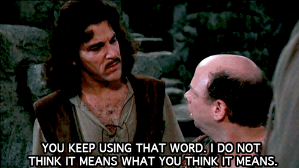

CS1440 - Monday, January 30 - Lecture 09 - Module 1

# Topics:
* [Announcements](#announcements)
* [Retrospective: Assignment #1](#retrospective-assignment-1)
* [Assignment #2 - Text Tools](#assignment-2-text-tools)
* [Assignment #1 Code ~~Review~~ Roast](#assignment-1-code-review-roast)
* [What does PyCharm's green "Run" button *really* do?](#what-does-pycharms-green-run-button-really-do)
* [The Current Working Directory and your code](#the-current-working-directory-and-your-code)
* [Python String Operations](#python-string-operations)
* [Reading files in Python](#reading-files-in-python)


------------------------------------------------------------
# Announcements

## Spring STEM Career Fair

*   **What**  The largest on-campus recruiting event of the year
*   **When**  2-6pm Tuesday, January 31st
*   **Where** TSC Lounge

Pre-Register for the fair and research the growing list of employers that will be attending.

https://usu.joinhandshake.com/stu/career_fairs/36881


# Action Items

*   Read the essay "The Tar Pit" (Chapter 1) of the book "The Mythical Man-Month" before our meeting on **Friday, February 3rd** and be prepared to discuss it.
    *   Instructions for accessing the electronic version of this book are [here](../../Required_Reading_Schedule.md#accessing-ebooks-for-free-through-the-usu-library)
    *   Take the Canvas quiz **The Tar Pit** *before* the beginning of Friday's lecture
        *   You can take this quiz twice.  It is open book with no time limit, so the 2nd attempt should not be necessary.
        *   It is due before class on the day we discuss this essay.
*	Call on 2 designated questioners
*	Hold a 3-minute stand-up scrum meeting with your team


# Retrospective: Assignment #1

**A Ha & Oh No! Moments**

Come get two sticky notes, one of each color.  On each note write down your A# and

*   **On a `#FF00FF` pink sticky note** a moment that made you say 'A Ha!'
*   **On a `#7fff00` chartreuse sticky note** a moment that made you say 'Oh no!'

Post them on the whiteboard along the timeline of Assignment #1 (Jan 18 - Jan 26) indicating when that event occurred to you.


*   What was the single biggest problem for the class?
    *   **Procrastination**, judging by the distribution of sticky notes
*   What was the most beneficial thing that happened to the class?
    *   Reading the starter code - saves time b/c some of the assignment is already written for us
    *   Carefully designing pseudocode in Phase 2 shortens amount of work needed in Phase 3
*   What is one thing that you will **begin doing** for Assignment 2?
    *   Read everything, including the starter code!
*   What is one thing that you will **stop doing** for Assignment 2?
    *   Procrastinating!


# [Assignment #2 - Text Tools](https://gitlab.cs.usu.edu/erik.falor/cs1440-falor-erik-assn2)

In this assignment you will create your own implementations of classic Unix text-processing utilities

| Tool   | Description
|--------|---------------------------------------------------
| `cat`  | Concatenate files and print on the standard output
| `tac`  | Concatenate and print files in reverse
| `cut`  | Remove sections from each line of files
| `paste`| Merge lines of files
| `grep` | Print lines of files matching a pattern
| `head` | Output the first part of files
| `tail` | Output the last part of files
| `sort` | Sort lines of text files
| `wc`   | Print newline, word, and byte counts of text files


## What questions do you have about this assignment?

*   ...
*   ...


# Assignment #1 Code ~~Review~~ Roast

*If your code is featured, please take it in the spirit of constructive criticism*


## Triple quoted string literals are NOT comments

The Liang book taught you a few bad habits in CS 1400.  We'll work on breaking them this semester.

Today I want to tackle so-called *paragraph comment*.  I found an example in someone's `engine.py`:

```python
"""
This file holds the functions related to game-flow
"""
```

The 2013 edition of Liang's book says this about comments:

>  When the Python interpreter sees #, it ignores all text after # on the same
>  line.  When it sees ''', it scans for the next ''' and ignores any text
>  between the triple quotation marks.
>
> p.17, section 1.6
 

Only the first sentence is correct.

The Python interpreter **does not** ignore text between triple quotation marks.  It reads the text and creates a new string literal object.  Because this string value is not stored in a variable, it is immediately forgotten.  All that work, and nothing to show for it!

It is *kinda sorta* like a comment in that the text between the quotes is not executed.  You can be forgiven for using this trick to "block out" bits of code that you do not want to run.  The problem with this is that these string literals *still need to respect the prevailing level of indentation*.
  If you mess up the indentation, then at best you may cause an `IndentationError` and at worse you may prematurely end a code block, resulting in several frustrating hours of debugging.

Comments *do not* need to follow the indentation level of their surrounding code.  They are *truly* ignored.

Try this for yourself in the REPL:

```python
>>>    # A comment following 3 spaces

>>>    """A string following 3 spaces"""
  File "<stdin>", line 1
    """A string following 3 spaces"""
IndentationError: unexpected indent
```


<details>
<summary>In case you still don't believe me</summary>

The phrase "paragraph comment" does not appear in the [Official Python Documentation](https://docs.python.org/3/search.html?q=paragraph+comment&check_keywords=yes&area=default)

The documentation only mentions [hash mark comments](https://docs.python.org/3.11/reference/lexical_analysis.html#comments)

If *paragraph comments* were truly a thing, then both of these expressions would yield an empty string:

```python
>>> import ast

>>> ast.unparse(ast.parse("# This file holds the functions related to game-flow")
''

>>> ast.unparse(ast.parse('"""This file holds the functions related to game-flow"""'))
'"""this is a comment"""'
```

(The `ast` module helps Python applications to process trees of the Python abstract syntax grammar. The abstract syntax itself might change with each Python release; this module helps to find out programmatically what the current grammar looks like.)

</details>


## I'm not saying that you need to live in a hut in the woods...

```python
def make_board():
    return tuple([1,2,3,4,5,6,7,8,9])
```

For some reason this code made me think of a quote:

> Our life is frittered away by detail.  Simplify, simplify, simplify!  I say, let your affairs be as two or three, and not a hundred or a thousand; instead of a million count half a dozen, and keep your accounts on your thumb-nail.
>
> -- Henry David Thoreau


<details>
<summary>In response, Ralph Waldo Emerson replied:</summary>

> One 'simplify' would have sufficed.


</details>


`tuple()` converts an *ordered collection* into a tuple.  Examples of ordered collections include lists, strings, ranges and tuples.

*   *lists* are written with `[]` brackets
*   *strings* are written with `"` and `'` quotes
*   *ranges* are made with the `range()` function
*   *tuples* are made with `()` parentheses

If what you want is a tuple, just make it a tuple in the first place:

```python
def make_board():
    return (1,2,3,4,5,6,7,8,9)
```

One pair of parentheses would have sufficed.

In the big scheme of things, this really isn't that big of a problem.  I use this to illustrate a philosophy of design: less is more.  You can't have a bug in the code that isn't there.


## I didn't think anybody would actually do it

(At least) one student converted the entire `MODEL` from 1D to 2D.  It looks like this was a *lot* of work, and took a few attempts to get right.  I don't mean to pick on this student, but their journey provided a lot of fodder for this lecture.

The original `MODEL` in the starter code was 4,540 lines of code long.  This student's final version is 9,354 lines long; more than twice the length of the original data.  This student created an auxiliary program to re-write `ai.py` for them.  They needed NumPy to pull this off.  This took them *way* above and beyond what was called for in an assignment in a 1000-level CS class.

As near as I can tell, they started work last Thursday afternoon.  I am positive that had they started earlier, they would have realized this is was a hare-brained way to go about it.  As they say, desperate times call for desperate measures.

**Protip:** I said this before, but I'll say it again.  You *never* need NumPy to solve *any* homework problem in this class.

You can tell it's software-generated code by the unorthodox formatting:

```python
(('1', '2', '3')
 , ('O', 'X', 'O')
 , ('X', 'X', '9')), (('1', '2', '3')
                      , ('O', 'X', 'O')
                      , ('X', 'O', 'X')), (('1', '2', '3')
                                           , ('O', 'X', 'O')
                                           , ('X', '8', 'X')), (('1', '2', '3')
                                                                , ('O', 'X', '6')
                                                                , ('X', 'O', 'X')), (('1', '2', '3')
                                                                                     , ('O', 'X', '6')
                                                                                     , ('X', 'X', 'O')),
```

Software that writes software?  What will they think of next?

For some reason, around 22% of the way through the file it starts to look like this:

```python
,('X','5','O')
,('O','X','9')),(('X','2','O')
,('X','5','O')
,('7','8','X')),(('X','2','O')
,('X','X','6')
,('O','8','9')),(('X','2','O')
```

The end product *does* appear to work; I think this student will get a decent score for the program's behavior.  But that's only 15 out of 70 points.  There are 20 points allocated to code *quality*.


## I didn't know it was incorrect

I came across a *helper* function in `ai.py` that converts a 2D game board to the "correct" form.  I know the original 2D board was wrong because this function is named `convertToCorrect2D()`:

```python
 1	def convertToCorrect2D(b):
 2	    i = 0
 3	    j = 0
 4	    newB = [['0','0','0'],['0','0','0'],['0','0','0']]
 5	    for row in b:
 6	        for p in row:
 7	            if p == 1:
 8	                newB[i][j] = '1'
 9	            elif p == 2:
10	                newB[i][j] = '2'
11	            elif p == 3:
12	                newB[i][j] = '3'
13	            elif p == 4:
14	                newB[i][j] = '4'
15	            elif p == 5:
16	                newB[i][j] = '5'
17	            elif p == 6:
18	                newB[i][j] = '6'
19	            elif p == 7:
20	                newB[i][j] = '7'
21	            elif p == 8:
22	                newB[i][j] = '8'
23	            elif p == 9:
24	                newB[i][j] = '9'
25	            elif p == 'X':
26	                newB[i][j] = 'X'
27	            elif p == 'O':
28	                newB[i][j] = 'O'
29	            j = j + 1
30	        i = i + 1
31	        j = 0
32	        
33	    return tuple([tuple(newB[0]), tuple(newB[1]), tuple(newB[2])])
```

Pre-declaring `i` and `j` at the top and manually incrementing them at the bottom of the loops is a lot of extra work, and is a great way to get mixed up.  I doubt this function was written correctly the first time, and required a fair bit of trial-and-error to make work.

The conditions and bodies of all of the `elif`s are repetitive.  This is a big red flag.  When you catch yourself writing code like this, **stop** and find a way to say the same thing *without* repeating yourself.  The bodies that convert integers into strings could have been replaced by a single assignment:

```python
newB[i][j] = str(p)
```

That one line of code works *no matter* what `p` is.

For that matter, the last two `elif`s that handle `'X'` and `'O'` are equally well served by that same assignment.  Sure, it is a waste of time to convert a string into a string, but is worth it to save 4 lines of redundant code.

I know it's not likely to happen in a normal game, but think about what this function would return if a board **did not** contain one of the digits or letters.  There would be a Zero at that position.  What would the rest of the program make of that?  It might crash, or worse, silently do the wrong thing.

The only reason for this function to exist is to cope with the fact that NumPy changed the numbers into strings when it converted the 1D `MODEL` into 2D.


<details>
<summary>If you must insist on doing this</summary>

Here is what the function looks like without the extra `i`, `j` and repetitive `if`/`elif`:

```python
1	def convertToCorrect2D(b):
2	    newB = []
3	    for row in b:
4	        newR = []
5	        for e in row:
6	            newR.append(str(e))
7	        newB.append(tuple(newR))
8	    return tuple(newB)
```

I avoided `i` and `j` by building up the list with `list.append()` instead of overwriting elements.

This isn't even remotely the shortest or most Pythonic way to write this function.  The same can be said in one line with a *list comprehension*:

```python
1	def convertToCorrect2D(b):
2	    return tuple([tuple([str(p) for p in row]) for row in b])
```

</details>


## "You keep using that word.  I do not think it means what you think it means."

When testing software, programmers tend to focus on making the software succeed.  This example illustrates the importance of testing failure cases, too.

I like to call code like this *Vizzini Code*.  Take a look at it and tell me what this `if` statement tests:

```python
if p == '1' or '2' or '3' or '4' or '5' or '6' or '7' or '8' or '9':
```

<details>
<summary>We asked 10 programmers about this bug. This is what they said.</summary>

This `if` test always succeeds!  Therefore, the test is completely useless.



Think about how `or` works.  Something `or` something `or` something... each "something" is tested, from left to right, until one of them evaluates to `True`.  This makes the value of the entire expression `True`, and the remaining "somethings" are ignored.  Only when all of the "somethings" but the last are `False` is the final one in the line even considered.

Starting from the left, the variable `p` is either equal to `'1'`, or it isn't.  This is the only comparison that takes place.  If `p` compares equal to `'1'`, the test passes, the `if` is satisfied, and the rest of the expression is ignored.

Otherwise, the string `'2'` is considered *in isolation*; it is **not** compared to `p`.  In isolation, `'2'` is *always* `True` so far as `if` is concerned (you can check this in the REPL).  The rest of the expression is never evaluated; I hope nothing bad happens inside the `if` block if `p` isn't one of the digits!

What the programmer expected was for their test to have this meaning:

```python
if p == any_one_of('1', '2', '3', '4', '5', '6', '7', '8', '9'):
```

You can actually write this in Python.  It looks like this:

```python
if p in ('1', '2', '3', '4', '5', '6', '7', '8', '9'):
```

However, none of this is necessary because `p` is **never** used again!

```python
1	for i in range(len(MODEL)):
2	    for row in b:
3	        for p in row:
4	            if p == '1' or '2' or '3' or '4' or '5' or '6' or '7' or '8' or '9':
5	                for j in range(len(MODEL[i])):
6	                    if b == MODEL[i][j]:
7	                        return i + 1
8	print("If you see this message, the Oracle does not recognize the current board")
9	return False
```

If this student wasn't working so close to the deadline, I am positive they would have realized the extra code was entirely unnecessary.  After deleting lines 2-4, the function does precisely the same thing:

```python
1	for i in range(len(MODEL)):
5	    for j in range(len(MODEL[i])):
6	        if b == MODEL[i][j]:
7	            return i + 1
8	print("If you see this message, the Oracle does not recognize the current board")
9 	return False
```

That this function still works after removing those lines demonstrates this it was only *accidentally* correct.

The only effect the extra `for` loops had was to slow the program down a little.  More importantly, the extra variables and indentation make this code harder to understand.  A future programmer will believe it is all there for a good reason, and may introduce a harmful bug because of their confusion.

Simplify!

</details>


# [What does PyCharm's green "Run" button *really* do?](../CLI_vs_Run_button.md)

It's just another convenient GUI mechanism to run a command line.  Unlike many other GUI program launchers, you have considerable control over the command that is run.

*demo: Set up [`args.py`](./args.py) to be run in PyCharm*


# [The Current Working Directory and your code](../How_to_Run_Programs.md#the-current-working-directory-and-your-code)

Every process running on a computer runs in the context of a directory (a.k.a.
folder) in the file system.  This affects how files are located by your
program.


## Use what you know

Modify [args.py](./args.py) to print the output of `os.getcwd()`.

*   Run the program from your current directory and note what it prints.
*   Go to the parent directory (`cd ..`) and run the program again; this time
    you'll need to give `python` the name of the directory you just came from.
*   Explain any discrepancies between the two runs of this program.


# Python String Operations

*If you know how to work with lists in Python you know how to work on Strings.*

Python's Strings are simply *lists* of characters.


## Practice

Assuming we have a string declared as `s = "Hello, World!"`, what code could you write to perform these tasks?

*   Get the length of the string `s`:
*   Get the 1st character of the string `s`:
*   Get the 3rd character of the string `s`:
*   Get the last character of the string `s`:
*   Change the last character from `!` to `?`:
*   Loop over each character in the string `s`:

See the answers in [string.py](./string.py)


# [Reading files in Python](../Reading_Files.md)

These are **four** basic operations that all programming languages allow you to perform on files.  We'll use **three** of them in this assignment:

* Open
* Read
* Write (we'll do this in a later assignment)
* Close


## Practice

*   Open `README.md` and obtain a file object
*   Print the file object
*   Read the first 10 bytes of the file into a variable
*   Read the next 20 bytes and print immediately
*   Print a few lines of text from the file, one at a time
*   Print until the end of the file using a for loop
*   Close the file object


*Question*: What do you think will happen if you try to **read** from the closed file object?

See the answers in [file.py](./file.py)


