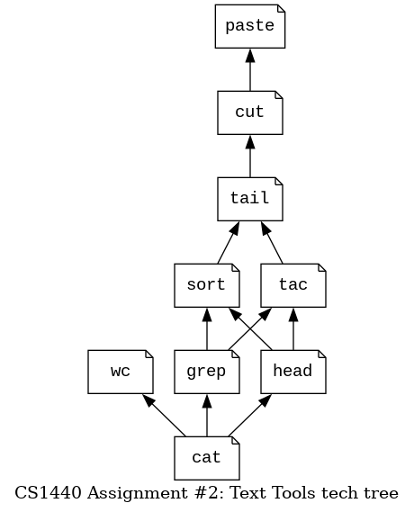

CS1440 - Friday, February 03 - Lecture 11 - Module 1

# Topics:
* [Announcements](#announcements)
* [Fred Brooks Jr.'s "The Tar Pit"](#fred-brooks-jrs-the-tar-pit)
* [Reading files in Python](#reading-files-in-python)
* [How to write the `cat` text tool](#how-to-write-the-cat-text-tool)
* [IDE Debugger Tools](#ide-debugger-tools)
* [Direct Debugging in the IDE](#direct-debugging-in-the-ide)
* [The call stack](#the-call-stack)
* [Another cool tool: the expression evaluator](#another-cool-tool-the-expression-evaluator)

------------------------------------------------------------
# Announcements

## I told ya so!

Remember how I told you about cybersecurity vulnerabilities in PNG image parsers in our last lecture?

*   The OG blog post [ImageMagick: The hidden vulnerability behind your online images](https://www.metabaseq.com/imagemagick-zero-days/)
    *   There is a short video at the bottom of this write-up
*   An AI-generated summary on a news aggregator [Researchers Uncover New Bugs in Popular ImageMagick Image Processing Utility](https://thehackernews.com/2023/02/researchers-uncover-new-bugs-in-popular.html?m=1)

This is a good example of **responsible disclosure**:

0.  The cybersecurity firm Metabase Q discovered a pair of vulnerabilities last year, in October
1.  ImageMagick fixed the bugs on October 22nd and released a new version
2.  Users of ImageMagick have had several months to obtain this updated version
3.  Metabase Q publicized their find in a blog post authored on February 1st, 2023

As soon as Metabase Q published their blog a race began between bad actors and lazy system administrators who haven't patched their systems in 3 months.  **This is why it is so important to regularly update your systems!!!**

In truth, the race began the day that ImageMagick published the broken code in the first place; the above paragraph is true iff *(if and only if)* Metabase Q were the first security researchers to discover this flaw.  It is entirely likely that some shady "security researchers" already knew about this flaw and kept it to themselves.  **This is why it is so important to regularly update your systems!!!**

# Action Items

*   *Today* you should finish phase **1. Design** of the assignment
    *   Be ready to move on to phase **2. Implementation** *early next week*
*	Call on 2 designated questioners
*	Hold a 3-minute stand-up scrum meeting with your team

# Fred Brooks Jr.'s "The Tar Pit"

[The La Brea Tar Pits in California](https://tarpits.org/)

## Who is this Fred Brooks guy, and why should I care?

* [Fred Brooks Jr.](https://www.cs.unc.edu/~brooks/)
* [Wikipedia Article](https://en.wikipedia.org/wiki/Fred_Brooks)

## Discussion: The Tar Pit

Let's spend a few moments now and discuss these questions together.

*   What is Fred Brooks trying to say in this essay?
    -   ...
    -   ...
*   This essay was first published in 1975.  Do you think its message is still relevant today?  Why or why not?
    -   ...
    -   ...
*   What is a program?
    -   ...
*   What is a programming system?
    -   ...
*   What is a programming product?
    -   ...
*   What is a programming systems product?
    -   ...
*   Which bugs are the easiest ones to find?
    -   ...
    -   ...

# [Reading files in Python](../Reading_Files.md)

These are **four** basic operations that all programming languages allow you to perform on files.  We'll use **three** of them in this assignment:

* Open
* Read
* Write (we'll do this in a later assignment)
* Close

## Practice

*   Open `README.md` and obtain a file object
*   Print the file object
*   Read the first 10 bytes of the file into a variable
*   Read the next 20 bytes and print immediately
*   Print a few lines of text from the file, one at a time
*   Print until the end of the file using a for loop
*   Close the file object

*Question*: What do you think will happen if you try to **read** from the closed file object?

See the answers in [file.py](./file.py)

# How to write the `cat` text tool

**This is the exception to the rule that I don't write your assignment code for you in class**

This figure shows that `cat` is the right place to start.  This is because its main loop is the skeleton that many of the other tools are built on.

Let's take a quick look at what a `cat(files)` function will look like.  I promise that you will be underwhelmed.

## Design

*   The `cat` function takes a *list of filenames* as input
*   The files are processed *one-at-a-time*
    *   Each file is opened in its turn
    *   Lines are read and printed, one-by-one
    *   Handle newlines properly!  Don't print extra blanks between lines!
    *   Files are closed after being processed
*   As soon as an invalid file is encountered the entire program may crash
    *   It is best to leave the error message to Python instead of writing my own

## Implementation

[cat.py](./cat.py)

## Testing

The assignment requirements say that it is **okay** for this function to crash when given an invalid filename

What are some test cases we can quickly try?

*   Make sure it actually crashes when I give it a bad file
	*   Non-existent file
	*   A directory
*   Make sure it doesn't crash when given a valid text file
*   What if we give it an empty list? It should print a usage message

Use your imagination to transform `cat` into the other tools.  *Hint: not all of the tools will follow this function's form exactly*

# IDE Debugger Tools

These demo programs contain sorting algorithms that you've already studied.  Let's follow them in the debugger and experience them like you've never seen them before.

Along the way we will learn how to use these debugger tools:

*   Inline debugging annotations
*   Run the program to the cursor
*   Breakpoints
*   Stepping...
    *   ...*over* function calls
    *   ...*into* function calls
    *   ...*into* function calls that *you* wrote yourself
    *   ...*out* of function calls
*   Watching variables
*   Evaluating expressions
*   Changing the values of live variables
*   Navigating call stack frames
*   Interactive Python Console (a.k.a. a REPL within the live program)

### Demo code

*   [Bubble Sort](./50-sorting/bubbleSort.py)
*   [Insertion Sort](./50-sorting/insertionSort.py)
*   [Selection Sort](./50-sorting/selectionSort.py)

# [Direct Debugging in the IDE](../Debugging.md#direct-debugging-in-the-ide)

Just like using `git` or the command line, debugging is a technique that improves with practice.

The best approach is to pick up one new skill at a time and *force* yourself to use it all day long.  It will either become ingrained **or** you will decide that it isn't useful right now.  Repeat until you are satisfied with your level of mastery.

Let's take PyCharm's debugger for a spin on a program that should be familiar to you. 
Through the debugger, you can watch your algorithms unfold in real-time!

[Quadratic Formula in Python](./52-quadratic.py)

*   An equation with zero roots:
    *   `a = 8`
    *   `b = 3`
    *   `c = 10`
*   An equation with one root:
    *   `a = 1`
    *   `b = -10`
    *   `c = 25`
*   An equation with two roots:
    *   `a = 10`
    *   `b = 20`
    *   `c = 4`
*   Our customer complains that this program crashes when `a == 0`
    *   Is it true?
    *   If so, why does it happen?

# The call stack

This program makes function calls.  **Lots** of function calls.  By placing breakpoints at the right point of the program we can observe how the debugger displays the call stack.

*   [Ackermann Function](./54-call-stack/ack.py)

The [Ackermann function](https://mathworld.wolfram.com/AckermannFunction.html) `ack(m, n)` is a recursive function famous for making many, many recursive calls.  Let's see just how many recursive calls it makes.

*   `ack(0, 0)` makes ? calls
*   `ack(0, 1)` makes ? calls
*   `ack(0, 2)` makes ? calls
*   `ack(0, 3)` makes ? calls
*   `ack(1, 0)` makes ? calls
*   `ack(2, 0)` makes ? calls
*   `ack(3, 0)` makes ? calls
*   `ack(4, 0)` makes ? calls
*   `ack(5, 0)` makes ? calls

Spoiler

# Another cool tool: the expression evaluator

At the top of the debugger pane, beside the debugger control buttons (Step Over, Step In, Step Out, ...) is a button that appears as a calculator.  This is the debugger's *expression evaluator*, which allows you to  **Experiment** with arbitrary snippets of code to answer "What If?" questions.

