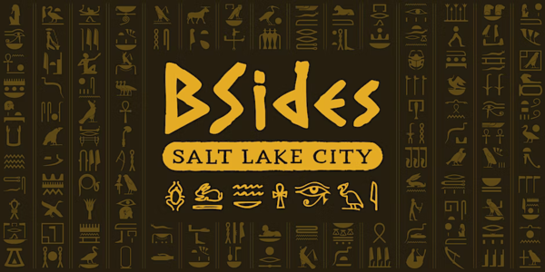

CS1440 - Wednesday, February 15 - Lecture 16 - Module 2

# Topics:
* [Announcements](#announcements)
* [Intermediate Git](#intermediate-git)

------------------------------------------------------------
# Announcements

## BSidesSLC Registration is Open!

*   **When**  Friday, April 14th - Saturday, April 15th
*   **Where** Conference Center at SLCC Miller Campus 9750 S 300 W, Sandy, UT
*   [**BSidesSLC Discord**](https://discord.com/invite/hBcnv9gb73).
*   **Cost**  
    *   General Admission $19 + taxes & fees
    *   General Admission + Electronic Badge $119 + taxes & fees
    *   [Tickets](https://www.eventbrite.com/e/bsidesslc-2023-tickets-527264701917)

### BSidesSLC attendance replaces your lowest assignment score

*   If you attend the conference I will replace your lowest assignment score with **full credit**
    *   It is good enough if you can only make it one of the days, either Friday or Saturday
*   Either find me at the conference or send me a selfie your conference badge
*   *Note:* if you are enrolled in both of my classes this semester, you may replace a low score in only **one** class

## Assigned Reading: "How to Read Documentation"

*   Read the essay "How to Read Documentation" before our meeting on Friday, February 17th and be prepared to discuss it.
*   The article is right here, [in the lecture notes repo](../How_to_Read_Documentation.md)

# Action Items

*   You should be ready to start phase **1. Design** of this assignment *today*
    *   Continue your design work through *the end of the week*
*	Call on 2 designated questioners
*	Hold a 3-minute stand-up scrum meeting with your team

# [Intermediate Git](../../Using_Git/Intermediate_Git.md)

> You learn best by making mistakes.
>
> Git gives you the freedom to make mistakes without consequence.

*Note to Erik: `git clone git@gitlab.cs.usu.edu:erik.falor/primetime`

