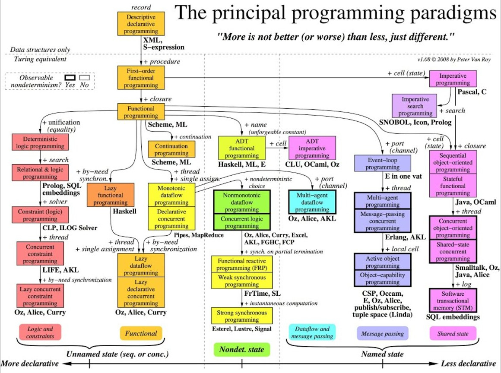

# Eight programming language paradigms emulated in Python3

The problem that programming languages solve is "how do I get this dumb machine
to follow my instructions?"  Programming languages exist to bridge the gap
between your mind and a machine, enabling you to explain to a CPU *what* to do
and *how* to do it.

The reason why there are so many different programming languages is because
there are many, many ways to solve this problem.


## What kinds of programming languages are there?

There are many programming paradigms, among them are imperative, procedural,
structured, modular, functional, declarative, and object-oriented.



[Programming Languages Influence Network](https://exploring-data.com/vis/programming-languages-influence-network/)

Each paradigm approaches the structure of code differently and encourages a
different approach to problem-solving.  Some programming languages were created
to encourage a single paradigm.  Some languages embrace two or more paradigms.
Other languages have started in one paradigm and have, over time, come to be
more strongly associated with a different paradigm.

However, these programming paradigms need not be mutually-exclusive.  Many
languages draw inspiration from and support many paradigms at once, even if
they are most well-known for supporting only one.  Python is one such
multi-paradigm language.  One of its design goals is to combine the best
features of many paradigms in a congruent way, giving the programmer the
freedom to write code however they see fit.


## I broadly separate languages along one dimension: *Imperative vs. Declarative*

There are lots of ways to categorize languages, and not all of them are
cut-and-dried.  I don't want your feelings to be hurt if you think that I have
mischaracterized your favorite language :)

The main distinction that I draw between these two paradigms can be stated in terms
of their primary concerns:

* Imperative languages instruct the computer how the computation should *proceed*
* Declarative languages instruct the computer how the result should *appear*


More information on this topic:

* [Programming Paradigms on Wikipedia](https://en.wikipedia.org/wiki/Programming_paradigm)
* [Category: Programming Language on the C2 wiki](http://wiki.c2.com/?CategoryProgrammingLanguage)


## The Fizz Buzz Program

FizzBuzz is a popular "job interview" program designed to filter out the 99% of
so-called "programmers" who can't.

* [The FizzBuzz job interview puzzle](https://blog.codinghorror.com/why-cant-programmers-program/)
* [FizzBuzz: the Programmer's Stairway to Heaven](https://blog.codinghorror.com/fizzbuzz-the-programmers-stairway-to-heaven/)
* [FizzBuzz Test on C2 WIki](http://wiki.c2.com/?FizzBuzzTest)

> Write a program that prints the numbers from 1 to 100.  But for multiples of
> three print "Fizz" instead of the number and for the multiples of five print
> "Buzz".  For numbers which are multiples of both three and five print
> "FizzBuzz".

```
1
2
Fizz
4
Buzz
Fizz
7
8
Fizz
Buzz
11
Fizz
13
14
FizzBuzz
...
```


The following examples show how the FizzBuzz program may be written in the
Python language following different paradigms.

I will also list the names of well-known languages which are tightly associated
with each paradigm.  You are encouraged to look up their entries on [Rosetta
Code](https://rosettacode.org/wiki/FizzBuzz) to see how many different ways
there are to tell a computer how to do the same thing.


## The Imperative Paradigms

These paradigms are characterized by step-by-step, from-top-to-bottom execution
of instructions.  While most modern programming languages bear vestiges of this
style of programming, they do not hold as strictly to it as did the earliest
programming languages.


0. [Imperative](./Imperative/README.md)
1. [Structured](./Structured/README.md)
2. [Procedural](./Procedural/README.md)
3. [Modular](./Modular/README.md)
4. [Object-Oriented Programming](./OOP/README.md)


#### Best-Practices Object-Oriented FizzBuzz in Java

[FizzBuzzEnterpriseEdition](https://github.com/EnterpriseQualityCoding/FizzBuzzEnterpriseEdition)

LOL calm down, this program is a joke.  It is an example of what happens when
"best-practices" are uncritically followed to their logical conclusion.


## The Declarative Paradigms

Imperative programs are written by describing to the computer *how* a
computation will occur.  Declarative programs, by contrast, describe *what* the
result should look like, leaving the *how* part up to the computer.

This paradigm is influenced by logical thinking and its programs can look like
mathematical proofs.

The programmer combines input data with a description of what a solution might
look like, and the system applies various algorithms to arrive at the correct
solution (typically, search or constraint-satisfaction algorithms are used).
Or, in failing, the system proves that no solution exists.  

The resulting program may not run quickly, but is easier to write and think
about than the imperative equivalent.  This is because all of the *how* details
are not a concern for the programmer who can focus on the *what*.  Depending
upon how the problem is formulated and the types of algorithms used, a
declarative program may not be slow at all.


5. [Functional](./Functional/README.md)
6. [List Comprehensions](./ListComprehensions/README.md)


#### TL;DR

There are lots of ways to categorize programming languages.  You may group them
by feature, by syntax, by purpose, by memory-management strategy, by
multiprocessing strategy, etc.  Be aware that the mainstream programming
languages you'll likely encounter only represent a small, boring slice of the kingdom.

Just remember that *Scheme* is the best language of them all!

```scheme
(import (only srfi-1 iota)) ; `iota` is equivalent to Python's `range()`

(for-each       ; this is a lie - there are no loops in Scheme
  (lambda (n)
    (display    ; print the result of a if/then/else block
      (cond
        ((zero? (modulo n 15)) "FizzBuzz")
        ((zero? (modulo n 5)) "Buzz")
        ((zero? (modulo n 3)) "Fizz")
        (else n)))
    (newline))
  (iota 101))
```

More information on this topic:

* https://en.wikipedia.org/wiki/List_of_programming_languages_by_type
* https://en.wikipedia.org/wiki/List_of_programming_languages_by_type#Curly-bracket_languages
