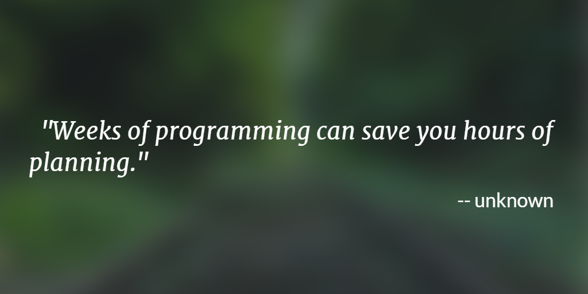

CS1440 - Monday, February 27 - Lecture 20 - Module 3

# Topics:
* [Announcements](#announcements)
* [Introduce Assignment #4: Bingo! UML Design](#introduce-assignment-4-bingo-uml-design)
* [Retrospective: Assignment #3](#retrospective-assignment-3)
* [What you need to gain from assignments](#what-you-need-to-gain-from-assignments)
* [A solution to Assignment #3](#a-solution-to-assignment-3)

------------------------------------------------------------
# Announcements

## Assigned Reading: "Passing the Word"

*   Read the essay "Passing the Word" (Chapter 6) of the book "The Mythical Man-Month" before our meeting on **Friday, March 3rd** and be prepared to discuss it.
*   Instructions for accessing the electronic version of this book are [here](../../Required_Reading_Schedule.md#accessing-ebooks-for-free-through-the-usu-library)

# Action Items

*   Work on phase **0. Requirements Analysis** of the new assignment *today*
    *   Wrap it up *tomorrow*
*	Call on 2 designated questioners
*	Hold a 3-minute stand-up scrum meeting with your team

# Introduce Assignment #4: Bingo! UML Design

In this assignment you will practice Test Driven Development and use UML as a design tool.

## What program should I use to make my UML class diagram?

I don't really mind which drawing program you use to create your UML class diagrams so long as your diagrams:

0. are legible
1. represent correct UML, at least as far as was discussed in class

One tool that's free and easy to get started with is https://diagrams.net/.  Detailed instructions are found in the starter code repo as well as in UML.md under the heading [How do I draw a UML class diagram?](../UML.md#how-do-i-draw-a-uml-class-diagram)

# Retrospective: Assignment #3

**Traffic jams**

Take one sticky note of each color.  Identify up to **three** things that
affected your progress on the Big Data assignment:

0. __Pink__: Things that **stopped** your progress (pretend these are red)
1. __Yellow__: Times you realized you were going **slow**
2. __Green__: Full speed ahead! ideas or techniques that helped you **go**

Describe each event and roughly when it happened to you.

There were 12 days from *Monday, Feb. 13th* to *Friday, Feb. 24th*

# What you need to gain from assignments

The point of programming assignments isn't to write a perfect program.
In fact, I *hope* that you make a lot of mistakes along the way.  

*You must make mistakes in order to learn*

The purpose of assignments is to exercise your *problem-solving skills* to gain
experience.  I want you to make your mistakes with me so you don't make them
in front of your boss and co-workers.

This is why I teach you skills and techniques such as

*   Regular scrum meetings
*   Actively asking questions instead of passively listening
*   Using Git
*   The Python REPL and debugger
*   Rubber Duck debugging
*   UML Class Diagrams

These tools reduce the risk of making mistakes, freeing you to have learning
experiences.

But this can only work if you have plenty of time to fail a few times.
Starting late leaves only enough time to get it right the first time.  If you
must get it right the first time you miss out on most of the value of the
assignment.

*The more times you fail, the better you will learn*

# A solution to Assignment #3 

## This is only *one* way to solve Assignment #3

This is not the only valid way write this program, and it's far from the best
way to solve the problem.

I don't want you to feel bad if your solution is longer than mine.  If your
program works, you succeeded in solving the problem and should feel proud!

A good program is exactly as long as it needs to be to solve the problem at
hand.  No more, no less.

A short program is evidence that the author possesses a clear understanding of
the problem.  When more time is allocated to studying and preparing for an
assignment, fewer lines of aimless code are written.  Programs become cleaner
because your ideas are expressed more forcefully and directly.

Once you have begun writing a program you have locked yourself into a
particular way of doing it.  Are you ready to be that committed to your
"solution"?  Are you sure that you haven't glossed over some important detail
that will save you from writing paragraphs of convoluted code?

*   [Erik's solution](./assn3-sln.py)

