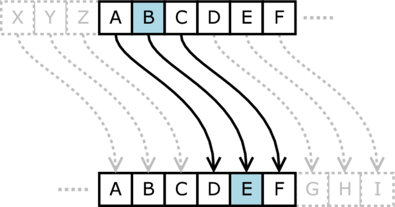

CS1440 - Wednesday, March 01 - Lecture 21 - Module 3

# Topics:
* [Announcements](#announcements)
* [UML: Multiplicity Constraints](#uml-multiplicity-constraints)
* [UML: Inheritance ("is a" relationships)](#uml-inheritance-is-a-relationships)
* [Introduction to Software Testing](#introduction-to-software-testing)
* [Writing and Running Unit Tests in Python](#writing-and-running-unit-tests-in-python)
* [Ad-Hoc Testing vs. Unit Testing](#ad-hoc-testing-vs-unit-testing)

------------------------------------------------------------
# Announcements

## BSidesSLC Registration is Open!

*   **When**  Friday, April 14th - Saturday, April 15th
*   **Where** Conference Center at SLCC Miller Campus 9750 S 300 W, Sandy, UT
*   [**BSidesSLC Discord**](https://discord.com/invite/hBcnv9gb73).
*   **Cost**  
    *   General Admission $19 + taxes & fees
    *   General Admission + Electronic Badge $119 + taxes & fees
    *   [Tickets](https://www.eventbrite.com/e/bsidesslc-2023-tickets-527264701917)

### BSidesSLC attendance replaces your lowest assignment/exam score

*   If you attend the conference I will replace your lowest assignment/exam score with **full credit**
    *   It is good enough if you can only make it one of the days, either Friday or Saturday
*   Either find me at the conference or send me a selfie your conference badge
*   *Note:* if you are enrolled in both of my classes this semester, you may replace a low score in only **one** class

## Assigned Reading: "Passing the Word"

*   Read the essay "Passing the Word" (Chapter 6) of the book "The Mythical Man-Month" before our meeting on **Friday, March 3rd** and be prepared to discuss it.
*   Instructions for accessing the electronic version of this book are [here](../../Required_Reading_Schedule.md#accessing-ebooks-for-free-through-the-usu-library)

# Action Items

*   You should be ready to start phase **1. Design** of this assignment *today*
    *   Continue your design work through *the end of the week*
*	Call on 2 designated questioners
*	Hold a 3-minute stand-up scrum meeting with your team

# [UML: Multiplicity Constraints](../UML.md#multiplicity-constraints)

In some systems it is important to document the number of objects that participate in relationships.

A multiplicity constraint indicates how many times an object from one class can be associated with objects of another class

# [UML: Inheritance ("is a" relationships)](../UML.md#inheritance-is-a-relationships)

The Inheritance relationship enables your code to capture the idea that two objects aren't exactly the same, but are similar enough to share common elements and methods.

We'll cover this idea in much more depth in a future module.

For now it is enough to understand that inheritance expresses the idea that one kind of class is a kind of another class.

# Introduction to Software Testing

We want to make software better, but where should we begin?  We can't debug
bugs we don't know about.  Therefore, the first thing to do is to *test* our
programs so we know what we're getting into.

## Writing naïve tests for [rotate.py](./rotate.py)

Small and simple programs are easy enough to run and manually check the
outcome.  However, you will quickly reach the point where that just isn't a
good use of your time.  You should do the usual lazy programmer thing and write
a program to test your program; testing software is one of those things that
greatly benefits from automation.

`rotate.py` implements a rotation cipher (a.k.a. Caesar cipher) where letters
in a message are "rotated" by one or more positions to yield an encrypted
message:

This file contains two functions:

0.  `rotate(c, n)` rotates a single character `c` by `n` positions
1.  `rotateLine(line, n)` rotates each character in a string by `n` positions

I *think* this version has some bugs, but it's hard to say for sure.  Let's add
some code that exercises the functions and see what problems are revealed.

*   What made those two functions hard to test?
*   How easy is the test code to understand?
*   Are the tests themselves bug-free?

# [Writing and Running Unit Tests in Python](../UnitTests.md)

Ideally all of our code is able to be tested automatically, beginning from functions and building up to complete integration tests.

While we should strive to write code that is easily testable, it is easier to achieve when code is designed with testing in mind.  If we do it the other way around, after the application code is produced some effort is necessary to put it into a testable state.  By that point you've probably already blown your deadline; this is how the testing phase falls by the wayside in so many projects.

# Ad-Hoc Testing vs. Unit Testing

By adding tests to [rotate.py](./rotate.py), I located and fixed a few bugs.

However, the code I wrote to do the testing itself had some bugs, and it took some work to make them right.  Now, I'm not too confident about my test code.

*   What's the solution, then?  To write more tests to test my tests?
*   Where does it end?

The correct answer to this is to impose some order and discipline on the process.  The code I wrote to test `rotate.py` was not very disciplined, nor well-organized.  It's almost like I just made it up as I went along...

#### Ad-hoc Testing

Informal, undocumented or unplanned software testing.

Instead of writing lines upon lines of my own janky code to test my other janky code, I might incorporate a well-designed and thought-out library into my project to help me get my tests on track.

A **unit testing** framework provides tools and structure that helps manage complexity.  There are lots of great unit testing libraries to choose from in nearly every programming language that you'll encounter.  In Python there are at least 4 quality libraries.  I'll use the one that comes from the Python Standard Library, `unittest`.

`import unittest` into `rotate.py` and see how it improves the situation.

## [Unit Test assertions](../UnitTests.md#unit-test-assertions)

When considering how to probe the boundaries of your functions it is helpful to know what sorts of tests are available.  I have compiled a brief list of assertion methods made available by the `unittest.TestCase` class for you in this module's documentation.

I have also written an example program that shows yow how the assertion methods are used: [assertions.py](../Assertions.py)

