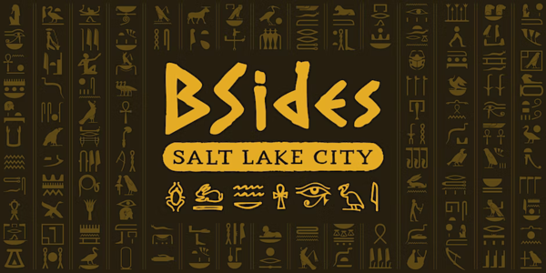
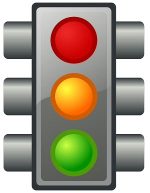

CS1440 - Wednesday, March 01 - Lecture 21 - Module 3

# Topics:
* [Announcements](#announcements)
* [Top comments from Monday's retrospective](#top-comments-from-mondays-retrospective)
* [UML: Multiplicity Constraints](#uml-multiplicity-constraints)
* [UML: Inheritance ("is a" relationships)](#uml-inheritance-is-a-relationships)
* [Real-world UML class diagrams](#real-world-uml-class-diagrams)
* [Introduction to Software Testing](#introduction-to-software-testing)

------------------------------------------------------------
# Announcements

## BSidesSLC Registration is Open!

*   **When**  Friday, April 14th - Saturday, April 15th
*   **Where** Conference Center at SLCC Miller Campus 9750 S 300 W, Sandy, UT
*   [**BSidesSLC Discord**](https://discord.com/invite/hBcnv9gb73).
*   **Cost**  
    *   General Admission $19 + taxes & fees
    *   General Admission + Electronic Badge $119 + taxes & fees
    *   [Tickets](https://www.eventbrite.com/e/bsidesslc-2023-tickets-527264701917)

### BSidesSLC attendance replaces your lowest assignment/exam score

*   If you attend the conference I will replace your lowest assignment/exam score with **full credit**
    *   It is good enough if you can only make it one of the days, either Friday or Saturday
*   Either find me at the conference or send me a selfie your conference badge
*   *Note:* if you are enrolled in both of my classes this semester, you may replace a low score in only **one** class

## Assigned Reading: "Passing the Word"

*   Read the essay "Passing the Word" (Chapter 6) of the book "The Mythical Man-Month" before our meeting on **Friday, March 3rd** and be prepared to discuss it.
*   Instructions for accessing the electronic version of this book are [here](../../Required_Reading_Schedule.md#accessing-ebooks-for-free-through-the-usu-library)

# Action Items

*   You should be ready to start phase **1. Design** of this assignment *today*
    *   Continue your design work through *the end of the week*
*	Call on 2 designated questioners
*	Hold a 3-minute stand-up scrum meeting with your team

# Top comments from Monday's retrospective

## __Red__: Things that **stopped** your progress

## __Yellow__: Times you realized you were going **slow**

## __Green__: Full speed ahead! ideas or techniques that helped you **go**

# [UML: Multiplicity Constraints](../UML.md#multiplicity-constraints)

In some systems it is important to document the number of objects that participate in relationships.

A multiplicity constraint indicates how many times an object from one class can be associated with objects of another class

# [UML: Inheritance ("is a" relationships)](../UML.md#inheritance-is-a-relationships)

The Inheritance relationship enables your code to capture the idea that two objects aren't exactly the same, but are similar enough to share common elements and methods.

We'll cover this idea in much more depth in a future module.

For now it is enough to understand that inheritance expresses the idea that one kind of class is a kind of another class.

# [Real-world UML class diagrams](https://www.uml-diagrams.org/class-diagrams-examples.html)

I show these examples of UML class diagrams to give you an idea of what a UML class diagram that describes part of a real-world program looks like.  Your diagrams do not need to be this complex or detailed!  Our Bingo Card Generator is far more simple than these systems.

It takes *many* UML class diagrams to fully describe a real-world system.  

The Unified Modeling Language defines other kinds of diagrams besides class diagrams.  A class diagram describes only one aspect of a system.  Other diagrams are used to explain how various parts of the system interact with each other while the program is running, and some are used to describe all of the ways a user might use a system, etc.

## Diagrams of interest:

*   Illustration of dependencies, public/private access modifiers, data types
    *   [Sentinel HASP Classes of Aladdin Package](https://www.uml-diagrams.org/software-licensing-class-diagram-example.html)
*   Illustration of associations, multiplicity constraints
    *   [Online Shopping](https://www.uml-diagrams.org/examples/online-shopping-domain-uml-diagram-example.html)
        *   This diagram uses the *composition* symbol for some of its associations; we won't be that strict in Bingo!
*   Illustration of associations, multiplicity constraints, relationship descriptions
    *   [DICOM Model of the Real World](https://www.uml-diagrams.org/dicom-real-world-uml-class-diagram-example.html)

### Symbology Glossary

*   `+` indicates *public* accessibility
*   `-` indicates *private* accessibility
*   `#` indicates *protected* accessibility
*   `^` denotes an *inherited* member
    *   This data member belongs to this class because it inherits from an ancestor class
*   `/` denotes a *derived* member
    *   This member's value is computed from other members
*   Open (white) diamond indicates an "Aggregation" association
    *   The diamond is attached to the "parent" class
    *   Instances of the child class may exist independently of its parent, and may be attached to other parents/aggregates
        *   For example Cars & Wheels
        *   Wheels can be removed from one car and attached to another, or may be kept in the garage until the weather improves
*   Closed (black) diamond indicates an "Composition" association
    *   The diamond is attached to the "parent" class
    *   Instances of the child class may **not** exist independently of its parent 
        *   For example, you and your brain
        *   You cannot live without your brain, and vice-versa

# Introduction to Software Testing

We want to make software better, but where should we begin?  We can't debug
bugs we don't know about.  Therefore, the first thing to do is to *test* our
programs so we know what we're getting into.

## Writing tests for [rotate.py](./rotate.py)

Small and simple programs are easy enough to run and manually check the
outcome.  However, you will quickly reach the point where that just isn't a
good use of your time.  You should do the usual lazy programmer thing and write
a program to test your program; testing software is one of those things that
greatly benefits from automation.

`rotate.py` contains a bit of code that should be familiar to you.  I *think*
it doesn't quite work right, but it's hard to say for sure.  Let's add some
code to test it out and see what problems we can find along the way.

*   How do tests improve the dependability of this code?
*   What is the difference between a useful test and one that is not helpful?
*   How might we re-write these ad-hoc tests using the `unittest` Python library?

