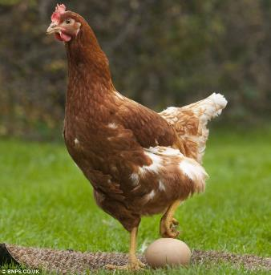
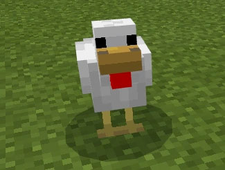

# Objects and Classes

*   [Real-world objects](#real-world-objects)
*   [Software Objects](#software-objects)
*   [Classification](#classification)
*   [Finding and Designing Good Classes](#finding-and-designing-good-classes)


## Real-world objects

In the real world, what do you consider an object?

*   ...
*   ...

<details>
<summary><h3>Spoiler Alert!</h3></summary>

*   An **object** is anything that has a boundary in *space* or *time*
    *   This means they are *distinct* from each other
    *   Every object is an unique entity in the universe, distinguished by its properties
    *   Many of those properties may not be observable or interesting to a software system
    *   In a software system, even if two objects have the same known properties, they are not the "same" object
*   Objects also have *state* and *behavior*
    *   An object's state include anything and everything that describes it or its mode of operation
    *   An object's behavior are the things it does in reaction to stimulus or on its own
*   An object may be made of other objects
    *   My car includes an *engine* and four distinct *tires*
    *   The engine is made from an engine block, pistons, valves, cams, a crankshaft, a flywheel, etc.
    *   Each tire is made of layers of rubber, nylon and steel, etc.

</details>

As an example from the real world, **Lucy the chicken**




#### State 
*   Name: Lucy
*   Eggs Laid: 370
*   Color: Brown & White
*   Age: 2 years
*   Molting: not right now
*   Health: I think so? What does a sick chicken even look like?
*   Alive: yes
*   Has Eaten Recently: yes (fed her this morning!)
*   Location: My backyard


#### Behavior
*   Cluck
*   Wander
*   Eat
*   Drink
*   Poop
*   Lay an egg


---

## Software Objects

In a software system, what is an object?

*   ...
*   ...


<details>
<summary><h3>Spoiler Alert!</h3></summary>

*   Conceptually, a software object simulates a real-world object
*   A software object has
    *   State, represented by *attributes*
        *   a.k.a. properties, data members
    *   Behavior, represented by *methods*
*   You can make the software simulation as true-to-life as you desire by giving it the right mixture of state and behavior
*   In most software systems, however, objects do not correspond to any tangible real-world thing:
    *   `IntegerArgumentMarshaller`
    *   `SpringConfiguredConfiguration`
    *   `AbstractValidatingLambdaMetafactory`
    *   `HttpsURLConnectionLocalCertificateChain`
    *   `SpinnerPanelSpinnerFormattedTextFieldPainter`
    *   `InternalFrameTitlePaneMaximizeButtonWindowNotFocusedState`
    *   `NewModelByteBufferWavetableModelByteBufferAudioFormatFloat` *(this may be the world's strongest refutation against CamelCase)*
*   Software Objects are unique, distinguished by their own attributes and their location in memory (address)
    *   This is their boundary in *space* and *time*
    *   Even if two objects happen to have exactly the same attributes, they are stored in different locations, and the computer can tell them apart
*   Objects may be made up of other objects
    *   Car Example: A car in a video game is an object unto itself, but may be made up of an *engine* and four distinct *tires*.
        *   The engine of the video game car may be an object of its own
        *   Instead of being made up of a virtual engine block, virtual pistons, valves, cams, etc., it may have numeric properties that influence the car's overall performance
        *   The number and kinds of these properties can contribute to the game being more or less realistic
        *   Ditto for the four tires - these may be four separate instances of a tire class
    *   Chicken Example: Lucy the chicken lays an egg
        *   That egg could be its own type of object with its own attributes and behaviors...
        *   ...or the egg may just be a number.  It depends on how realistic you want the game to be

</details>


How many objects do you think there can be in a software system?

*   ...
*   ...

What limits the number of objects that can exist?

*   ...
*   ...

Consider a system for managing your favorite songs

*   What would be some meaningful objects?
    *   ...
*   How many objects would the typical user have?
    *   ...
*   How do the objects come and go in this system?
    *   ...


Consider a relaxing crafting game with chickens

*   What would a chicken object look like here?
    *   ...
*   How many chickens would the game need to keep track of?
    *   ...
*   What would these chickens be capable of doing?
    *   ...
*   Besides poultry, what other objects might exist?
    *   ...
*   How would these other objects *differ* from chicken objects?
    *   ...
*   In what ways would they be *the same*?
    *   ...


How do programmers manage the complexity caused by having lots of software objects?  *This is the central question of object-oriented design.*


### Example: a Minecraft chicken

As an example from the digital world, a **Minecraft chicken** *(Notch, please don't sue me!)*:



#### State

*   Name: Lucy
*   Eggs Laid: 12
*   ~~Color: White~~ (all chickens in Minecraft are white, because they share the same skin)
*   Age: 288,522 ticks
*   ~~Molting: None~~ (chickens in this mod don't molt, you must kill them for their feathers)
*   Health: 100
*   Max Health: 100
*   ~~Alive: True~~ (don't need a separate attribute for this; while `Health > 0` the Chicken is alive)
*   Has Eaten Recently: False (n.b. can't poop on an empty stomach!)
*   Location: (0.0, 65.0, 0.0)


#### Behavior

*   `cluck()`
*   `eat()`
*   `get_location()`
*   `get_name()`
*   `heal()`
*   `isalive()`
*   `lay_an_egg()`
*   `lay_some_eggs()`
*   `poop()` (I'm running a mod that enables this behavior)
*   `take_damage()`
*   `wander()`


One might define a Chicken in code like this *(pretend for a moment that Minecraft is written in Python instead of Java)*:

```python
class Chicken():
    def __init__(self, name, x=0.0, y=65.0, z=0.0):
        self.name = name
        self.eggs_laid = 0
        self.max_health = 100
        self.health = self.max_health
        self.has_eaten = False
        self.location = [x, y, z]

    def cluck(self):
        if self.isalive():
            print(f"{self.name} says 'cluck cluck cluck.'")
        else:
            print(f"{self.name} is very quiet.")

    def eat(self):
        if self.isalive():
            print(f"{self.name} pecks at the food.")
            self.heal(25)
            self.has_eaten = True
        else:
            print(f"I don't think that {self.name} is hungry anymore...")

    def get_location(self):
        return self.location

    def get_name(self):
        return self.name

    def heal(self, hp):
        if self.isalive(): # there are no Zombie Chickens in this mod
            self.health += hp
            if self.health > self.max_health:
                self.health = self.max_health

    def isalive(self):
        return self.health > 0

    def lay_an_egg(self):
        if not self.isalive():
            return
        self.eggs_laid += 1
        if self.eggs_laid == 1:
            print(f"{self.name} just laid her first egg. Congratulations!")
        elif self.eggs_laid == 3:
            print(f"You can make an omelete with this many eggs (maybe don't tell {self.name})")
        elif self.eggs_laid == 12:
            print(f"That's a dozen eggs!  Good work, {self.name}!")
        elif self.eggs_laid == 13:
            print(f"A baker's dozen!")
        elif self.eggs_laid == 18:
            print(f"{self.name}, we're gonna need a bigger carton.")
        elif self.eggs_laid == 60:
            print(f"Five dozen eggs! Somebody get {self.name} a blue ribbon!")
        elif self.eggs_laid == 72:
            print(f"That'll do for now, {self.name}.")
        elif self.eggs_laid == 108:
            print(f"Seriously, knock it off, {self.name}.")
        else:
            print(f"{self.name} just laid another egg.")
        return self.eggs_laid  # for now, an Egg is simply an integer

    def lay_some_eggs(self, eggCount):
        if eggCount <= 0: return
        eggs = []
        for _ in range(eggCount):
            eggs.append(self.lay_an_egg())
        return eggs

    def poop(self):
        if self.isalive() and self.has_eaten:
            print(f"{self.name} just practiced Python Object Oriented Programming!")
            print(f"You probably need to clean up after {self.name}.") 
            self.has_eaten = False

    def take_damage(self, hp):
        if self.isalive():
            self.health -= hp
            self.cluck()

    def wander(self):
        if self.isalive():
            print(f"{self.name} just wandered a bit.")
        else:
            print(f"{self.name} isn't going anywhere.")
```


In another module you can use the `Chicken` class to create a `Chicken` object:

```python
from Chicken import Chicken

# create a Chicken with the name Lucy
lucy = Chicken('Lucy')

# Ask Lucy to perform the behaviors defined for her
lucy.get_name()
lucy.get_location()
lucy.cluck()
lucy.isalive()
lucy.lay_some_eggs(18)
lucy.eat()
lucy.take_damage(100)
lucy.eat()
```

Try this in the REPL and see what happens!

This Minecraft chicken, like a real chicken, can cluck, wander, poop, and lay an egg (amongst other things).  It also has a quantity of hit points, a location, an age, and a name.


## Classification

*Classification* **(verb)** is the process of grouping related pieces of data together with behaviors.

A *classification* **(noun)** or "class" is a set of related objects that share the same kinds of attributes and behaviors.

A class, e.g., `Chicken`, is a set of objects (instances).

When you engage in *classification*, you are searching for the *core set* of attributes and behaviors that apply to **all** members of the class.

*   You will encounter things that apply only to a small minority of members
*   Decide if these are important enough to be considered
*   Certain attributes are shared by all objects in a class:
    *   e.g. all chickens have an "age", a "name", a location, etc.
*   Some attributes don't apply to **every** member of the class, and are excluded from consideration
    *   I don't know why, but my chicken is the only one I've met that doesn't cluck.  Is this important enough for me to write extra code to handle this circumstance?
*   It will suffice if all chickens are white
    *   All the objects in a class have the same set of common behaviors
    *   All chickens can eat, poop, cluck and lay eggs
*   Some objects in a class can or cannot do a particular behavior
    *   Most of the chickens will wander around, but one or two just like to stay put
    *   Some chickens fight with one another; is this important enough to implement?


### Software Classes

*   When creating software, use *classification* during the design phase to better understand the problem and to help structure a solution
    *   At the design phase this helps you set *boundaries* around what your objects are expected to do
*   You want to assign responsibilities to classes such that each responsibility is handled by as few classes as possible
    *   Ideally each class has *one* responsibility, and it is the only class that serves it
*   Organize and manage objects with classes, such that
    *   The class has a meaningful and cohesive purpose
    *   The name of the class accurately and concisely represents a typical instance of the class
    *   The attributes are closely related to the purpose of the class
    *   The methods rely primarily on the attributes of the class for their computations
        *   i.e. minimize the number of parameters needed to perform their work


### Python Classes

*   The keyword `class` in Python comes from the idea of *classification*
*   Objects are *instances* of classes, but Python does not automatically keep track of each object in a class
    *   When you create a `Chicken` object, it's up to you to keep it in a variable
        *   If you don't, it is lost!
    *   In other words, you cannot ask Python to give you a list of all of the objects of type `Chicken` that have been created in your program
*   In Python, a class defines
    *   Attributes that represent the common types of data needed by the instances of the class
    *   The methods that can be apply to all instances of the class
*   Python classes can be thought of a blueprints from which new instances of the class are created
    *   This reduces the amount of code needed to create objects through *code reuse*
        *   Semi-trucks, cars, bicycles and wheelbarrows all need tires, though in different quantities
        *   Instead of writing four different tire-creation functions, they can all use the same one


### What's the difference between a _Class_ and a _Module_ in Python?

*   A **Module** in Python:
    *   Is a Python source code file (name ends in `.py`)
    *   Contains variables, functions and classes
    *   A module may be run as a *program* (e.g. `python main.py`, `__name__ == '__main__'`)
    *   A module may be imported into another module (`import Chicken`)
*   A **Class** in Python:
    *   Is declared with the `class` keyword
    *   Is a datatype unto itself - is distinct from other types of data (integers, strings, other kinds of objects)
    *   Associates pieces of data (attributes) with 
    *   Contains *methods*, which are functions indented 4 spaces in from the class definition, and whose first parameter which represents the object itself is traditionally named `self`
    *   Typically defines an *initializer* method named `__init__`
        *   The initializer method sets up the object's *attributes* with their initial values
*   In the line of code `from Chicken import Chicken`
    1.  The first occurrence of the word `Chicken` refers to the **module** `Chicken.py`
    2.  The second occurrence of the word `Chicken` refers to the **class** `Chicken`


## Finding and Designing Good Classes

The essence of writing an object-oriented program is to design "good" classes, and use them to build up your system.  A "good" class:

*   has a meaningful and cohesive purpose
*   its name accurately and concisely represents a typical instance of the class
*   its attributes are closely related to its purpose
*   its methods rely primarily on its own attributes for their computations


### Designing classes

*   Think about the purpose of the class in the system
    *   If is too complicated or diverse, consider splitting the class
    *   The number of instances that will eventually be created from the class is *not* important
    *   The number and complexity of attributes and methods *is* important
    *   If the class is trivial, consider merging it into a closely related class
*   Give the class a *descriptive but concise* name
    *   If you have trouble naming it, you may need to reconsider its purpose
*   Consider the types of attributes (data members) that are common to all instances of the class
*   Consider the methods (behaviors) that are common to all instances of the class


### Finding classes

You can "find" the classes lurking in a system by carefully studying the *requirements specification* provided by the customer/project manager.

There are two approaches you can take:

1.  Finding classes via **noun search**
    *   Document a high-level description of the system from a user’s perspective
    *   Look for key nouns and noun phrases and consider them as potential classes
    *   Discard any that are outside the scope of work for the system your are building
2.  Finding potential classes by grouping **features and logic**
    *   Consider the requirements of the system
    *   Look at the required features or chunks logical, and think about what is going to perform those operations
    *   Group closely related features together
    *   If they don’t already belong to a class, consider whether they could represent a new class of objects whose responsibility it is to perform those operations

Finding and designing good classes is a critical, but challenging skill to learn.  It just takes time and practice!
