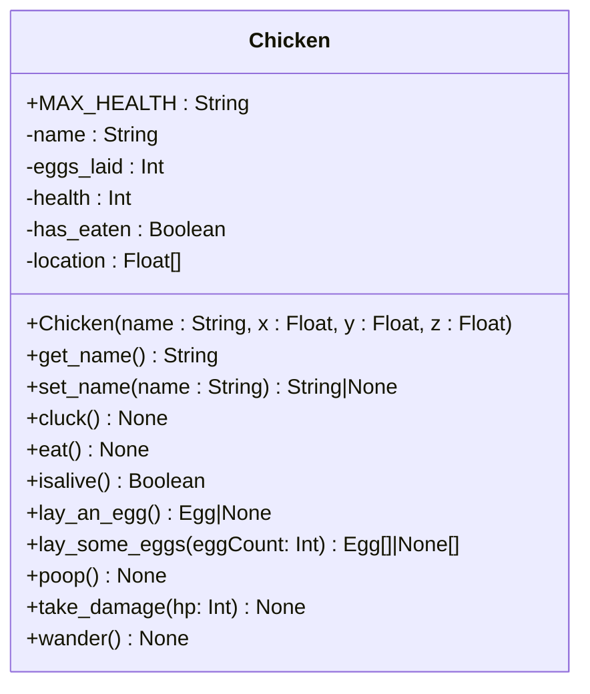
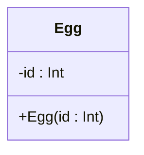
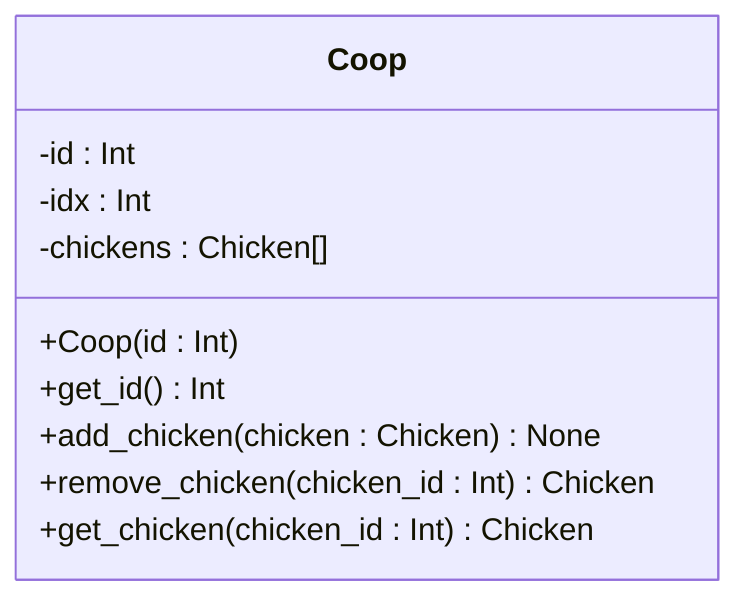
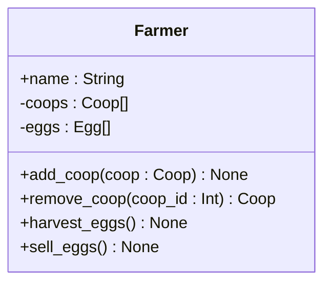
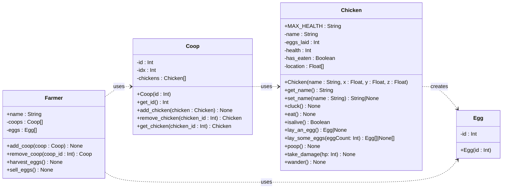
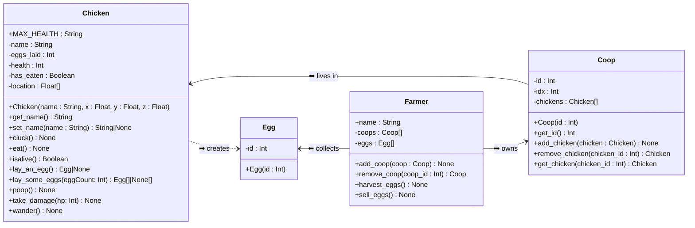

# The Unified Modeling Language

*   [What is UML?](#what-is-uml)
*   [Classes in UML](#classes-in-uml)
*   [How do I draw a UML class diagram?](#how-do-i-draw-a-uml-class-diagram)
*   [What are we trying to accomplish with a UML Class Diagram?](#what-are-we-trying-to-accomplish-with-a-uml-class-diagram)
*   [Dependencies](#dependencies)
*   [(Sidebar) Programming Language Identifier Naming Conventions](#sidebar-programming-language-identifier-naming-conventions)
*   [Converting UML Classes into Python Classes](#converting-uml-classes-into-python-classes)
*   [Links Between Objects](#links-between-objects)
*   [Associations in UML](#associations-in-uml)
*   [Difference Between Associations and Dependencies](#difference-between-associations-and-dependencies)
*   [Navigability of Associations](#navigability-of-associations)
*   [Multiplicity Constraints](#multiplicity-constraints)
*   [Inheritance ("is a" relationships)](#inheritance-is-a-relationships)


## What is UML?

The **Unified Modeling Language** (UML) is a graphical language used by programmers to concisely and precisely convey information about their software systems to each other.

Like any other language, UML has rules that must be followed so everybody can understand each other.

*   Each shape and line in UML has a specific meaning
*   Don't add an element to your diagram unless you are *positive* that you understand what it means

UML defines many types of diagrams.  In this course we use only one kind: **Class Diagrams**.


### What is a UML class diagram?

*   A way to describe the structure of a program that is programming language agnostic
*   A graphical representation of Object-Oriented classes including their attributes and methods
    *   A description of relationships between classes/objects in such a program


## Classes in UML

*   For Class Diagrams used at DuckieCorp, a class must be drawn this way:
    *   A box with 90° corners
        *   Other boxes designate different kinds of entities besides classes
    *   The top compartment of the box contains the name of the class
        *   This compartment is *always* required
        *   Use a noun or noun phrase that accurately represents a typical object in the class
    *   The middle compartment contains *attributes* of the class
        *   Some diagrams leave this off - at DuckieCorp, we **always** include it unless a class has *no* attributes
        *   Attributes are written as `visibility name : type`
        *   In Python, visibility is either *private* or *public*
            *   Private attributes are marked with a minus sign `-`
            *   Public attributes are marked with a plus sign `+`
        *   *Name* should be a noun or noun phrase that describes the property the attribute will capture.
        *   The data type can be any standard data type or the name of another class
    *   The bottom compartment is for *methods* of the class
        *   Some diagrams leave this out - at DuckieCorp, we **always** include it unless a class has *no* methods
        *   Methods are written as `visibility name(parameters) : return_type`
        *   As with attributes, method visibility is either *private* `-` or *public* `+`
        *   *Name* should be a verb or verb phrase that describes the effect of calling the method
        *   *Parameters* are a comma-separated list of variables between parentheses `( )`, in the format `name : type`
        *   The data type returned by a method follows the parameter list, separated by a colon `:`

This is what the Chicken class from [Objects_and_Classes.md](./Objects_and_Classes.md#class-chicken) looks like in UML:




<details>
<summary>Python code for comparison</summary>

```python
class Chicken():
    MAX_HEALTH = 100
    def __init__(self, name, x=0.0, y=65.0, z=0.0):
        self.__name = name
        self.__eggs_laid = 0
        self.__health = self.MAX_HEALTH
        self.__has_eaten = False
        self.__location = [x, y, z]

    def get_name(self):
        return self.__name

    def set_name(self, name):
        if len(name) < 20:
            self.__name = name

    def cluck(self):
        if self.isalive():
            print(f"{self.__name} says 'cluck cluck cluck.'")
        else:
            print(f"{self.__name} is very quiet.")

    def eat(self):
        if self.isalive():
            print(f"{self.__name} pecks at the food.")
            self.heal(25)
            self.__has_eaten = True
        else:
            print(f"I don't think that {self.__name} is hungry anymore...")

    def isalive(self):
        return self.__health > 0

    def lay_an_egg(self):
        if not self.isalive():
            return
        self.__eggs_laid += 1
        if self.__eggs_laid == 1:
            print(f"{self.__name} just laid her first egg. Congratulations!")
        elif self.__eggs_laid == 12:
            print(f"That's a dozen eggs!  Good work, {self.__name}!")
        elif self.__eggs_laid == 13:
            print(f"A baker's dozen!")
        elif self.__eggs_laid == 18:
            print(f"{self.__name}, we're gonna need a bigger carton.")
        elif self.__eggs_laid == 60:
            print(f"That'll do for now, {self.__name}.")
        elif self.__eggs_laid == 72:
            print(f"Seriously, knock it off, {self.__name}.")
        else:
            print(f"{self.__name} just laid another egg.")
        return Egg(self.__eggs_laid)

    def lay_some_eggs(self, eggCount):
        if eggCount <= 0:
            return
        return [self.lay_an_egg() for _ in range(eggCount) ]

    def poop(self):
        if self.isalive() and self.__has_eaten:
            print(f"{self.__name} just practiced Python Object Oriented Programming!")
            self.__has_eaten = False

    def take_damage(self, hp):
        if self.isalive():
            self.__health -= hp
            self.cluck()
        else:
            print("It's dead, Jim")

    def wander(self):
        if self.isalive():
            print(f"{self.__name} just wandered a bit.")
        else:
            print(f"{self.__name} isn't going anywhere.")
```

</details>


Here are some other classes that exist in this Minecraft mod.  Compare the Python code to the UML diagram.  Notice that I do not include the parameter `self` in the UML class diagrams.  That is a Python-centric feature of code that doesn't need to be included in UML diagrams.

#### class Egg



<details>
<summary>Python code for comparison</summary>

```python
class Egg:
    def __init__(self, id):
        self.__id = id
```

</details>


#### class Coop

The `Coop` class uses two Python-specific dunders `__iter__` and `__next__` to enable its use in a `for` loop.  Because that's a Python-specific implementation detail, I've chosen to leave it off my UML diagram.



<details>
<summary>Python code for comparison</summary>

```python
class Coop:
    def __init__(self, id):
        self.__id = id
        self.__idx = 0
        self.__chickens = []

    def get_id(self):
        return self.__id

    def add_chicken(self, chicken):
        self.__chickens.append(chicken)

    def remove_chicken(self, chicken_id):
        return self.__chickens.pop(chicken_id)

    def get_chicken(self, chicken_id):
        return self.__chickens[chicken_id]

    # These two dunders enable Coops to work in `for` loops, like this:
    #   for chicken in coop:
    def __iter__(self):
        self.__idx = 0
        return self

    def __next__(self):
        if self.__idx >= len(self.__chickens):
            raise StopIteration
        c = self.__chickens[self.__idx]
        self.__idx += 1
        return c
```

</details>


#### class Farmer



<details>
<summary>Python code for comparison</summary>

```python
class Farmer:
    def __init__(self, name):
        self.name = name
        self.__coops = []
        self.__eggs = []

    def add_coop(self, coop):
        self.__coops.append(coop)

    def remove_coop(self, coop_id):
        return self.__coops.pop(coop_id)

    def harvest_eggs(self):
        batch = []
        for coop in self.__coops:
            for chicken in coop:
                egg = chicken.lay_an_egg()
                if egg is not None:
                    batch.append(egg)
        print(f"Farmer {self.name} harvested {len(batch)} more eggs")
        self.__eggs.extend(batch)
        print(f"That makes {len(self.__eggs)} eggs all together!")
        
    def sell_eggs(self):
        print(f"Farmer {self.name} sold {len(self.__eggs)} eggs at the market")
        self.__eggs.clear()
```

</details>

These classes are defined in the file [Chicken.py](./Chicken.py) in this directory.  You can test them in the REPL by running `$ python -i Chicken.py`.


## How do I draw a UML class diagram?

You may draw your UML class diagram any way you prefer, so long as they are *clean*, *legible* and *correct*.

*   *Clean*
    *   Straight lines
    *   Sharp corners
    *   All lines of boxes connect
    *   Text runs in parallel lines
*   *Legible*
    *   Text is easy to read
    *   Neutral colors that don't distract
    *   Minimize the number of crossed lines
*   *Correct*
    *   Your diagram is a UML Class Diagram instead of another type of diagram
    *   Only valid UML Class Diagram elements are used
        *   You only need use the elements shown in the lecture notes; no more, no less!

You can draw your class diagrams by hand, but if you do that they need to look *really* good.


### Drawing UML Class Diagrams in Diagrams.net

[Diagrams.net](https://app.diagrams.net/) is a simple web app for making diagrams.  It is free, easy to use, and good enough for this project.

0.  Open the website
1.  Click "Create New Diagram"
2.  Select the "Basic" "Blank Diagram"
    *   Don't use one of the pre-defined UML templates, as they start with a bunch of placeholder junk that you'll just end up deleting
3.  Find the UML section in the accordion list on the left-hand side of the screen
    *   There are multiple shapes available with names like `Class`, `Class 2`, `Class 5`, etc.
    *   Make sure that your classes have 3 sections as described in our lectures:
    *   ```mermaid
        classDiagram
        direction LR
        class Classic {
            +field0 : type0
            +field1 : type1
            +method0() type0
            +method1() type1
        }
        ```
4.  Download your diagram as a PDF or PNG by clicking **File** -> **Export**.
    *   **Do not select _Transparent Background_**
5.  Click **Download** to create the file.  You may be redirected to a new tab where you will need to save the file.


## What are we trying to accomplish with a UML Class Diagram?

*   Analyze or design an Object-Oriented system
*   Think about each individual part of a program
*   Consider how each component interacts with its peers in the system

What you are trying to capture in this diagram is the large-scale *structure* of your system.  UML class diagrams aren't particularly suited to describing the small, fiddly details of a complicated system.  Apart from assigning names to behaviors, a class diagram has *nothing* to say about *how* a method will achieve its purpose.

This is by design.

Use the UML class diagram as a tool to separate the "Essence" of the Bingo!  Cards system from the "Accidental" details.


### What a UML Class Diagram is *NOT*

*   A flowchart
*   A way to understand the runtime behavior of a program

UML provides other diagrams that address these needs.  In this class we study only one small slice of UML.

Class diagrams are *not* the place to design or define an algorithm.  In a way, class diagrams are the opposite of pseudocode.  Instead of explaining *how* the program should work, a class diagram describes *what* components comprise the system.


### Erik's UML Class Diagram Rule of thumb

If it's hard to capture in a UML class diagram, it's likely an "Accidental" quality of your system


## Dependencies

*   A **dependency** indicates that one class's definition or implementation depends on another class
    *   Represented by a *dashed line* with an arrowhead pointing **from** the client (dependent) class **to** the supplier (provider) class
*   Dependencies can optionally have a label that explains how the first class uses the second class, e.g.
    *   Dependency labels are enclosed by a pair of angle brackets `<< >>`
        *   `<<calls some method>>`
        *   `<<creates>>`
        *   `<<deletes>>`
    *   Commonly encountered dependency labels:
        *   `<<uses>>` the 1st class uses 2nd class in an attribute definition or as a method parameter
        *   `<<creates>>` the 1st class instantiates objects of the 2nd class
        *   `<<deletes>>` the 1st class deletes a objects of the 2nd class




*You'll have to forgive my diagram - this UML tool doesn't allow double angle bracketed annotations on dependency lines*


## (Sidebar) Programming Language Identifier Naming Conventions

Over the years many ways of writing multi-word identifiers have been proposed.
Like so many things in programming culture, this has become a [religious issue](http://www.catb.org/~esr/jargon/html/R/religious-issues.html).

*   There are no "right" or "wrong" answers
    *   People form unreasonably strong opinions about the alternatives
    *   They will try to convince you that *their* way is the best way
*   When in doubt, optimize for **consistency** by following the lead of the prevailing culture:
    1.  Follow your company's programming style first
    2.  Then follow the programming language's recommended style (if your language has one)
    3.  Then do what you feel is best
    4.  But no matter what you do, **be consistent**!


### Some common conventions, listed in no particular order

0.  `PascalCaseNamingConvention`
    *   Begins with capital letter
    *   Each word is capitalized
    *   Spaces are removed
        *   Example: `AbstractValidatingLambdaMetafactory`
        *   Example: `LastCommandExitValue`
    *   Popularized by the Pascal programming language in the 70's and 80's
    *   PEP8 recommends this for Python class names
    *   Widely seen in many languages
1.  `camelCaseNamingConvention`
    *   Begins with lower-case letter
    *   Each following word is capitalized
    *   Spaces are removed
        *   Example: `abstractValidatingLambdaMetafactory`
        *   Example: `lastCommandExitValue`
    *   Widely used across many languages for variables, functions and methods
2.  `snake_case_naming_convention`
    *   All letters in lower-case
    *   Spaces replaced by underscores `_`
        *   Example: `abstract_validating_lambda_metafactory`
        *   Example: `last_command_exit_value`
    *   PEP8 recommends this for Python variables, functions, methods
    *   Widely used in C, C++
3.  `SCREAMING_SNAKE_CASE_NAMING_CONVENTION`
    *   All letters upper-case
    *   Spaces replaced by underscores `_`
        *   Example: `ABSTRACT_VALIDATING_LAMBDA_METAFACTORY`
        *   Example: `LAST_COMMAND_EXIT_VALUE`
    *   <details>
        <summary>PEP8 recommends this for constants in Python</summary>
        
        </details>
4.  `Pascal_Snake_Case_Naming_Convention`
    *   Example: `Abstract_Validating_Lambda_Metafactory`
    *   Example: `Last_Command_Exit_Value`
5.  `kebab-case-naming-convention`
    *   All letters in lower-case
    *   Spaces replaced by hyphens `-`
        *   Example: `abstract-validating-lambda-metafactory`
        *   Example: `last-command-exit-value`
    *   Illegal in most languages because `-` is an operator and cannot be part of an identifier
    *   Mostly encountered in Lisp and its dialects


### Hungarian Notation

*   Not a capitalization convention, but rather the convention to give identifiers a brief prefix indicating the type or purpose of the variable
*   Widely used before IDEs could annotate a variable's type in real-time, especially in the C and C++ communities
*   There is no *official* list of prefixes, but here are some common ones:
    *   `b` = Bool
    *   `i`, `n` = Integer
    *   `f` = Float
    *   `c`, `ch` = Character
    *   `sz` = string that is null-terminated (or zero terminated); size of an array or string
    *   `m` = member
    *   `g` = global
    *   `_` = private (this idea is preserved in Python where the prefix `__` is part of the language)
        *   Example: `n_last_command_exit_value` - integer
        *   Example: `_szName` - private zero-terminated string
        *   Example: `m_DbConnectorContext` - member of a class
        *   Example: `gPrefs` - global

### Further Reading

*   https://www.python.org/dev/peps/pep-0008/#naming-conventions
*   https://en.wikipedia.org/wiki/Naming_convention_(programming)
*   https://en.wikipedia.org/wiki/Hungarian_notation
*   http://wiki.c2.com/?CapitalizationRules


## Converting UML Classes into Python Classes

*   The UML class name becomes the Python class name
    *   Re-write the class name in `PascalCase`
*   The UML attributes become Python attributes
    *   Re-write names in `snake_case`
    *   Prefix names of *private* members with two underscores `__`
*   The UML methods become Python methods
    *   Re-write names in `snake_case`
    *   Use the same method signature as in the design
    *   Prefix names of *private* methods with two underscores `__`


## Links Between Objects

*For this section, the metaphors switch gears from the barnyard to the used car lot*

*   A software object can include, reference, or point to an object.
*   For example,
    *   Vehicle `#125436430` was built by Ford
    *   Vehicle `#246363252` was built by Honda
    *   Vehicle `#748457265` was built by Ford
    *   Sammy's Used Cars currently owns Vehicle `#125436430` 
    *   Susan Smith currently owns Vehicle `#246363238` 
    *   Jonathan Johnson currently owns Vehicle `#748457265` 
*   Logically, links can be navigated or "queried".  For example,
    *   What manufacturer built Vehicle `#125436430` ? 
        *   Ford
    *   What were vehicles built by Ford?
        *   Vehicle `#125436430` and Vehicle `#748457265` 
    *   Who currently owns Vehicle `#246363238?`
        *   Susan Smith 
    *   Who currently own vehicles built by Ford?
        *   Sammy's Used Cars and Jonathan Johnson


## Associations in UML

*   Associations model relationships between classes
*   Specifically, a binary association connects two classes, e.g., Vehicle and Manufacturer, and describes a set of links such that each link connects an object from one of the classes with an object from the other


*   An association is represented by a solid line that connects the classes
*   Every association has a name that describes the meaning of an individual link
    *   Fully written out, the name includes the connected class names and forms an understandable sentence or phrase, e.g. "Vehicle is built by Manufacturer".


The association name can be abbreviated to a verb or prepositional by dropping the class names.  In some tools, an arrow (⬅ or ➡) may be placed beside or above the association name to indicate which way it should be read:


This is a more elaborate diagram with many more entities:


## Difference Between Associations and Dependencies

*   A **dependency** provides insight into the *static* definition of a class
    *   e.g. what you can learn about a class simply by reading its definition in source code
    *   Dependencies communicate that a class relies on another class in some way
        *   A class's definition uses another class's definition
        *   The implementation of a method in a class uses or creates objects from another class
    *   A dependency is drawn as a dashed arrow pointing from the client (dependent) at the tail to the supplier (provider) at the arrowhead
*   An **association** tells us something about the structure of the data at *runtime*
    *   e.g. what you could learn as you traced the execution of the program in a debugger or similar tool
    *   Associations explain that objects from a class have some kind of link to objects from another class
        *   Farmer John owns Chicken Coop #234
        *   Joe is registered for CS1440, Section 001, Spring 2022
        *   Paul has an annual income of $64,000

This diagram reads "A Car depends upon or uses a Wheel".  It means that, at runtime, a Car object cannot navigate to its Wheel object(s).  There is not an attribute (neither public nor private), nor a method that it can call to gain access to a Wheel.


This diagram describes a system in which a Car does have access to its Wheels.  In this case, the link is provided by the private array `wheels`:


## Navigability of Associations

An association is generally shown as a solid line (with or without an arrow head) connecting two items which are linked together or combined logically or physically.

This diagram reads "A Car is associated with wheels"


This diagram expresses an association between the Car and its wheels, and further indicates that from a Car object the software system can navigate to its Wheel objects


Navigability can go both ways.  This diagram shows a system where a Car can access its Wheels and vice versa.  The Wheel class has been given an attribute that refers back to the Car it is a part of.


In this diagram of the Chicken farm, neither the system or users know or care which Egg is laid by which Chicken.  _Use a dependency_.

The system or its users *do* care about which Farmer owns which Coop.  _Use an association_.




### Discovering Associations in a System

*   Document a description of the system from the user's or customer's prescriptive and look for 
    *   Important classes (nouns and noun phrases)
    *   Connections between objects of those classes (verbs, verb phrases, or prepositional phases)
*   Consider those verbs which represent information or facts the system will need to navigate among objects or to perform queries, not mere "actions"
    *   i.e. there is not an association for every method in the system


## Multiplicity Constraints

*   In some systems it is important to document the number of objects that participate in relationships
*   A multiplicity constraint indicates how many times an object from one class can be linked to objects of another class
    *   It **does not** imply an absolute limit on the number of objects that may exist in the whole program
    *   it merely indicates a limit on the number of objects that can be related to each other at one time
*   Use multiplicity constraints when this information is present in the requirement specification, or if it will become relevant when the program is written
*   If you use a multiplicity constraint once in a diagram, it does not mean that you need to define them on both sides of all relationships in the diagram
*   To read a multiplicity constraint,
    *   Read the name of a first class and the abbreviated relationship name
    *   Then jump across the limit
    *   Read the multiplicity constraint
    *   Finally, read the name of the second class


In this diagram:

*   A vehicle is built by one and only one manufacturer
    *   In this system there can be no collaboration between different manufacturers
*   A manufacturer builds zero or more vehicles (hopefully more than zero, but we must account for this possibility in this program!)


Here is a more detailed example.  Attributes and methods are left off this diagram to keep it simple.


## Inheritance ("is a" relationships)

The Inheritance relationship enables your code to capture the idea that two objects aren't *exactly* the same, but are similar enough to share common elements and methods.  We'll cover this idea in much more depth in a future module.  For now it is enough to understand that inheritance expresses the idea that one kind of class **is a** kind of another class.  One of the classes is considered to be *specific* or *specialized* and is called a **subclass**; the other class is more *general* and is called the **superclass**.

Inheritance is drawn with an association line with an open (white) arrow head pointing from the subclass **toward** the superclass.

```mermaid
classDiagram
theme neutral
direction TB
    class Animal {
        +name : String
        +max_health : Int
        +health : Int
        +has_eaten : Boolean
        +location : Int[]
        +eat(): None
        +get_location(): Int[]
        +get_name(): String
        +heal(hp: Int): None
        +isalive() Boolean
        +poop(): None
        +take_damage(hp: Int): None
        +wander(): None
    }

    class Chicken {
        +eggs_laid : Int
        +cluck(): None
        +lay_an_egg(): Int
        +lay_some_eggs(eggCount: Int): Int[]
    }

    class Sheep {
        +sheared : Boolean
        +color : Color
        +bleat(): None
    }

    class Horse {
        +grown : Boolean
        +tame : Boolean
        +saddled : Boolean
        +color : Color
        +ridable(): Boolean
        +rear(): Boolean
    }

    Animal <|-- Chicken
    Animal <|-- Sheep
    Animal <|-- Horse
    Horse <|-- Donkey
    Horse <|-- Mule
```




*I apologize that the inheritance arrow heads appear dark; they are supposed to be light*

This diagram states the following facts:

*   `Chicken` *is a* kind of `Animal`
*   `Sheep` *is a* kind of `Animal`
*   `Horse` *is a* kind of `Animal`
    *   `Donkey` *is a* kind of `Horse`, which *is a* kind of `Animal`
    *   `Mule` *is a* kind of `Horse`, which *is a* kind of `Animal`


*Updated Fri Feb 24 13:15:06 MST 2023*
