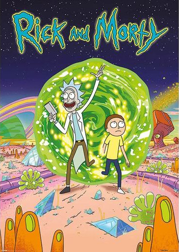

CS1440 - Monday, March 13 - Lecture 23 - Module 4

# Topics:
* [Action Items](#action-items)
* [Advanced Git](#advanced-git)
* [A review of Git basics](#a-review-of-git-basics)
* [Experimentation with branches](#experimentation-with-branches)
* [Resolving merge conflicts](#resolving-merge-conflicts)
* [Using `git bisect` to track down a bug](#using-git-bisect-to-track-down-a-bug)


------------------------------------------------------------
# Action Items

## This Week's Assigned Reading: "The Other Face"

*   Read the essay "The Other Face" (Chapter 15) of the book "The Mythical Man-Month" before our meeting on **Friday, March 17th** and be prepared to discuss it.
*   Instructions for accessing the electronic version of this book are [here](../../Required_Reading_Schedule.md#accessing-the-mythical-man-month-for-free-through-the-usu-library)


*   Work on phase **2. Implementation** of this assignment *today* with the goal to complete it *tomorrow*
    *   Begin phase **3. Testing and Debugging** ASAP so you can identify and fix any problems with your assignment
*	Call on 2 designated questioners
*	Hold a 3-minute stand-up scrum meeting with your team


# [Advanced Git](../../Using_Git/Advanced_Git.md)

This lecture will put your git skills above power level 9000, enabling you to navigate parallel universes and control time itself.


# [A review of Git basics](../../Using_Git/Advanced_Git.md#a-review-of-git-basics)

Read `git help revisions` to learn all of the ways you can refer to commit objects in the log.


# [Experimentation with branches](../../Using_Git/Advanced_Git.md#experimentation-with-branches)

Branches are a feature of Git that let you maintain multiple parallel versions of project development.




# [Resolving merge conflicts](../../Using_Git/Advanced_Git.md#resolving-merge-conflicts)

The trouble with parallel universes is that they can collide with disastrous
results.  Knowing how to resolve merge conflicts is a crucial skill for any 
multiverse explorer.


Clone my *merge-conflict* repo from GitLab and try this for yourself.

```
$ git clone git@gitlab.cs.usu.edu:erik.falor/merge-conflict.git
```


# [Using `git bisect` to track down a bug](../../Using_Git/Advanced_Git.md#using-git-bisect-to-track-down-a-bug)

Git's Bisect command is a power tool which tames the unmanageable size of your
repository.  Use it to perform a binary search on your git repo to identify the
commit which introduced a bug.


