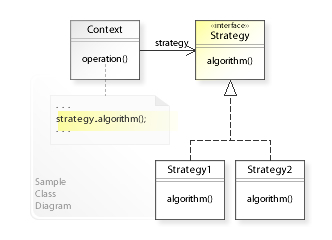

# Design Patterns

A design pattern is a general repeatable solution to a commonly occurring
problem in software design. A design pattern isn't a finished design that can
be transformed directly into code. It is a description or template for how to
solve a problem that can be used in many different situations.

[Design Patterns on SourceMaking](https://sourcemaking.com/design_patterns)

* [Code reuse](#code-reuse)
* [The Factory Method Pattern](#the-factory-method-pattern)
* [The Strategy Pattern](#the-strategy-pattern)

# Code reuse

To understand when and why you might apply a design pattern, you must first
think about when and why you reuse code.

Programmers use repetition at many levels to solve their problems. Computers
are good at repetition. From loops within a program, to automated systems which
repeatedly run a program, repetition is a fundamental part of what we do.

Programmers also like to repeat code. A proven solution, once written, is
better reused than re-written.

## 0. Cutting & pasting blocks of code

Works well with just a few lines or a paragraph of code

#### _pros_

-   Quick & easy to reuse

#### _cons_

-   If you didn't write it (perhaps even if you did) you may not  _really_  understand it
-   It can be difficult to adapt to the specific problem at hand (Variables to rename, etc.).
-   Bugs propagate through cloning this way

## 1. Abstract Data Types (ADT)

A data type defined by the  _behaviors_  it enables, or which methods it provides

#### _pros_

-   Once it's implemented, you can keep re-using it
-   knowing that you have the right tool for the job

#### _cons_

-   No Silver Bullet - beware of being a fanboy
-   Not understanding what they are or what their weaknesses/strengths are -> using them inappropriately

## 2. Libraries

A vast collection of reusable code. Code that is organized so that related things go together, designed to be reusable.

#### _pros_

-   Quick and Easy to use
-   Readily available, especially as part of modern programming languages

#### _cons_

-   May be difficult to integrate into your specific problem
-   Lose some flexibility in your solution

## 3. Algorithms

Solves a specific problem.  This is not necessarily code: an algorithm is an idea.

#### _pros_

-   Not specific to a single language
-   Many algorithms are well-known amongst programmers and facilitate easy communication

#### _cons_

-   Not specific to a single language - you have to 'encode' it into a language to use it

## 4. Design Patterns

Solves a general problem. Is not necessarily code: a design pattern is an idea

#### _pros_

-   Like UML, understanding it makes it easier to communicate to other programmers
-   Enables "design by analogy", many problems are actually the same thing when you think about it

#### _cons_

-   Is not a ready-made solution, requires effort on the programmer's part
-   Must use judgement as to the right time & place to apply a pattern

# The Factory Method Pattern

In a system containing many related classes the question "which kind of object
do I need to make now?" often arises.  In many places in the program a block of
code must be written to decide which possibility should be chosen given the
circumstances.  This may take the form of a big `if/else if/else` decision tree
in each location where these objects need to be created.

You introduced abstraction to remove duplication only to find yourself
repeating another bit of code throughout the project.  Fortunately, there is a
commonly-accepted way to break this cycle.

## Designated industrial zones for your code

The idea of the Factory Method design pattern is to separate the location of
creation from the choice of what to create.  Consider how the Logan city
council has zoned our community such that all of the factories and
manufacturing businesses are out on the west end of town along 10th west (zoned
as "Industrial Park") while the consumer-facing stores are located along Main
Street (zoned as "Commercial").  Other parts of the city are designated as
residential neighborhoods.

In a well-organized program some modules/classes are designated to be in the
"industrial zone".  These units of code are responsible for producing objects
which are consumed by other parts of the program in the "commercial" zone.

The consequence of this organization is that the `if/else if/else` decision
tree is hidden away in a Factory object in the "industrial" zone of the city.
This leaves the nice store-front in the user-facing portion of the program.
The user-facing "commercial" zone can be rearranged as needed without impacting
the layout of the factories.  And the converse is true: the Factories can be
refactored with a minimum of impact on the user-facing code.

*   [Factory Method on Sourcemaking.com](https://sourcemaking.com/design_patterns/factory_method)
*   [Factory Method Pattern on Wikipedia](https://en.wikipedia.org/wiki/Factory_method_pattern)

# The Strategy Pattern

Allows your system (or a user) to select an algorithm or behavior at runtime.

Imagine a system where there are many ways to solve a problem, and each
approach has its own pros and cons; sorting algorithms are a good example:

*   Bubble sort is easy to write and to understand, but it needs more time than other algorithms
*   Quick sort runs faster than other sorts, but is harder to understand and is not stable.
*   Merge sort is nearly as fast as Quick sort and is stable, but needs extra storage space in some cases

The programmer could simply choose one algorithm to use all of the time and
hard-code that into the system.  However, the user may know that in some
situations a different algorithm would perform better and would like to choose
it herself.

One could surround every use of the sorting algorithm in the program with a
tree of `if/else if/else` statements.  The `if` statements could consult a
variable to decide which sorting function to call.

The Strategy Pattern offers a way to write code which *uses* the algorithm
in a simple, straightforward way while abstracting the `if/else if/else` tree
of choices away.

The Fractal Renderer's choice of which `count()` method to use based upon the
user's chosen fractal configuration file is an example of the Strategy Pattern.

*   [Strategy Pattern on SourceMaking.com](https://sourcemaking.com/design_patterns/strategy)
*   [Strategy Pattern on Wikipedia](https://en.wikipedia.org/wiki/Strategy_pattern)
