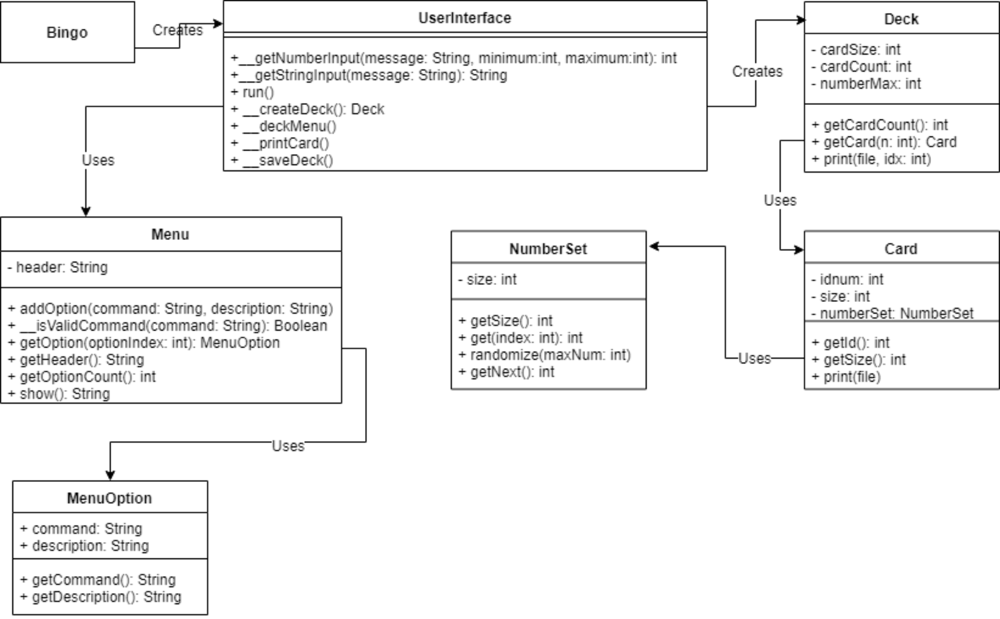
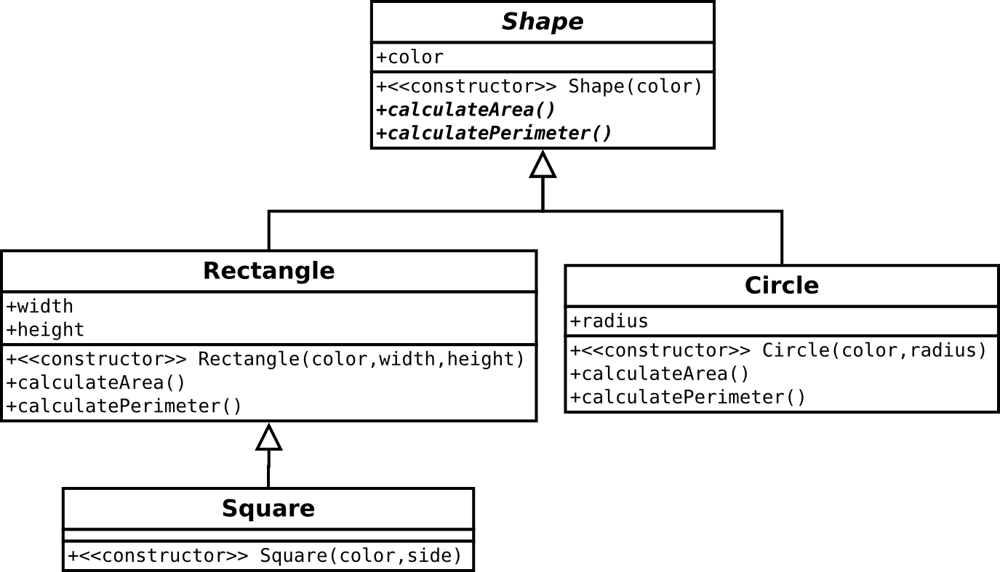

# The Four Principles of Object-Oriented Design

*   [What is Object-Oriented Programming?](#what-is-object-oriented-programming)
*   [Classification](#classification)
*   [The 4 Principles](#the-4-principles)
    *   [0. Encapsulation](#0-encapsulation)
    *   [1. Abstraction](#1-abstraction)
    *   [2. Inheritance](#2-inheritance)
    *   [3. Polymorphism](#3-polymorphism)
*   [Inheritance and Abstract Classes](#inheritance-and-abstract-classes)
*   [Avoiding duplicate code through inheritance](#avoiding-duplicate-code-through-inheritance)


## What is Object-Oriented Programming?

In a previous module we took a whirlwind tour through some of the most
influential programming paradigms.  Each programming paradigm has its benefits
and limitations.  Modern, mainstream programming languages don't slavishly
adhere to a pure interpretation of only one paradigm, but instead incorporate
features from many paradigms.  With experience you will come to understand when
and how to apply each paradigm to your programming problems.

Object-Oriented Programming (OOP) is one paradigm among many.  As can be said
of the others, it is not the best way to program, and it's far from the only
way to write a program.  OOP happens to be the dominant paradigm today,
enjoying broad support in all mainstream programming languages.  This means
that it is widely understood by a majority of programmers in industry today.
One of its best advantages is that OOP code will be approachable to as many
programmers as possible.


### What does OOP bring to the table?

When you studied UML in the Bingo! assignment you thought about the
relationships among different objects in that system.  For these relationships
to be meaningful, there must exist distinct classes, each with their own role
and purpose.

Objects are only useful in so far as there are boundaries between them.

Contrast the structured Bingo! program with the amorphous mishmash of code 
that was the Fractal Visualizer starter code.

Bingo! was organized into well-named modules.  What it if it were more like
`mbrot_fractal.py` and `phoenix_fractal.py` which lacked any organization beyond
a few poorly-conceived functions.

* Where would you begin to make sense of such a code base?
* What could happen if you tried to add new features to that version of Bingo!?


When you consider a program as a collaboration between individual units of code
with distinct roles, you will find that the cognitive burden of understanding
what is going on is relieved.

* Why (or why not) do you think that this is the case?


## Classification

Object-Oriented languages are distinguished by possessing a concept called
_class_ which enables a programmer to express the concept of "units of data
imbued with behavior" to the computer.  OOP is chiefly concerned with
organizing code based upon how it relates and interacts with data.  Good
organization is achieved when data is isolated into distinct classes and code
which operates on that data is located with the data it operates upon.


Within philosophy is a school of thought called *Ontology* which studies the
nature of being, the categories of being and the relationships between these
categories.  The programming term _class_ comes from the ontological idea of
_Classification_.  Classification is the process of grouping objects together
into sets (read: classes) based on common features.

System designers who study a system seek to identify _data_ (nouns) along with
_functions_ (verbs) which will operate on that data.  Nouns and their related
verbs are grouped together into a *class* to identify and remove accidental
details from the system.  Wise designers also seek to decrease the number of
essential details necessary to understand each class.

The fruit of their labor is an easy-to-understand system; the amount of effort
needed to understand the entire system is minimized.  A system may still be
composed of several classes, but not all of the classes must be understood all
at once.  Programmers working in the system may only need a deep understanding
of one portion of the system, and a cursory understanding of the rest of the
system will suffice.

Classification exemplifies the problem-solving strategies of "dividing the
problem" and "reducing the problem".

* Consider how the Bingo! starter code divided the problem of creating a deck
  of cards into separate classes.  What classes were a part of that solution,
  and what were their responsibilities?
* What data is used by the Fractal program?
* What functions make up the Fractal program?
* What classes can you imagine creating by combining them?  Write a small list
  of classes and briefly describe their responsibilities.




## The 4 Principles

As you classify data and behaviors in a system there are four fundamental
concepts that can be applied to classes which help you to create a system
which is easy to reason about.

0. Encapsulation
1. Abstraction
2. Inheritance
3. Polymorphism


## 0. Encapsulation

Encapsulation means to organize related code together into one package while
reducing its apparent complexity so other programmers need not be concerned
about details irrelevant to their immediate problem.


The poet Robert Frost wrote ["Good fences make good
neighbours"](https://www.poetryfoundation.org/poems/44266/mending-wall).
Defining distinct boundaries around different classes settles the question
"which class is responsible for this?"  A code base which involves turf wars
around which classes should be doing which tasks is very difficult to
understand.  Don't let your program devolve into roving gangs of classes
battling each other for control of the entire program.  Good fences make good
neighbours.

When faced with an object of irreducible complexity, you can further reduce its
cognitive surface area by separating _internal_ complexity from _external_
complexity.  This idea is best understood by putting yourself in the shoes of
another programmer who will use your class to solve their problems.  How much
do they *really* need to understand to be able to use it?  The pieces of
information they need to know about are _external_ details.  Every detail which
is not part of that answer should be kept on the _inside_ of the class.

#### Examples of *external* details:

* Name of the class
* How to create an object from that class
* What methods the class defines
* The parameters those methods take
* What types of values those methods return
* Which data members may be accessed, and their types


#### Examples of *internal* details:

* The algorithm used to create a new instance
* Which other objects this object makes upon creation
* How many iterations of a for loop are used to return a result from a method
* The fact that it is a for loop used within that method
* Types and names of temporary variables used within methods
* Names and signatures of methods used to produce results for external methods

Help your fellow programmers by protecting them from as many extraneous details
as possible.  Just because a concept is important to your class doesn't mean
that everybody working on the codebase needs to know about it.

Encapsulation reduces potential for accidental complexity caused by adding bad
dependencies between classes which need not be related.  Encapsulation also
frees you to change *how* your class works without the risk of causing another
programmer's code to break.  So long as you keep the *external* details the
same (such as the name of the class and signatures of external methods), you
can completely rewrite *how* the class works and other programmers will never
notice the difference.

Through encapsulation you offer the programmers who will use your code a way to
"start with what you know".

*   How do the classes of the Bingo! program exhibit encapsulation?
*   How have you been putting the principle of Encapsulation to work as you've
    refactored the fractal program?


## 1. Abstraction

When you hear this word you may be tempted to think of something that is
abstruse or difficult to grasp.  In Computer Science we mean quite the
opposite.

The idea behind abstraction is to de-emphasize *accidental* details in a system
and present only the *essential* qualities that really matter.

By removing extraneous details we reduce the cognitive "surface area" of an
important concept, making it easier to understand in the context of the larger
system which we are trying to assemble.  There is, of course, a point at which
we are unable to further reduce the complexity of a concept.  Some things are
just complicated.  Our goal is to reduce a concept down to that appropriate
level of simplicity and no further.


*   What complex ideas are simplified with abstraction in your Bingo program?
*   What complex ideas can you identify within the Fractal program?
*   With an eye on the goal of refactoring, how might you use the principle of
    abstraction to simplify a code base?

Abstraction offers a way to "restate the problem" as well as to "reduce the
problem".


## 2. Inheritance

The activity of classification results in a collection of interrelated classes.
By further studying these classes you may recognize relationships between
classes.  You might find that one class is essentially the same as another
class, only varying in a few particulars.  Such duplication feels wrong to a
programmer who recognizes the trouble caused by cut & paste programming and you
will want to rewrite the code in a way that says "this class is the same as
that other class _except_ for this single detail".


Inheritance lets us avoid code duplication by reusing common behaviors and
properties among related classes, and adding unique aspects to those classes
which differ.  In an OOP language you may declare that a class is a "kind of"
another class, and the language will be able to make use of that knowledge in a
way that enables us to avoid duplicated code.

We do this by arranging related classes in a *hierarchy* organized from general
to specific.  We place all of the duplicated code into the class at the top of
the hierarchy.  This class embodies the most basic, general, common behaviors
and properties shared among all of the related classes.  You may say that it is
the least common denominator.

A class which represents a more specific version will *inherit* the common
properties from the general class.  Instead of copy-pasting common code into a
new file, the programming language copies the functionality into the
more-specific class for us.  Our files remain short, to the point, and are
without duplication.

A programming language supporting the principle of inheritance enables us to
write code which means "a self-winding wristwatch is a specific kind of
wristwatch".  When the programming language understands this relationship it
will give us the ability to write a `SelfWindingWristWatch` class which will
broadly behave the same as an ordinary `WristWatch`, but with the added feature
that it is self-winding.

We've already written and used classes which use another class in a way that
suggests ownership.

*   What classes of the Bingo! program exhibited the "has a" relationship?
*   Were there any classes of the Bingo! program which participated in a "is a"
    relationship?
*   Which of the following statements best describes the Deck object from Bingo!?

    "A Deck object _is_ an array of Card objects"

    "A Deck object _has_ an array of Card objects"

*   Do either of these statements reflect the idea of "inheritance"?


Common points of confusion around the idea of inheritance

*   Ownership != inheritance.  One object owning another is called
    *aggregation*.  Example: the `UserInterface` class from Bingo! created and
    used `MenuOption` objects.  This relationship does not make "UserInterface
    is a `MenuOption`" a valid statement.
*   "Being made out of" != inheritance.  One object being built of other
    objects is called "composition".  Example: a `Deck` is made of `Cards`.  In
    English we might say something like "that is a deck of cards", but it does
    not mean that the deck is a kind of card.


### Denoting Inheritance in UML

The Inheritance relationship is expressed in UML by a white (open) arrow
pointing _from_ the specialized object _to_ the generic object.



From this diagram we learn the following facts:

* "A `Rectangle` is a type of `Shape`"
* "A `Square` is a type of `Rectangle`"
* "A `Circle` is a type of `Shape`"

The name of the `Shape` class is written in an _italic_ font.  This informs the
reader that no objects of type `Shape` are to be instantiated.  Rather, the
`Shape` class exists to lend its structure and common operations to its
descendants.  Furthermore, the operations `calculateArea()` and
`calculatePerimeter()` are written in _italics_.  This indicates that these
functions must be overridden by the child class.


### Denoting Inheritance in Python

To learn how inheritance works in Python see the accompanying [source code](./Shapes_demo/)
that implements the above classes.  Running the driver program
`Shapes_demo/main.py` illustrates what can happen when one attempts to
instantiate and use an abstract class in Python.


## 3. Polymorphism

Polymorphism is a Greek way of saying "many-shaped".

When many OOP classes each implement methods with the same names, to an outside
observer they all appear to be capable of the same operations.  *How* the
methods work might be different.  By following the OOP principle of
encapsulation we won't be too concerned about that at the moment.  What is
important right now is the fact that, by considering only the methods each
class implements, they all appear to basically do the same thing.

In other words, to an outside observer, each of these classes appear to be
*usable* in the same way.  If I write a function which can use a `FizzBuzz`
sequence, I could replace the instance of `FizzBuzz` with a `FogBag` and not
need to change any other code.


### Duck Typing

> If it walks like a duck and it quacks like a duck, then it must be a duck

When one object happens to provide the same methods as another object, it may
be used in place of the latter.  An example of this in your assignment are your
concrete Fractal objects which descend from the Abstract `Fractal` class.  They
are only interchangeable insofar as they all have a `count()` method which
accepts a Complex number as a parameter and return an integer.  The Python
language does not enforce that all of the `Fractal`-derived classes have a
method named `count` with compatible parameters and return values.

Polymorphism in strongly-typed languages such as C++, Java and C# is commonly
achieved through the mechanism of *inheritance*.  In these languages I can
instruct the compiler that a method with a particular name is required, and
that it must have a particular type signature.  Failure to supply this method
in the sub class is an error which is noticed at compile-time, and it is
impossible for such an error to make it into a production system.

In a dynamically-typed language such as Python, *duck typing* presents an
alternative.  *Duck typing* refers to an object which works as a drop-in
replacement for another object by virtue of the fact that both objects just so
happen to each have methods of the same name, with compatible parameter lists,
and identical return types.  Hence,

> If it walks like a duck and it quacks like a duck, then it must be a duck

With Duck Typing the programming language cannot make any guarantees that a
particular line of code won't cause an error due to a missing or mismatched
method.  What is a compile-time error in C++/Java/C# becomes a run-time error
in a dynamically-typed language such as Python, JavaScript, Ruby, Perl, etc.

This is why I go out of my way to add a method in the "abstract" parent class
which intentionally crashes the program.  It is an attempt to raise the
visibility of the situation where a careless programmer forgets to supply
important functionality.


## Inheritance and Abstract Classes

An *abstract* class is a class that cannot be instantiated into an object (in
other words, you can't construct an object from an abstract class).  In the
"inheritance among shapes" UML diagram above the `Shape` class is abstract.  In
UML the name of an abstract class is written in an _italic_ font.

The opposite of an abstract class is known as a *concrete* class; these are the
ordinary sorts of classes you've been using all along.

* **Concrete** classes can be instantiated into objects
* **Abstract** classes cannot be instantiated into objects

Furthermore, there are two types of abstract classes which differ in the degree
to which they embrace the idea of abstractness:

0. An abstract class *may* provide implementations for some of its methods
1. A **pure** abstract class provides *no* implementation for any of its methods

Because abstract classes are incomplete they should not be made into objects.
In strictly-typed languages such as C++ and Java the compiler forbids the
instantiation of abstract classes at compile time.  If you try to construct an
object from an abstract class's constructor the compiler quits with a type
error.  Thus, in a strictly-typed language it is impossible to instantiate an
incompletely-defined object from an abstract class.

Python, a loosely-typed language, offers no such guarantees and leaves it up to
the designer to ensure that incomplete classes are fully defined.  Strictly
speaking, there is no such thing as an abstract class in Python because all
classes may be instantiated into objects.

Fortunately, the behavior of strict languages may be emulated by writing
classes which purposefully crash when a programmer attempts to instantiate
them.  In Assignment #5.1 you will do this by writing placeholder methods which
raise a `NotImplementedError` when run.  A programmer inheriting from your
abstract class is obligated to supply their own implementation of these methods
so that their program doesn't crash.  That programmer's own methods *override*
your placeholders.


### Overriding methods

If a child class (a.k.a. *sub-class*) must perform a different operation than
its super-class it can simply define its own version of that operation by
implementing a method of the same name.  This is known as *overriding*.

Here is an example from the file `Sequence/Sequences.py`:

```
def get_n(self):
    raise NotImplementedError("A subclass of Sequence must define its own get_n()")
```

A programmer creating a sub-class of `Sequence` is obligated to override this
method with a version of their own.  The end result is essentially the same as
in a strictly-typed language, though we still do not enjoy the assurance of
compile-time error messages.


## Avoiding duplicate code through inheritance

The activity of classification results in a collection of interrelated classes.
By further studying these classes you may recognize relationships between
classes.  You might find that one class is essentially the same as another
class, only varying in a few particulars.

Duplication will feel *wrong* to a seasoned programmer who recognizes the
trouble caused by cut & paste programming.  You would like to remove the
redundancy in a way that says "this class is the same as that other class
_except_ for this single detail".

A programming language supports _inheritance_ if it provides a way for the
programmer to express the "is a" relationship between *generic* and
*specialized* classes.


### What does inheritance give me that modular programming doesn't?

When your programming language understands "this object is like that other
object, but with a few differences", you are freed from writing duplicate code.
Inheritance lets you avoid code duplication by reusing common behaviors and
properties among related classes, and adding unique aspects to those classes
which differ.  The language essentially copies & pastes the extra code so you
don't have to write it.

You do this by arranging related classes into a hierarchy organized from
*general* to *specific*.  Remove all of the code that is duplicated and place
it into the class at the top of the hierarchy.  This class embodies the most
general and common behaviors and properties shared among all of the related
classes.  You may say that this class is the least common denominator.

A sub-class represents a more specific type of object than the parent class.
It *inherits* the common properties from its generic parent class.  It adds new
methods and fields to support more specific operations.  It may also override
generic operations with more specific ones.

Instead of literally copying and pasting common code into another file, through
inheritance the programming language copies the functionality into the
more-specific class.  Our files remain short, to the point, and are without
duplication.

Modular programming languages don't have the notions of *hierarchy*, *general*,
*specific*, or *inherit*.  Using the modular paradigm you *can* write a program
that is equivalent in behavior to an OOP program that uses inheritance, but it
will necessarily be more convoluted or contain lots of duplicate code.


*updated Wed Nov  9 17:07:11 MST 2022*
