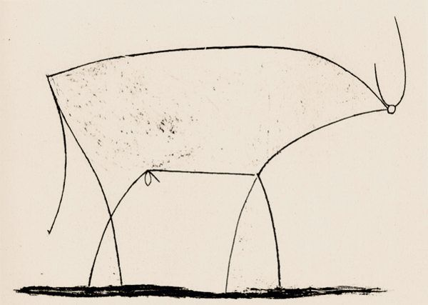

CS1440 - Wednesday, March 29 - Lecture 30 - Module 5

# Topics:
* [Announcements](#announcements)
* [Recapitulation: Encapsulation](#recapitulation-encapsulation)
* [1. Abstraction applied](#1-abstraction-applied)
* [Prematurely enhancing the Sequences program](#prematurely-enhancing-the-sequences-program)
* [2. Inheritance Applied](#2-inheritance-applied)

------------------------------------------------------------
# Announcements

## BSidesSLC Registration is Open!

*   **When**  Friday, April 14th - Saturday, April 15th
*   **Where** Conference Center at SLCC Miller Campus 9750 S 300 W, Sandy, UT
*   [**BSidesSLC Discord**](https://discord.com/invite/hBcnv9gb73).
*   **Cost**  
    *   General Admission $19 + taxes & fees
    *   General Admission + Electronic Badge $119 + taxes & fees
    *   [Tickets](https://www.eventbrite.com/e/bsidesslc-2023-tickets-527264701917)

### BSidesSLC attendance replaces your lowest assignment/exam score

*   If you attend the conference I will replace your lowest assignment/exam score with **full credit**
    *   It is good enough if you can only make it one of the days, either Friday or Saturday
*   Either find me at the conference or send me a selfie your conference badge
*   *Note:* if you are enrolled in both of my classes this semester, you may replace a low score in only **one** class

# Action Items

*   You should be in the midst of phase **3. Testing and Debugging** *today*
    *   Continue your testing work *tomorrow*, taking care to document your test cases and their results
*	Call on 2 designated questioners
*	Hold a 3-minute stand-up scrum meeting with your team

## This Week's Assigned Reading: "No Silver Bullet"

*   Read the essay "No Silver Bullet" (Chapter 16) of the book "The Mythical Man-Month" before our meeting on **Friday, November 18th** and be prepared to discuss it.
*   Instructions for accessing the electronic version of this book are [here](../../Required_Reading_Schedule.md#accessing-the-mythical-man-month-for-free-through-the-usu-library)

# [Recapitulation: Encapsulation](../Four_Principles_of_OO_Design.md#0-encapsulation)

> Encapsulation means to package related code together into one package while reducing its apparent complexity so other programmers need not be concerned about details irrelevant to their immediate problem.

While encapsulating your design is helpful to distinguish between *external* and *internal* details.

# [1. Abstraction applied](../Four_Principles_of_OO_Design.md#1-abstraction)

"Abstraction" sounds like it will make my code even more complicated!

Good software is easy to understand and no more complex than necessary.  For
most people the word *abstract* doesn't evoke a sense of understandability or
simplicity.  Picture related.

In software engineering *abstraction* means to remove extraneous details,
leaving only the bare essentials.  This is a theme you'll find repeated
everywhere in Computer Science.

Pablo Picasso demonstrates *abstraction* through this sequence of charcoal
drawings.  Each successive picture comes closer to capturing the essence of a
bull by removing accidental details.  The final image consists only of a
handful of strokes but is still unmistakably a picture of a bull.

That's a lot of bull

Applying abstraction is the only way to get anything done when you work
in fantastically complicated modern systems.

The [Sequences](./Sequences/) program is, at its heart, very simple: given
anywhere from 0-3 parameters print a slice of an infinite sequence of numbers.
All of the classes comprising this program are essentially similar to each
other, even if they look different on the surface.  The differences in their
accidental details, however, pose a very difficult challenge to overcome.  Each
class can do *most* of the same operations, but in each class those methods
have different names.  For a programmer working on this program this increases
the burden of learning how to use each class.

We can apply the principle of abstraction to unite these different interfaces
and simplify the programmer's task of learning the use of these classes.  At
this stage we aren't going to throw out dozens of lines of code as Picasso was
able to discard dozens of strokes (that'll come soon enough ;), but what we can
throw out are inconsistencies.  Think of the documentation needed to describe
this program's inner workings.  How much description could be deleted if these
classes followed the same naming convention?

# Prematurely enhancing the Sequences program

Now that I have applied the principles of Encapsulation and Abstraction to the
[Sequences/](./Sequences/) project, my refactored code is better organized and
easier to reason about.  I am now tempted to add new features to the system.
Suppose I want to create a new sequence called `FogBag`.  The `FogBag` sequence
is essentially the `FizzBuzz` sequence except it uses the next prime numbers
(`5` and `7`).

It isn't too hard copy [FizzBuzz.py](./Sequences/FizzBuzz.py) to a new file
called `FogBag.py`, make a few changes, and integrate it into
[main.py](./Sequences/main.py).  But, somehow, copying & pasting code makes me
feel icky in the same way as global variables.

### Questions to consider

*   What's icky about copying & pasting code?
*   Sometimes duplication cannot be avoided.  What would be a better way to
    deal with necessary duplication?

## Stop me if you've heard this one before...

The problem that I'm trying to solve in the Sequences program involves re-using
the same code in two or more parts of my program.  I achieved this by naively
copying & pasting the necessary code, but it feels like there must be a better
way.

A car needs four wheels.  While each wheel is identical to the others and thus
interchangeable, it is impossible to get by with only one wheel by quickly
swapping it into place just in time for the car to use it.  We must accept some
degree of redundancy in physical systems.

However, software does not have the limitations of the physical world.  In our
world we *can* swap in a needed bit of code just in time to be useful.  In
software we do not need to tolerate any redundancy.

There are various ways that we can reuse code in our projects.  Some aren't
necessarily better than others; they each have their strengths and weaknesses.
Wisdom is understanding these attributes and knowing when to apply each.

# [2. Inheritance Applied](../Four_Principles_of_OO_Design.md#2-inheritance)

Programming languages that support *inheritance* enable us to write programs
that can express the idea "these objects are basically the same because they
are related to each other".  Inheritance makes it possible for programs to
understand the concept "Y is a kind of X".

Inheritance allows us to enjoy the benefits of code re-use without the ickiness
of actually copying and pasting lines of code.  In essence, inheritance makes
the programming language do the copying & pasting for us.

This is good - copying & pasting code is icky because it's tedious and
error-prone.  Computers are really good at doing tedious things accurately.
Therefore, it is better to leave this up to the computer.

