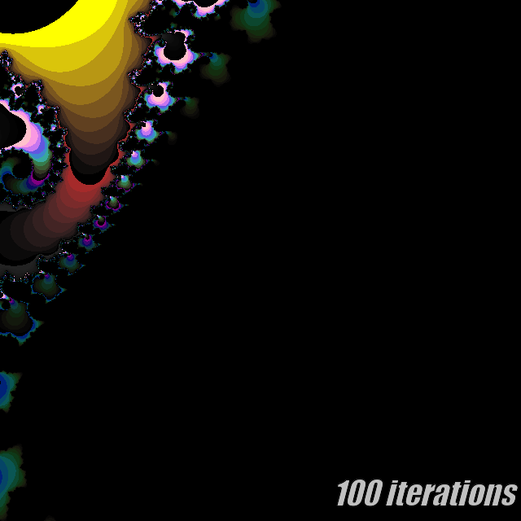
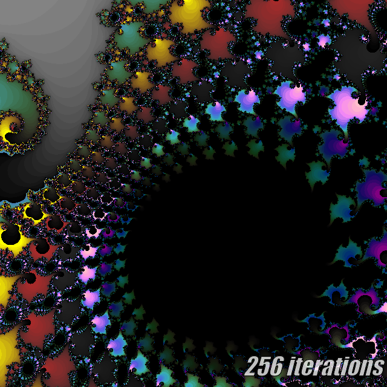
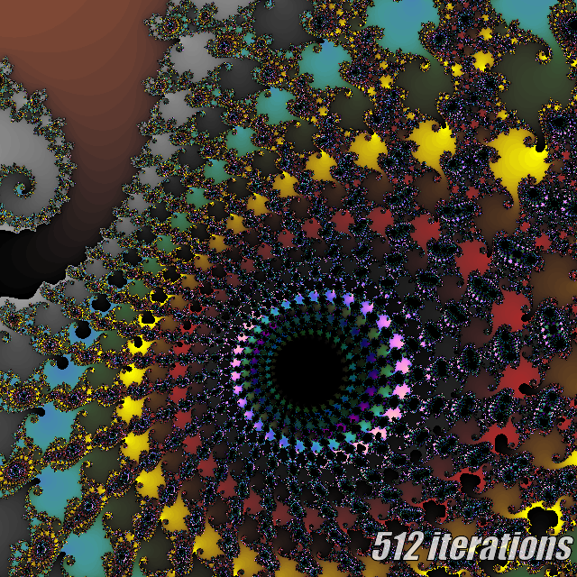
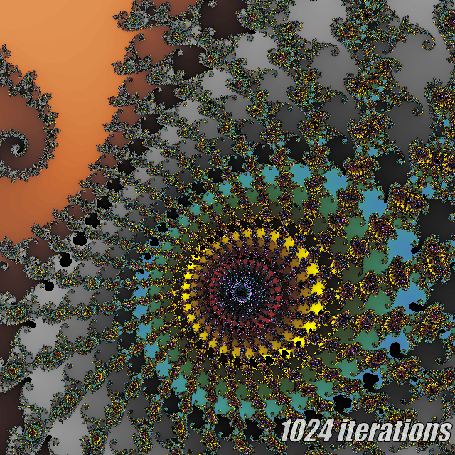
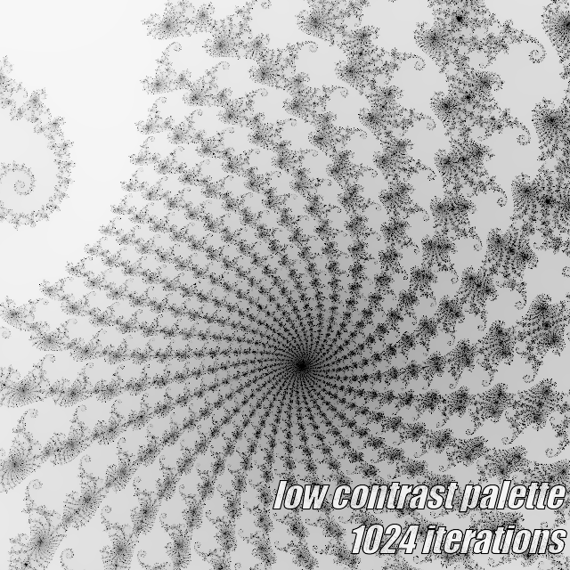
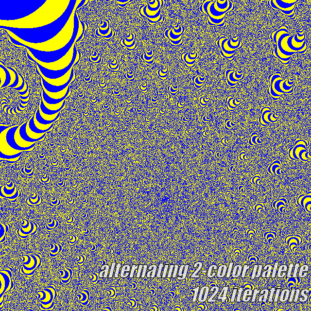
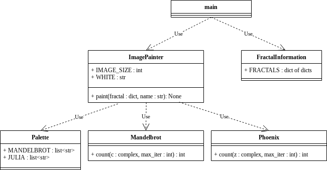

CS1440 - Wednesday, April 05 - Lecture 33 - Module 5

# Topics:
* [Announcements](#announcements)
* [Advice from Monday's Retrospective](#advice-from-mondays-retrospective)
* [Generating color palettes with `colour.Color`](#generating-color-palettes-with-colourcolor)
* [Use `pathlib.Path` to find the "stem" of a path](#use-pathlibpath-to-find-the-stem-of-a-path)
* [Refactoring reduces complexity of the Fractal Viewer](#refactoring-reduces-complexity-of-the-fractal-viewer)
* [Factory Method Pattern](#factory-method-pattern)
* [The Strategy Pattern](#the-strategy-pattern)


------------------------------------------------------------
# Announcements

## BSidesSLC Is Next Week!

*   **When**  Friday, April 14th - Saturday, April 15th
*   **Where** Conference Center at SLCC Miller Campus 9750 S 300 W, Sandy, UT
*   [**BSidesSLC Discord**](https://discord.com/invite/hBcnv9gb73).
*   [Tickets](https://www.eventbrite.com/e/bsidesslc-2023-tickets-527264701917)


## DC435 Meeting Tomorrow Night

*   **What**  T-Pot Honeypot by Allen Hill
*   **When**  7:00pm Thursday, April 6th
*   **Where** Bridgerland Technical College (1301 N 600 W, Logan)
    *   Room 840
*   [Discord](https://discord.dc435.org/)


# Action Items

*   You should be ready to start phase **1. Design** of this assignment *today*
    *   Continue your design work through *the end of the week*
*	Call on 2 designated questioners
*	Hold a 3-minute stand-up scrum meeting with your team


# Advice from Monday's Retrospective 

Some good advice I came across while reading your sticky notes:

*   Get help early
*   Documentation is your friend, use it to your advantage
*   Keep it simple. Make small changes, then test and keep going until you finish.
*   The code looks intimidating at first, but it *does make sense* as you clean and study it
*   ChatGPT can help you understand the code, but it's not great for writing it
*   Take time the week prior to get done up to the pseudocode, so the assignment is more evenly distributed
*   Start phases 0 and 1 early.  I know you're busy, but if you at least look at the code, and kind of let it stew in the back of your mind, phases 2 and 3 become a lot easier


# Generating color palettes with `colour.Color`

A hard-coded array of colors drastically limits the beauty of images our Fractal program is capable of producing.

Colors in computers are most commonly encoded as 24-bit numbers.  8 bits of data encodes each of the primary colors of `Red`, `Green` and `Blue`.  Another 8 bits may be used to encode the opacity or "alpha" channel to produce transparent colors.

As you may have noticed, computers are really good with numbers.  Since colors are essentially numbers, couldn't we just write a function to generate an array of colors that is as long as we want it to be?

Yes we could, but no we won't.

Python provides a neat module that will do this for you.  Since this assignment is already big enough, you can just use this pre-written code.


## Installing the `colour` module

```
$ pip3 install --user colour
```

If that doesn't work, try running `pip` instead.

If *that* still doesn't work, try this:

```
$ python -m pip install --user colour
```

See this [palette demo](./palette.py) to learn how to use the `colour` module in your code.


## The effect of longer/larger color palettes on your program

These are images of the same fractal **spiral1** rendered to different iteration counts.  You will find that there may be more interesting details lurking just beyond the horizon of the (arbitrary) iteration count.









Being able to change the iteration count on the fly without changing the Python source code of the program is a huge win over the original formulation of this program.  Think about how big of a pain it would be to do this in the original 5.0 source code?  This is the primary reason why the iteration count is a part of the fractal's configuration file.


## Strive for high-contrast color palettes

This is what the Spiral1 image looks like when painted with a 1,024-color palette which does not have enough contrast:



This palette ranges smoothly from  white to black.  The color gradient is so smooth that each color is repeated **four times**.

There are two ways to mitigate this:

0.  Create a palette that uses a few strongly-contrasting colors and simply alternates between them.
    *   These palettes are very easy to make, but do not look very nice.
    *   Consequently, you are allowed to use this technique **only once in Assignment #5.1**.
    *   
1.  Use the technique demonstrated at the end of the [palette demo](./palette.py), which is to break up the palette into smaller segments that contrast with their neighboring colors.


# Use `pathlib.Path` to find the "stem" of a path

On Assignment 5.1 you will need to extract the "stem" from a file name specified by a user on the command line.  This is a straightforward text-processing task that you know how to solve.

Suppose the user entered the path `../data/8-points.frac`.  The "stem" is the string `8-points`.


## Algorithm

0.  Split the path into its *directory* and *file name* components
    *   Keep the file name and discard the names of any directories
1.  Remove the *extension* from the file name
    *   The extension is the suffix of a file's name from the *final* period `.` to the end of the string.


## Python code

```python
pathname = '../data/8-points.frac'

# 0.  Split the path into its *directory* and *file name* components
file = pathname.split('/')[-1]

# 1.  Remove the *extension* from the file name
file = file[:file.rfind('.')]
```

## But, there's a catch

What if the path doesn't use `/` as its **directory separator** character?  Windows uses backslash `\`, so our algorithm would need to take that into account, too.  It is difficult to ensure the algorithm works on everywhere when you don't have easy access to multiple operating systems.

This has created headaches for us when grading this assignment in the past.  To save our time and spare you from a penalty, I'll share a library with you that solves this problem portably.

```
from pathlib import Path

Path('../data/8-points.frac').stem
```

*Note: `stem` is a data member, not a method!*


# Refactoring reduces complexity of the Fractal Viewer

I hope you can appreciate how much nicer the source code of the refactored fractal program is over the original starter code.  But the benefits of refactoring go deeper than the code itself.  Refactoring changed the structure of the program itself.

I tried to make a UML class diagram for this slide describing the program `phoenix_fractal.py`, but gave up because a class diagram just can't express the horror of that program.

Instead, I identified functions and global variables in the program and connected them with association lines to indicate their relationship.  This is what I came up with:


How easy is this diagram to understand?  You've spent the past two weeks in this code base; do you recognize what you're seeing here?  While I was able to untangle the associations such that no lines cross, there are just way too many lines.  Too many pieces of this program depend on too many other pieces of the program.

Here is the same thing for `mbrot_fractal.py`:


By identifying and removing relationships that aren't essential to the solution we arrive at a much simpler and cleaner diagram with only **5** dependency lines!




This is the power of modularization and encapsulation.


# The [Factory Method Pattern](../Design_Patterns.md#the-factory-method-pattern)

The idea of the Factory Method design pattern is to separate the *location of creation* from the choice of *what* to create.

See the completed [Sequences](./Sequences) demo for an example of this pattern


# [The Strategy Pattern](../Design_Patterns.md#the-strategy-pattern)

This design pattern allows your users to select an algorithm or behavior at runtime.


