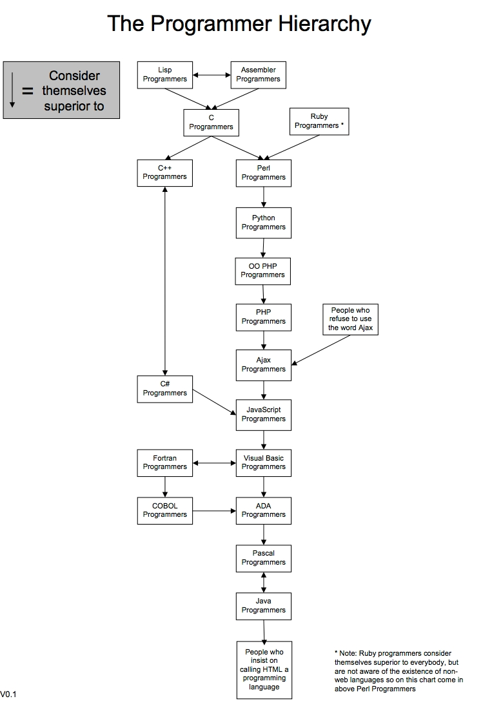
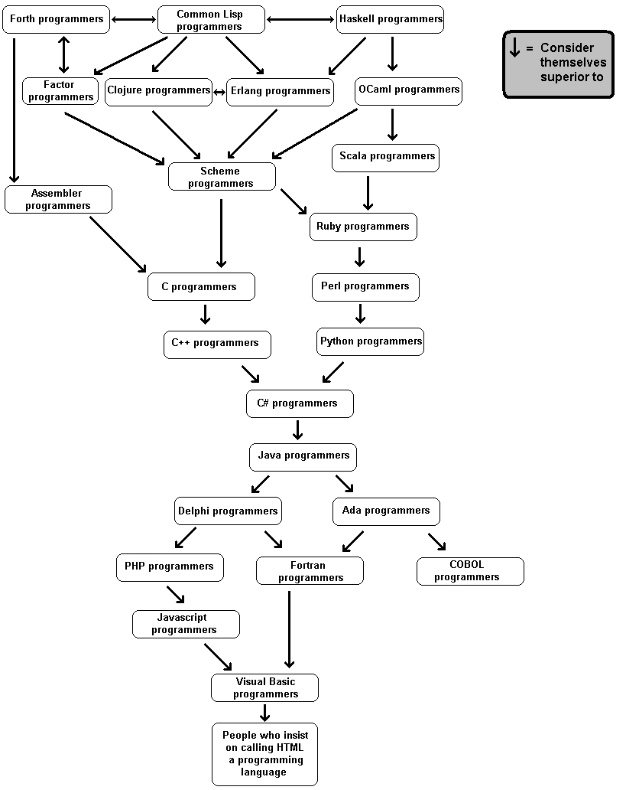

CS1440 - Friday, April 21 - Lecture 39 - Module 6

# Topics:
* [Announcements](#announcements)
* [Thinking like a Programmer](#thinking-like-a-programmer)
* [Wisdom vs. Knowledge](#wisdom-vs-knowledge)
* [Suggested activities to continue your growth as a programmer](#suggested-activities-to-continue-your-growth-as-a-programmer)
* [Things Which Have Made Me a Better Programmer](#things-which-have-made-me-a-better-programmer)

------------------------------------------------------------
# Announcements

## Take the IDEA Survey

*   So far we're at a XX% response rate!
    *   My goal for the class is 80%
*   It's worth 25 points of extra credit
*   The survey closes 04/26/2023 at 11:59 PM

## Discussion thread for AMA lecture closes tonight!

*   Reminder that the discussion thread will be locked tonight at midnight (Friday, April 21st) to give me time to put the lecture together
*   Because the last lecture is all about your questions, I won't be taking Designated Questioners next time

# Action Items

*	Call on 2 designated questioners
*	Hold a 3-minute stand-up scrum meeting with your team
*   Work on phase **2. Implementation** of this assignment *today* with the goal to complete it *tomorrow*
    *   Begin phase **3. Testing and Debugging** ASAP so you can identify and fix any problems with your assignment
    *   Be ready to enter phase **3. Testing and Debugging** *tomorrow*
    *   Continue your testing work *throughout the weekend*, taking care to document your test cases and their results

# Thinking like a Programmer

This lecture is about applying our problem solving strategies to the problem of becoming a better programmer.  As stated in the syllabus, the purpose of this course has been to teach you how to

*   Use the **Git Version Control System** to push your work to a remote code repository
*   Apply analysis and **problem solving skills** to develop quality, maintainable software
*   Learn and apply software engineering best-practices to **overcome the complexities** of real-world software systems
*   Identify and avoid **"code smells"**, and improve a code base through **refactoring**
*   Develop good habits around the use of code comments, identifier names, and modularity with a focus on crafting **readable** software
*   Learn about the various **programming paradigms** embodied by programming languages, past and present
*   Where appropriate, leverage existing solutions through **software reuse**
*   Use **debugging** tools and techniques to locate and correct software defects
*   Craft exhaustive **tests** to ensure correctness of your software
*   Apply your understanding of advanced concepts within data structures, algorithms and software engineering to prepare for higher-level courses
*   Intentionally **design a solution before writing code** by creating a Software Development Plan, including UML class diagrams, design patterns, and test cases
*   Safely process user input and respond to **exceptional** circumstances
*   Understand how and when to apply the **four principles** of object-oriented programming

As we wrap up this semester, let's take a moment to think back upon some of the new programming skills you have learned about:

*   Having a bigger, broader perspective on the project.  Don't be "in the trenches" and terribly worried about the details
*   Take time to really understand what the problem actually is, and define our inputs and outputs... this informs how the "black box" in the center needs to be filled-in
*   Understand how your brain/personality works, and structure activities such that it synergizes with your natural work ethic
    *   The value of taking breaks.  Sometimes you go to bed with a problem, then the solution comes to you when you wake up - you can't force good programming
    *   Put a whiteboard on the opposite side of the room.  It not only forces you to get up & walk, but makes you think of the bigger picture
*   Understand what you have and don't have - and what you need to find to fill in the gaps.
*   Know your limitations. Talk to people (or your duckie) - they have good ideas!
*   If you feel like you're bashing your head against a wall to get it to work, recognize that there is probably a better way to do it
*   The idea of "growing" your program vs. building it - constantly have a working program to test
*   Understand the problem *before* you try to solve it
    *   Always have a plan!
    *   Don't write code that you don't need - if you can't articulate *why* you need this function, don't write it
*   The more you try to rush your code, the longer it's going to take

# Wisdom vs. Knowledge

Having learned these things has increased your *knowledge* about programming.
There are still many techniques that you'll need to learn about, but this is a
good first step.  Another important ingredient, *wisdom* comes only with
experience and time.

## The difference between wisdom and knowledge

Knowing *when* to use a technique is just as important as knowing *how* to do it

> Knowledge is knowing that a tomato is a fruit, but wisdom is knowing to not
> put a tomato into a fruit salad.
>
> -- Somebody wiser than I

* What is the cost of applying a technique inappropriately?
    + It could take longer - both from a computational perspective, and from a
      productivity perspecive
    + You can introduce bugs - both subtle design errors and implementation issues
* How will you know when you should do something in a particular way?
    + It's not going as easily as planned
    + Your problems are more "accidental" in nature than "essential"
    + You find yourself running into lots of "unintended consequences" (the bad
      kind of consequences)

We all understand how to increase our knowledge, that's as simple as opening a
book or finding a blog.  But how can you intentionally increase your wisdom?
One must have experiences to learn *when* and *why* to do things in a particular
way.  Here is one way you can find those experiences that will give you the best
return on your time investment:

#### Exploratory Learning
Explicitly allot time for learning new components as a general task.

#### As-needed Learning
Search for a component to solve a specific problem facing you now.

Much of the time you will spend engaged in learning as a professional programmer
will be in the "as-needed" category.  When your boss asks you to do something
that you've never done before, you now *need* to figure it out.

# Suggested activities to continue your growth as a programmer

## Catalog your strengths and weaknesses

Catalog what you're good at, and where you need to improve.  Devise activities
to turn your weaknesses into strengths.

Another way to identify areas for you to focus on is to make a list of your
strengths and weaknesses, and devise activities to turn your weaknesses into
newfound strengths.

### What are your weaknesses?

* Convoluted designs
* Can't get started
* Don't finish anything
* Fail to test
* Overconfident
* I don't know the "..." programming technique

Are there any others?

### What are your strengths?

* Eye for detail
* Fast learner
* Fast coder
* Never gives up
* Super problem-solver
* Tinkerer
* Mull it over
* Curious!!!
* Able to work on many pieces at once
* Good at doing up-front research
* Find all of the ways *not* to do it

What else are you great at?

Curiosity and an unstoppable drive to learn and improve are indispensable
attributes of the fledgling Computer Scientist, and their cultivation is the
focus of this course.

> Do only what only you can do
>
> -- Edsger W. Dijkstra

Success is just a matter of making time for practice.  If there were topics in
this class or other classes which you don't feel that you possess a mastery of,
spend a little bit of time on them over the Summer so that when you return
you'll feel confident and deserving of your place in the next challenges which
will come your way, whether those are new classes or an internship or a new
career.

## Curate a portfolio of programming artifacts

Keep every bit of code you ever write.  This is easier than ever if you're
using Git.

*   It's nice to look back upon your old programs and to see that you've
    improved.
*   Someday you'll face a problem and say to yourself "I think I've solved this
    once before".  If you are keeping track of your code you'll be able to
    reach into an ever-growing library of past solutions and find something
    that may be adapted to your current task.

One of my greatest regrets is that I have long since lost the code to the very
first programs I ever wrote in CS1 and CS2 (no Git in those days).  I do have
code from CS3 and onward, and every now and then I'll look at that code and
laugh at it.

## Explore the world of Open Source software

Most "real world" programming is not writing a new solution completely from
scratch, but rather supplementing or modifying an existing code base.

Between GitLab, Bitbucket and GitHub it is easier than ever to get involved
with an Open Source software project.  Find a project that you're curious about,
clone the code, and dive in.  You will learn just as much from *reading* code as
you do from *writing* code.

## Connect with the broader community of programmers

By this I mean "connect with programmers IRL".  Get involved with other hackers
at meetings in meatspace.  There are plenty of clubs and events on campus
during the school year.

Networking is so crucial to your career, yet it is something which we invest
too little energy into.

*   [HackUSU](https://hackusu.org/)
*   [USU Software Development Workshop](https://discord.gg/bFUY9aS)
*   [FSLC](https://discord.gg/t8xy7sR)
*   [DC435](https://dc435.org)
*   [Utah Python User Group](http://utahpython.org/#/locations) Look for the Logan location about 2/3 of the way down:

## Take part in coding competitions/challenges

There are plenty of these out there; here are a few I've enjoyed:

*   https://adventofcode.com/ **going on right now!**
*   https://exercism.io/
*   https://programmingpraxis.com/
*   https://projecteuler.net/
*   https://www.hackerrank.com/

Combine these challenges with a new language for double the benefit.  In fact,
when you pick a new language it's helpful to have some project in mind to focus
your effort on.  These coding challenges serve that need well.

## Learn a new programming language

This will be beneficial to you for so many reasons:

0.  When your only tool is a hammer, you'll have sore thumbs.  I first learned
    to think in C++.  It took me years to reverse the brain damage that caused.
    But now I can think about problems in higher-level terms because I
    understand alternative ways to approach them.
1.  You will gain context.  "Why does language X have this feature?"  You can
    reason about trade-offs in the design of languages because you will have
    more and varied points of comparison.  You have available more handholds by
    which you can understand new concepts.  Seeing new code (and the same code
    in different styles) is not as perplexing as it once was.
2.  Each new language will teach you a bit more about logical thinking and
    computation.  The pace of learning accelerates with each new language you
    learn.
3.  Like human languages, programming languages are embedded within their
    unique cultures.  My advice is to learn at least one programming language
    which is embedded in an "academic" culture (How can you tell if a language
    is academic?  Good signs are that its website doesn't look very good, and
    it was created as someone's dissertation).

I've personally learned very much from the Scheme hackers that I've hung out
with.  The level of discourse is so much higher there than in other places.
There's something to gain from *every* language culture out there.  Make sure
that your cultural diet gets you out to the Opera every now and then instead of
subsisting solely on whatever Spotify spoon-feeds you.

The point isn't to learn just those things that look neat on your résumé, but
to learn things that are neat to you.  Besides, the more languages you know,
the more of a language snob you get to become.

#### The programmer hierarchy

#### The programmer hierarchy for LISP hackers

### Write something bigger than "Hello World!"

"Hello World!", the factorial function and FizzBuzz are common first programs
to write in a new language.  But you can't *really* say you know a language
until you write something substantial in it.  On the other hand, your first
project in a brand-new language is always extra tough; when you run into
trouble is it because you misunderstand the new language or the problem itself?

I recommend that your first mid-sized foray into a new language be a program
that you already understand well.  Translate something that you've written
before into the new language.  Dip into your portfolio of completed homework
assignments (they're all safely filed away in Git, right?) and recreate them in
the new language.  This translation process is beneficial for X reasons:

0.  It helps the new language to better fit in with what you already know
1.  You will learn something new about the old language
2.  Comparing the two finished programs will give you a sense of the relative
    merits of both languages

### How to pick your next programming language

#### Method 0: Follow the `$$$`

Pick a language that will further your career.  There are many good resources
to learn what the most in-demand languages and frameworks are:

*   [The TIOBE Index](https://www.tiobe.com/tiobe-index/)
*   [Stack Overflow Developer Survey 2022](https://survey.stackoverflow.co/2022/)
*   [HackerRank 2023 Developer Skills Report](https://www.hackerrank.com/research/developer-skills/2023)
*   [GitHub Octoverse 2022: The top programming languages](https://octoverse.github.com/2022/top-programming-languages)

#### Method 1: Follow your `<3`

Pick a language that piques your interest and looks fun.  If, all of a sudden,
you begin hearing buzz about some new (or not-so-new) language, you should
check it out.  It *could* just be a fad, or it could be the next big thing.

Here are two of my favorite *Programming chrestomathy* websites.
A chrestomathy is a selection of texts written in different languages or styles
for the purpose of learning or comparison.  Reading the programs presented on
these sites helps you get a sense of the essence of a language.

*   [99 Bottles of Beer](http://www.99-bottles-of-beer.net/)
*   [Rosetta Code](https://rosettacode.org/wiki/Rosetta_Code)

# Things Which Have Made Me a Better Programmer

## Learn the History of Computer Science

Learning about the challenges of the past helps you understand why things are
the way they are.  We often think that through the magic of Moore's law that we
have moved past the concerns of the generations of programmers.  But we'd do
well to remember their struggles because:

0.  Our predecessors had to do really clever things out of necessity; they
    couldn't just throw more RAM at their problems like we do now.
    *   Today we don't *need* to think as hard about our solutions as they did
    *   This is not because our computers are better
    *   It is because they were good enough to write papers and books about
        what they did
    *   Instead of re-inventing their wheels, we could learn from them and
        be inspired
1.  Moore's law is not a *natural law* that guarantees future performance.
    *   It is merely an observation that happened to explain how computers
        progressed for a few decades.
    *   We've already run into serious limitations of hardware.
    *   Also, Gordon Moore himself noted that:
        > Moore's law is a violation of Murphy's law.
        > Everything gets better and better.
        >
        > -- "Moore's Law at 40 - Happy birthday"
        > The Economist 2005-03-23.  Retrieved 2006-06-24
    *   Computer Science is a young field. There is no excuse for being
        ignorant of its beginnings while there are still people living who were
        born before it began.

There is a point where over-researching a situation becomes a Bad Thing (Google
*analysis paralysis* to see what I mean).  However, most of the time we are
nowhere near that problem.

## Understand and Appreciate the Fundamentals of Computation

When I was younger computers held a mysterious, magical quality for me.  Part
of me didn't want to ruin the magic by uncovering their secrets.

Now, I am ashamed that I felt that way toward learning.  The more I learn about
computers, my youthful awe is replaced by disbelief that things work as well as
they do.  This is almost the same as believing in magic, just tempered by
cynicism.  I am still in awe, but now I can do something about it.

Writing a compiler in CS 5300 made me a better user of compilers and
programming languages.  Learning assembly language enabled me to debug and fix
problems that had puzzled co-workers for years.  Learning Artificial
Intelligence lets me understand how seemingly "magical" things can be possible
through the application of a lot of data to statistical analysis.

You will write better code faster because you aren't fighting with your own
faulty assumptions.  Nor will you waste time trying to get the computer to do
something that it just can't do.

Many say that they do not wish to be bogged down by lots of fiddly details.
Neither do I, but for me it is a conscious choice that I can make, not a
limitation imposed upon me by the circumstance of my ignorance.

