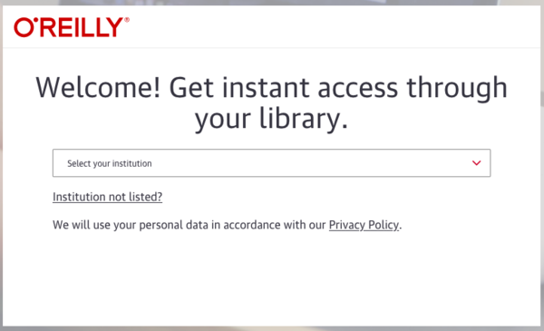

# Fall 2022 CS 1440 Reading Schedule

**TMMM** = *The Mythical Man-Month* by Frederick P. Brooks, Jr.

| Reading  | Module   | Week    | Dates         | Title
|:--------:|:--------:|:-------:|:-------------:|--------------------------------------
|          | Module 0 | Week 1  |  8/29 -  9/02 | 
| 0        | Module 0 | Week 2  |  9/12 -  9/09 | [Simon Tatham: How to Report Bugs Effectively](https://www.chiark.greenend.org.uk/~sgtatham/bugs.html)
|          | Module 1 | Week 3  |  9/12 -  9/16 |
| 1        | Module 1 | Week 4  |  9/19 -  9/23 | TMMM Ch. 1: The Tar Pit 
|          | Module 2 | Week 5  |  9/26 -  9/30 | 
| 2        | Module 2 | Week 6  | 10/03 - 10/07 | [How to Read Documentation](./Module2/How_to_Read_Documentation.md)
|          | Module 3 | Week 7  | 10/10 - 10/14 | **Fall Break**
| 3        | Module 3 | Week 8  | 10/17 - 10/21 | TMMM Ch. 6: Passing the Word
|          | Module 4 | Week 9  | 10/24 - 10/28 |
| 4        | Module 4 | Week 10 | 10/31 - 11/04 | TMMM Ch. 15: The Other Face
|          | Module 5 | Week 11 | 11/07 - 11/11 | 
| 5        | Module 5 | Week 12 | 11/14 - 11/18 | TMMM Ch. 16: No Silver Bullet
|          | Module 6 | Week 13 | 11/21 - 11/25 | **Thanksgiving Break**
| 6        | Module 6 | Week 14 | 11/28 - 12/02 | TMMM Ch. 2: The Mythical-Man Month   
|          | Module 6 | Week 15 | 12/05 - 12/09 | 

We will discuss passages from the readings in class and/or online.
Be prepared to answer questions from these readings on Mastery Quizzes.

## Accessing *The Mythical Man-Month* for free through the USU Library

This book is available **for free** through the USU Library from *O'Reilly Online*.  To access the book, you must connect to *O'Reilly Online* either from an on-campus network or the USU VPN (instructions below).  If you switch networks or shut down the VPN, you will lose access to the book until you reconnect.

0.  Go to [O'Reilly for Higher Education](https://library2.usu.edu/inabs/more.php?Identify=918)
1.  Click **Go to Database**
2.  You should see a screen that reads "Welcome! Get instant access through your library" (if you don't, follow the VPN instructions below and try again).
    *   
3.  Click the **Institution not listed?** link
4.  Enter your `@usu.edu` email address and proceed to log in
5.  Search for `Mythical Man-Month, The: Essays on Software Engineering, Anniversary Edition`
6.  Say out loud "I'm in" like a Hollywood hacker

## USU VPN instructions

USU's Virtual Private Network (VPN) server creates an encrypted stream between your computer and campus to provide you with a secure, remote connection to the university network. Authorized users can access the university network from anywhere (home, hotel, conference, etc.) with a secure internet connection.

USU uses the Cisco AnyConnect VPN.  To access the VPN you must install and set up the Cisco AnyConnect application on your device.

*   [Cisco AnyConnect VPN for MacOS](https://usu.service-now.com/aggies?sys_kb_id=77410656b8834100bd5c10e091b7dba8&id=kb_article_view&sysparm_rank=3&sysparm_tsqueryId=ac78c9c14775119055f4f7c5536d432f)
*   [Cisco AnyConnect VPN for Linux](https://usu.service-now.com/aggies?sys_kb_id=d56093ccf5f95900496e86b8fd29bfd9&id=kb_article_view&sysparm_rank=4&sysparm_tsqueryId=ac78c9c14775119055f4f7c5536d432f)
*   [Cisco AnyConnect VPN for Windows](https://usu.service-now.com/aggies?sys_kb_id=fb3eb5d2b8834100bd5c10e091b7dbf3&id=kb_article_view&sysparm_rank=2&sysparm_tsqueryId=ac78c9c14775119055f4f7c5536d432f)
*   [Cisco AnyConnect VPN for iOS and Android](https://usu.service-now.com/aggies?sys_kb_id=6ae68ad6b8834100bd5c10e091b7db32&id=kb_article_view&sysparm_rank=1&sysparm_tsqueryId=ac78c9c14775119055f4f7c5536d432f)
